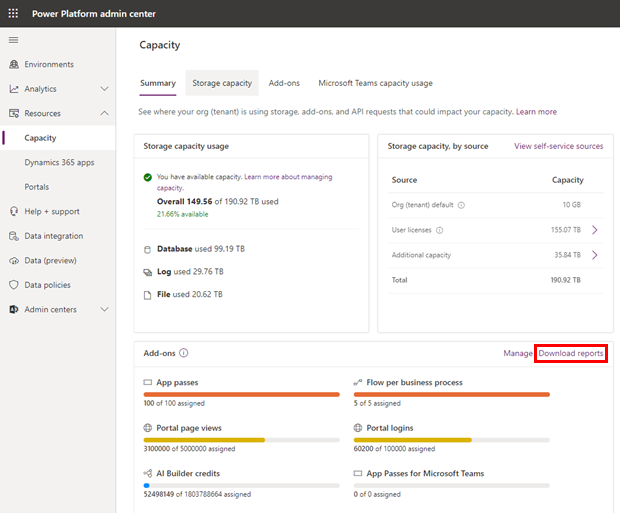
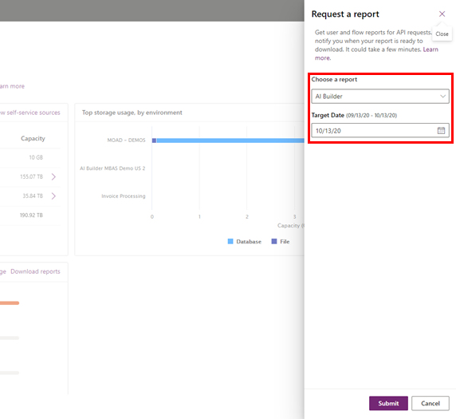
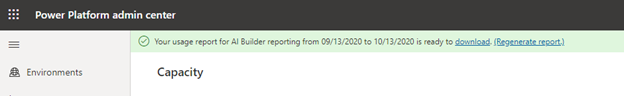
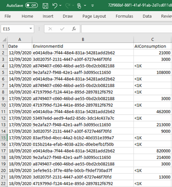

# AI Builder consumption report

AI Builder is licensed as a capacity add-on that must be allocated to a Power Platform environment by an administrator. Each AI builder capability consumes credits at a different rate.

- The [AI Builder calculator](https://flow.microsoft.com/fr-fr/ai-builder-calculator/) allows you to perform an assessment of what you need for your business.
- The [AI Builder licensing page](administer-licensing.md) gives you more details on how AI Builder capacity works.

In addition, administrators can download an Excel report that shows the actual capacity consumption in your tenant. The consumption report shows the capacity used in the 30 days preceding the selected target date for each environment. This makes it easier to compare your allocated capacity with the actual capacity consumption of your organization so you can fine tune your capacity allocation.

## View the consumption report

To download and view an excel file showing your AI credit consumption report:

1. Sign in to the [Power Platform Admin Center](https://admin.powerplatform.microsoft.com/) and select **Capacity** in the left-side navigation pane.
1. On the **Summary** tab, select **Download reports** in the **Add-ons** section.

 > [!div class="mx-imgBorder"]
 > 

1. Select **AI Builder** in the **Choose a report** box, and select the target date that you want to get the data for the preceding 30 days, and then select **Submit**.

 > [!div class="mx-imgBorder"]
 > 

1.	A notification message appears at the top of the screen when the report is ready. Click **download** to download the report as an Excel file.

 > [!div class="mx-imgBorder"]
 > 

## Understanding the consumption report

 > [!div class="mx-imgBorder"]
 > 

The report shows AI credits consumed by date for each environment.
 
**EnvironmentId** is the identifier visible in your Power Apps or Power Automate URL (E. g. https://make.powerapps.com/environments/%GUID%). **<1K** in the **AIConsumption** column means that you have consumed less than 1,000 credits on that day and that environment. You can compare the aggregated consumption for the current calendar month on each environment with what has been allocated. Using this information, you can take action to allocate more credits to environments that are in overage. Remember, the number of allocated credits by environment is visible and can be changed in the Power Platform Admin Center [Add-ons](https://admin.powerplatform.microsoft.com/resources/capacity#add-ons) page.

## See also

- [Microsoft Power Apps and Power Automate Licensing Guide](https://go.microsoft.com/fwlink/?LinkId=2085130)<!--I don't think you want the locale identifier? -->
- [AI Builder licensing FAQ](/power-platform/admin/powerapps-flow-licensing-faq#ai-builder)
