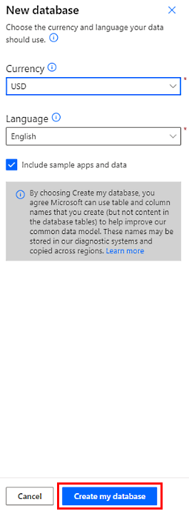
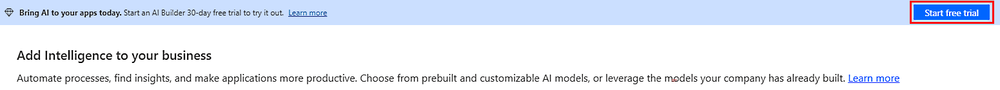

# AI Builder licensing

AI Builder is licensed as an add-on to your Power Apps, Power Automate, or Dynamics 365 license. This means you can start your AI Builder trial after you have a Power Apps, Power Automate, or Dynamics 365 license that allows you to create a Microsoft Dataverse environment.

The AI Builder capacity add-on doesn't exist in the Microsoft 365 business premium license.

More information about AI Builder licensing:

- [Microsoft Power Apps and Power Automate Licensing Guide](https://go.microsoft.com/fwlink/?LinkId=2085130)
- [AI Builder licensing FAQ](/power-platform/admin/powerapps-flow-licensing-faq#ai-builder)
- [Estimate the AI Builder capacity that’s right for you](https://powerapps.microsoft.com/ai-builder-calculator/)

## Get started

- [Start your free trial](<!-- BROKEN LINK HttpLinkNotFound: https://web.powerapps.com/signup?redirect=marketing&email= -->)

## Paid licenses

First, you have to purchase AI Builder capacity add-on for your Power Apps or Power Automate licenses. Then an administrator has to allocate that capacity to any Power Apps environment where you want to use AI Builder.

### Purchase AI Builder capacity

The  AI Builder capacity add-on can be purchased by a billing administrator in Microsoft 365 admin center, or by using your usual channel.

The <a href="https://powerapps.microsoft.com/ai-builder-calculator/" target="_blank">AI Builder calculator</a> helps estimate the required add-on capacity based on your estimated consumption.

Some Microsoft products like Power Apps per app plan, Power Apps per user plan, and Power Automate per user plan with attended RPA include some AI Builder capacity. Your environment admin can check entitlement in Power Platform admin center in [Capacity add-ons](/power-platform/admin/capacity-add-on). When this amount isn't enough, you can complete it with 1 or several AI Builder capacity add-ons.

### Allocate capacity

Once entitled to AI Builder capacity, credits are unallocated and available as a pool on the tenant, which can be used on any environment. The administrator can restrict usage by allocating all credits to specific environments.

For information about how to allocate capacity in Power Platform admin center, go to [Capacity add-ons](/power-platform/admin/capacity-add-on). For information on how to allocate credits, go to [Manage capacity](administer.md#manage-capacity).

## Trial licenses

Want to get started using AI Builder? Use premium features for a limited time with a [trial license](<!-- BROKEN LINK HttpLinkNotFound: https://web.powerapps.com/signup?redirect=marketing&email= -->), or use preview features without obtaining a license at all.

> [!NOTE]
> You *can't start an AI Builder trial* if you have AI Builder credits already on your tenant by purchasing a capacity add-on or through other products.

### Benefits of a trial license

An [AI Builder trial license](<!-- BROKEN LINK HttpLinkNotFound: https://web.powerapps.com/signup?redirect=marketing&email= -->) enables you to use AI Builder features for free during the 30-day trial period.

What you get with an AI Builder trial license:

- Create and use AI models in any environment (trial or production).
- Store your AI model results in Dataverse.
- Use AI model in your apps, flows, and more.

### Activate an AI Builder trial license

1. Sign in to	[Power Apps](https://make.powerapps.com) or [Power Automate](https://flow.microsoft.com).
1. Select **AI Builder** > **Explore**.
1. (If requested) Select **Create a database** and choose a currency and language.
1. Select **Create my database**.

   >[!div class="mx-imgBorder"]
   >

1. Refresh the build page.
1. At the top of the screen, select **Start free trial**.

   >[!div class="mx-imgBorder"]
   >

> [!NOTE]
> Your AI Builder trial license is applicable at the user level, not the environment level: you can use your trial license on multiple environments. Another user would have to start their own trial or paid license to use your models in any environment.

### Preview features

AI Builder features that are in preview release status are free to use. You don't need to obtain a license to use AI Builder preview features.

### After the trial expires

Your AI Builder trial license expires after 30 days.

To continue using AI Builder, purchase AI Builder add-on capacity and allocate AI Builder capacity to your environments. You may also be able to extend the trial period. Trials can be extended a limited number of times. Extension can only occur after the trial expires.

To renew your AI Builder trial license, sign in to Power Apps or Power Automate, select **AI Builder** > **Explore**, and then select **Extend trial** in the banner on the top.

### Trial capacity

An AI Builder trial license includes a limited amount of AI Builder capacity. You use this capacity when running or training models.

If you exceed your AI Builder capacity, you’ll receive an over-capacity  notification. These notifications appear as banners in AI Builder pages or when using the model.

The following functions aren't available when you exceed capacity:

- Create a model or a new version of a model
- Run a model within Power Apps or in a Power Automate flow.
  - You can still share your model with another user. They can run it using their own AI Builder capacity. 
- Scheduled model run or retrain
  - Some scenarios allow scheduled run or retrain, which is configured on the model settings panel. These scheduled tasks will fail when you exceed capacity. Therefore, data won’t be refreshed, and the model won’t be retrained.

To continue using AI Builder when you exceed capacity, purchase AI Builder add-on capacity, and allocate it to your environments.

If you extend a trial after expiration, capacity is reset. You can again run and train your models, and create new ones. Scheduled run and retrain instances will resume according to the existing settings.

### AI Builder paid licenses FAQ

#### I exceeded my trial capacity. What can I do?

- You can purchase AI Builder Add On and allocate capacity to your environment
- You can wait for your trial to expire, then extend your trial: this will add new capacity.
- You can also share your existing model with another user who still has active trial with capacity.

#### How do I convert my trial environment to a production environment?

For more information, see [About trial environments](/power-platform/admin/trial-environments).

#### Where can I find more information about license management in Power Apps and Power Automate?

More information about licenses and license management in Power Apps is available in Microsoft Power Platform [License management](/power-platform/admin/wp-license-management).

#### Where can I find more information about trial environments?

For more information, see [About trial environments](/power-platform/admin/trial-environments).

After your AI Builder trial license expires, or if you exceed capacity:

- You have to [purchase a license](/power-platform/admin/signup-for-powerapps-admin) to continue using your AI models.
- An administrator must allocate AI Builder capacity to any environment where you want to use AI Builder.
- You can't create or modify AI Builder models, and no new inference will be possible when the trial expires if you don't purchase a license.

#### How do I convert my trial environment to a production environment?

For more information, see [About trial environments](/power-platform/admin/trial-environments).

#### Can I block users in my organization from signing up for an AI Builder trial?

Any individual can try out the features of AI Builder for 30 days and incur no costs to your company. This option is available to any user in a tenant and cannot be disabled by an admin.

#### What can I do with the 5,000 AI credits included in the per user plan with attended RPA?

Each user license grants you 5,000 credits, allowing you to assess the capabilities in AI Builder. For instance, you could use these credits to extract data from a few documents with *document processing* or perform hundreds of basic OCR extractions with *text recognition*.

[!INCLUDE[footer-include](includes/footer-banner.md)]
