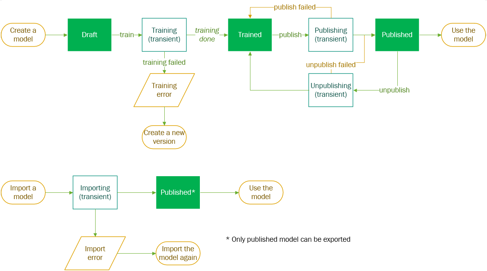
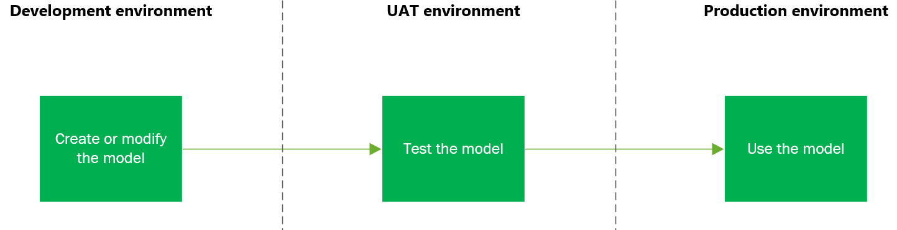
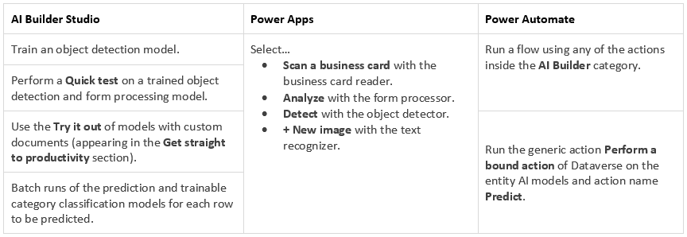

# Administer AI Builder

Microsoft Power Platform administrators can use the [Power Apps admin center](https://admin.powerapps.com) and the [Power Platform admin center](https://admin.powerplatform.microsoft.com) to manage environments and settings for Power Apps and AI Builder. For more information, go to [Power Platform administrator guide](/power-platform/admin/admin-documentation).

The availability, which is also known as the release status, of AI Builder is dependent on your region. For a breakdown of AI Builder feature availability by region, go to [Feature availability by region](availability-region.md).

## AI custom model and environment lifecycle

This section applies to AI Builder custom models. It does not apply to prebuilt models.

### Lifecycle states of a model

A model can go through different states depending on the makers’ actions. The model states are stored through configurations within the AI Configuration table.

The states are draft; training (transient); trained; publishing (transient); published; unpublishing (transient); training error; importing (transient), and import error.

> [!div class="mx-imgBorder"]
> 

### Application lifecycle management

Makers should be able to continuously update and deploy their models across single or multiple environments.

Managing new versions of a model often requires going through different environments. A typical scenario would be to make model changes in a *development environment*, qualify in a *test environment*, and predict in a *production environment*.

> [!div class="mx-imgBorder"]
> 

### Environment lifecycle

AI Builder models are fully moved, along with user data, during environment backup/restore and environment copy operations.

After restore and copy operations, form processing and object detection models may be under the *importing* state. This is due to the backend copy of binary models between Azure storages (which is the same principle as model import).

## Backup and restore

Microsoft Dataverse has backup and restore capabilities to help protect your apps' data, providing continuous availability of service. System administrators and delegated admin users can use the standard capabilities described in [Back up and restore environments](/power-platform/admin/backup-restore-environments).

- Backup and restore is fully supported for prediction, object detection, form processing, and prebuilt models.

  >[!NOTE]
  >For object detection and form processing models, the restore process might take some time to be completed. The AI Builder models list shows an "importing" status message while the restore operation is in progress.

- **For models *not* supported by backup and restore**: If you restore an environment, you'll have to retrain and republish these models to make them available again.

## Manage capacity

### AI Builder consumption model

AI Builder offers a subscription model allowing you to purchase add-ons.

Only certain actions in the product consume credits. Preview scenarios don't consume credits.

Each AI Builder model has a different credit consumption mechanism. To perform an assessment, go to the [AI Builder calculator](https://powerapps.microsoft.com/ai-builder-calculator/).

### Allocate credits

By default, the credits are unallocated and available as a pool on the tenant. They must be allocated to an environment. If they aren't, users won't be able to consume credits.

> [!NOTE]
> This is how administrators stay in control of *where* AI is used in their organization, and with the role assignments described in [Roles and security in AI Builder](security.md#roles), *who* is using it.

 As an administrator, you'll assess which environments must consume AI Builder credits. Using the [AI Builder calculator](https://powerapps.microsoft.com/ai-builder-calculator/), you can define how many predictions will happen in a monthly period on each one and so the credits to allocate.

To learn how to allocate credits in the Power Platform admin center, go to [Allocate or change capacity in an environment](/power-platform/admin/capacity-add-on#allocate-or-change-capacity-in-an-environment).

### Monitor usage

As an administrator, you have access to a consumption report that provides the AI credits consumption on a chosen period per environment. This will allow you to fine tune the credits allocation which can be updated any time.

To learn how to download reports, go to [Allocate or change capacity in an environment](/power-platform/admin/capacity-add-on#allocate-or-change-capacity-in-an-environment).

## Where and how are data are stored in Dataverse?

Your AI model is deployed in the region that hosts the environment. For example, if your environment is created in the Europe region, your model is deployed in datacenters in Europe. For more information, go to [Environments overview](/power-platform/admin/environments-overview).

Images used for training purposes in object detection and form processing models are persisted in Dataverse. In contrast, images used at prediction time aren't persisted. Examples of non-persisted images are those in a Power Apps component framework (PCF) control and in Power Automate.

## Enable or disable AI Builder preview features

Some AI Builder features are released for general availability. Others remain in preview release status.

Preview features appear on the build page with the **Preview** label. In the Power Platform admin center, administrators control whether users have access to preview features.

By default, the **AI Builder preview models** feature is enabled for any eligible environment. Eligible environments must have Microsoft Dataverse and be in a [supported region](availability-region.md). If the environment isn't eligible, the **AI Builder preview models** feature doesn't appear in the Power Platform admin center.

To control AI Builder preview feature availability:

1. Sign in to the [Power Platform admin center](https://admin.powerplatform.microsoft.com).

1. In the admin center, go to **Environments** > *[select an environment]* > **Settings** > **Features**.

1. On the **Features** settings page, under **AI Builder**, enable or disable **AI Builder preview models**.

### Important points related to enabling or disabling the feature

- If you disable **AI Builder preview models**:
  - We don't delete existing models that users of this environment have created.
  - AI Builder components are disabled.
  - Existing experiences that use existing AI Builder components will fail or return errors.
  - Admins and owners can delete preview models.

- If you enable **AI Builder preview models** again:
  - AI Builder components are available again.
  - Components function as they did before the feature was disabled (assuming nothing else has changed).

For more information about enabling or disabling features in the Power Platform admin center, go to [Manage feature settings](/power-platform/admin/settings-features).

## Data loss prevention (DLP)

You can control DLP policies within Power Platform admin center, **Data policies** menu item.

Connectors can be listed in three (3) categories: *Business*, *Non-business*, and *blocked*.

- AI Builder is part of the Dataverse connector.

- Business and Non-business connectors can’t share data within the same consumption experience in the Power Platform.

  - For example, if you add the Dataverse connector in *Business* category, and Microsoft Outlook in the "Non-business* category, you won’t be able to create a Power Automate flow that gets the output of an AI Builder model and send it to a recipient in Outlook.
•	Blocked connectors can’t be used in Power Platform consumption experiences.

To learn more, go to [Data loss prevention policies](/power-platform/admin/wp-data-loss-prevention).

<!-- Is this putdated? ## Move and copy environments

- For prediction and prebuilt models, moving and copying environments is fully supported.

- For other models, after you move or copy an environment, you have to retrain and republish existing models to make them available again. -->

[!INCLUDE[footer-include](includes/footer-banner.md)]