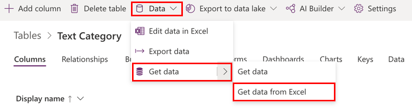
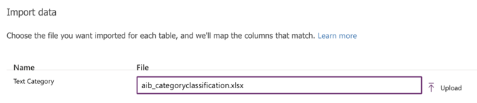
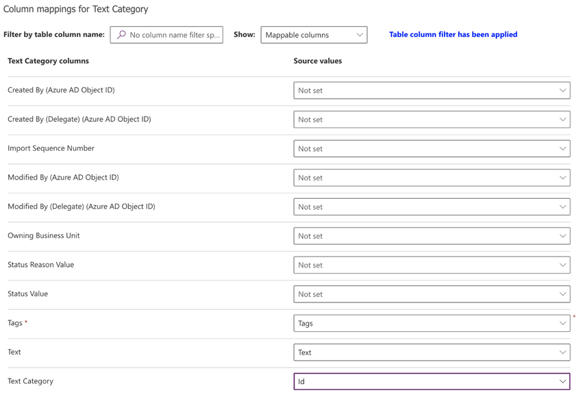
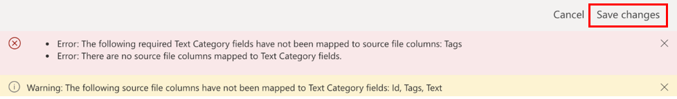
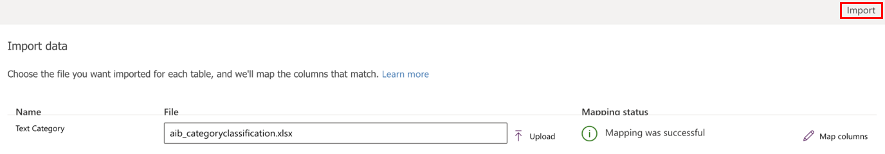

# Before you build a category classification model

Before you build your category classification model, make sure your data is in Microsoft Dataverse and it's structured in the correct format.

## Prerequisites

- This model requires the training data to be available within a Dataverse table. Support for data from external sources is currently unavailable.

- Make sure your administrator has assigned you a security role with Read privilege for the table that has the training data.

- Make sure you have appropriate permissions to create tables in your Dataverse environment. You can use either the System Customizer or System Administrator [built-in security roles](security.md).

### Supported languages

AI Builder category classification supports the following languages. If you try to classify text in other languages, your model might not work properly.

- English
- French
- German
- Italian
- Spanish
- Portuguese  

## Data preparation

The training data used to train the model from the Dataverse table should conform to the following:

- Store text and tags as two columns in the same table. Each row must have data in the **Text** column.

- You can provide one or more tags to data in the same row in the **Text** column. You can also leave the **Tags** column empty.

- If you've identified multiple tags within the text sample, provide them as delimited text in the **Tags** fields. Currently, commas (,), semicolons (;), and tab characters are supported separators.

  |Text  |Tags  |
  |---------|---------|
  |Great clean and quiet room with a free to-go breakfast     | Dining, Room        |
  |Small but well-orchestrated room that was comfy   | Room        |
  |I love the view from the 13th floor   | (none)        |

- Make sure to have a minimum of 10 distinct text samples for each tag to be extracted. Tags with fewer than 10 samples won't be trained. In the previous example, there should have been a minimum of 10 rows each that have been tagged with the **Dining** and **Room** tags. 

- If **Room** has been tagged in fewer than 10 rows in the data, it will be ignored. The model won't be trained to categorize data for that tag.

- For every tag that is used, provide a minimum of 10 text samples where it *isn't* used.

  |Text  |Tags  |
  |---------|---------|
  |Great clean and quiet room with a free to go breakfast     | Room        |
  |Small but well-orchestrated room that was comfy   | Room        |
  |(none)  | Room        |

  If all rows in the table are tagged to **Room**, and there are no rows—or fewer than 10 rows—that have been tagged to another label, the model will fail the training process.

- A table must have at least two tags, and each one must have ten text samples.

- You can define up to 200 distinct tags. Each tag is a category that will be identified and extracted from the given text.

- Each sample of text data must have fewer than 5,000 characters.

If you don't have training data and want to try AI Builder category classification, follow these [instructions](text-classification-sample-data.md) to use sample data.

## Examples of training data format

This section provides examples of the training data format in a Dataverse table.

|Columns  |Data type  |Size  |
|---------|---------|---------|
|Comments     | Text        | 3,000        |
|Tags     | Text        | 100        |

  

|Comments  |Tags  |
|---------|---------|
|During my stay, I was completely ignored. The staff failed to pick up on me aspirating and having a UTI. I also had pneumonia.      |  Care       |
|I was seen very soon after arriving each time and all the staff, nurse, doctor, and anesthetist were very helpful. There seems to be a good sense of teamwork.     | Staff, Check-in        |
|The equipment seemed up to date. The nurse/healthcare assistant seemed quite caring.     | Facilities, Staff         |

> [!NOTE]  
> If you don't have your own training data and want to try AI Builder category classification, you can get started by downloading sample data for the category classification model. More information: [Use sample data to do category classification](text-classification-sample-data.md)

## Import your data into Dataverse

Because training data for a category classification model needs to be available as a Dataverse table, let's begin with preparing data in Dataverse table.  

Dataverse includes a powerful set of connectors to help you import data from many sources. More information: [Add data to a table in Microsoft Dataverse by using Power Query](/powerapps/maker/data-platform/add-data-power-query)

As an example, let's look at how to import training data from an Excel workbook. This example uses a file containing what's shown in the following table.

|Id  |Tags  |Text  |
|---------|---------|---------|
|1     | Dining        |Breakfast was a bit of a hassle.         |
|2     | Dining, Room        | Great clean and quiet room with a free to-go breakfast.        |
|3     | Room, Dining, Location        | The staff we dealt with was very friendly and helpful. The hallways and our room were clean and comfortable. Breakfast (included) was muffins and bagels.        |
|4     | Location, Dining        | Surrounding area is full of bars and restaurants.         |
|5     | Service        | Staff was respectful.        |

In the example, the tags are separated by a comma (,). As an alternative, you can use a semicolon (;) or tab character.

1. Sign in to [Power Apps](https://make.powerapps.com/).

1. Select the environment you want to work in.

   > [!div class="mx-imgBorder"]
   > 

1. Select **Data** > **Tables**.

1. Select your table. If you don't have a table already, follow the steps in [Create a custom table](/powerapps/maker/data-platform/data-platform-create-entity).

1. Select **Data** > **Get data** > **Get data from Excel** from the ribbon of the selected table.

   > [!div class="mx-imgBorder"]
   > 

1. In the **Import data** screen, select the Excel file that has the data referred to in the [Examples of training data format](#examples-of-training-data-format) section earlier in this topic, and then select **Upload**.

   > [!div class="mx-imgBorder"]
   > 

1. To review the field mappings in the **Column mappings for Text Category** screen, select **Map Columns**.

   > [!div class="mx-imgBorder"]
   > 

    The left side lists all columns defined in the table. The dropdown list on the right shows the columns available in the Excel file.

    Map the **Tags**, **Text**, and **Id** columns from Excel to the respective columns in the table.

1. After you've mapped the columns, go back to the import step by selecting **Save changes** in the upper-right corner.

   > [!div class="mx-imgBorder"]
   > 

1. After you see the **Mapping status** as successful, begin the import process by selecting **Import** in the upper-right corner.

   > [!div class="mx-imgBorder"]
   > 

1. The import process might take a few minutes depending on the volume of data being imported. After a few minutes, refresh the **Data** tab of the table to find all the records imported from the Excel file.

You're now ready to go to the next step.

### Next step

[Create a category classification model](create-text-classification-model.md)

[!INCLUDE[footer-include](includes/footer-banner.md)]
