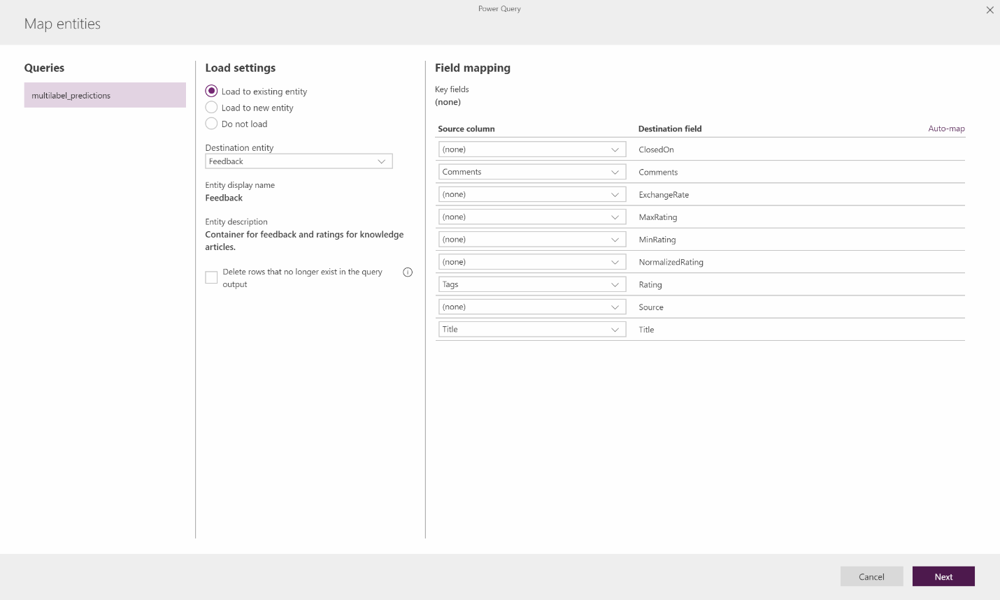

# Before you build a text classification model

[!INCLUDE[cc-beta-prerelease-disclaimer](./includes/cc-beta-prerelease-disclaimer.md)]

Before you build your text classification model, you'll need to make sure your data is in Common Data Service, and in the correct format.

## Prerequisites

 - Training data should be in a Common Data Service entity.
 - Make sure your administrator has assigned you a security role with read privilege over the training data.
 - You need to have a PowerApps P1 or P2 plan to be able to use AI Builder.
 - You have appropriate permissions to create entities in your Common Data Service environment.

## Data format

> [!NOTE]
> For best results, use a data set that is smaller than 1.5 GB. When your data set exceeds 1.5 GB, AI Builder only uses 1.5 GB of your data to train and predict. Because you can’t control which data exceeding the 1.5 GB limit is not used, you should optimize your data to stay under 1.5 GB.

<!--from editor: The tab, below, is just a blank space between quotation marks?-->

 - Text and tags should be stored in text fields under the same entity. 
 - Tags should be separated using a delimiter. We currently support the following delimiters: Comma ",", semicolon ";", tab "	", and no separator. 
 - Tags that contains less than 50 text items are ignored.
 - Text must be fewer than 5,000 characters.

If we represent data in a table, it would look like this:

| Text      | Tags                |
|-----------|---------------------|
| Text data | Tag X, Tag Y        | 
| Text data | Tag X, Tag Y, Tag Z | 

## Import your data into Common Data Service

<!--from editor: Will the link below work ok when this is published? Or do you need to use the full URL?-->

We understand that your data might not be in Common Data Service. However, Common Data Service includes a powerful set of connectors that will help you import your data from all major data sources. For more information about how to import data into Common Data Service, see [Add data to an entity in Common Data Service by using Power Query](/powerapps/maker/common-data-service/data-platform-cds-newentity-pq). 

As an example, here is how to import training data from an Excel sheet. This example uses an Excel file like this:

|---|---|---|
|326589    |It’s a powerful tool that helps make quick changes   |Good \| Quick \| Powerful |
|326590    |This program is great and has lots of potential. The user interface is intuitive and makes it easy to filter results. However, when I try to edit a link, I get an error.    |Potential, Easy \| Good, Ease of Use \| filters \| bug  |
|326591    | You need to work on your Feature Y capabilities, they are not as good as your competition. |Feature Y \| Competition     |
|326592    |Easy to view data        |Easy \| Ease of use                                |
|326593    |I like how you made feature X easy to use. This reduces a lot of complexity when I want to onboard new customers. | Easy \|Good \| Feature X                             |

Note that the tags data is separated using a vertical bar or pipe (\|).

<!--from editor: In step 2 below, should it say "Go to" instead of "Under"?-->

1. Sign in to [PowerApps](https://web.powerapps.com/), and then select the down arrow to expand **Data** in the navigation pane.
2. Under **Data** > **Entities** > **Get data**. 
    - If you need to create a new entity, use [this guide](https://docs.microsoft.com/powerapps/maker/common-data-service/data-platform-create-entity).
3. In the list of data sources, select **Excel**.
4. Select **Browse** to upload your Excel file,  and then select the sheet or sheets your data is in.
    - You might have to allow third-party cookies for your browser to perform this step.
6. On the **Edit Queries** screen, select **Transform table** > **Use first row as headers**. Next, select the **Tags** column, and then select **Transform Column** > **Replace values**.
1. Replace the **|** character with a semicolon **;**, and then select **OK**.
1. Now that your data is in the correct format, select **Next** > **Load to new entity**.
1. Use the drop-down menu to select your target entity, and then map your columns to the destination field. 

    > [!div class="mx-imgBorder"]
    > 

1. Select **Refresh manually** on the **Refresh settings** page. 

You’re all set—Power Query will import your data into the Common Data Service entity you have picked.

### Next steps

[Create a text classification model](create-text-classification-model.md) 
