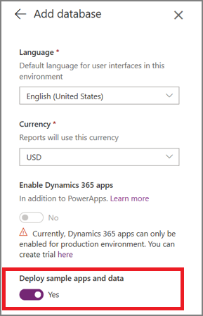

# Build a model in AI Builder

In AI Builder, we guide you through each step to create your AI model.

> [!div class="mx-imgBorder"]
> 

## Prerequisites

Make sure your admin has enabled AI Builder for your environment. Otherwise, you won't have access to the AI Builder functionality. For more information, go to [Enable or disable AI Builder preview features](administer.md#enable-or-disable-ai-builder-preview-features).

AI Builder requires the use of [Common Data Service](/powerapps/maker/common-data-service/data-platform-intro), which is the data platform for Power Apps and allows you to store and manage business data. Common Data Service is the platform on which Dynamics 365 apps are built so if you’re a Dynamics 365 customer, your data is already in Common Data Service.

### Deploy sample apps and data

If you want to explore AI Builder using sample data provided by Microsoft, you can enable the **Deploy sample apps and data** setting when you create your environment to add sample data to your environment automatically. You can also download this sample data and upload it to your environment.

Sample data and information on how to work with it is available [here](samples.md).

## Get started

To get started:

1. Sign in to [Power Apps](https://make.powerapps.com).
2. In the left navigation pane, select **AI Builder** > **Build**.
3. Under **Make your own AI model**, select an AI model type.
4. Type a model name and select **Create**.

### Next step

[Train a model in AI Builder](train-model.md)
