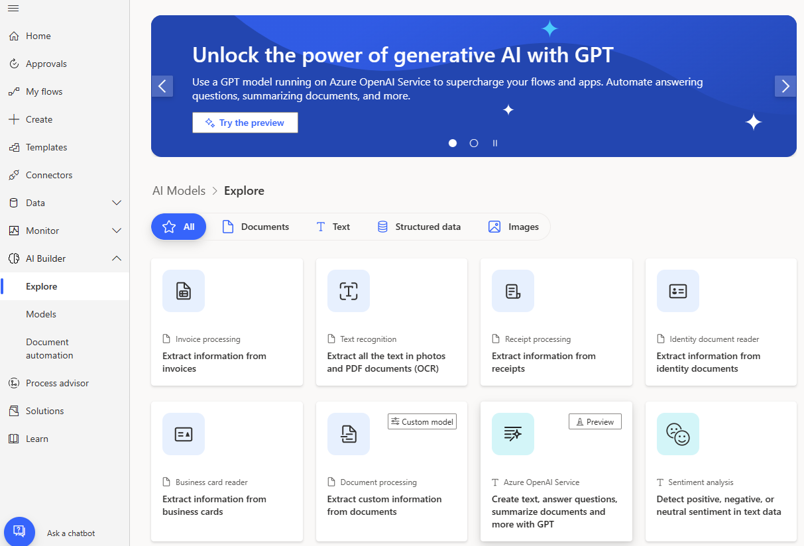

# Build a model in AI Builder

In AI Builder, we guide you through each step to create your AI model.

> [!div class="mx-imgBorder"]
> 

## Prerequisites

Make sure your admin has enabled AI Builder for your environment. Otherwise, you won't have access to AI Builder functionality. More information: [Enable or disable AI Builder preview features](administer.md#enable-or-disable-ai-builder-preview-features)

AI Builder requires the use of [Microsoft Dataverse](/powerapps/maker/common-data-service/data-platform-intro), which is the data platform for Microsoft Power Platform that allows you to store and manage business data. Dataverse is the platform on which Dynamics 365 apps are built, so if you're a Dynamics 365 customer, your data is already in Dataverse.

### Deploy sample apps and data

Do you want to explore AI Builder by using sample data provided by Microsoft? Enable the **Deploy sample apps and data** setting when you create your environment to add sample data to your environment automatically. You can also [download sample data](samples.md), and then upload it to your environment.

## Get started

1. Sign in to [Power Apps](https://make.powerapps.com).
2. In the left pane, select **AI Builder** > **Explore**.
3. Under **Make your own AI model**, select an AI model type.
4. Type a model name, and then select **Create**.

### Next step

[Train your model in AI Builder](train-model.md)

[!INCLUDE[footer-include](includes/footer-banner.md)]
