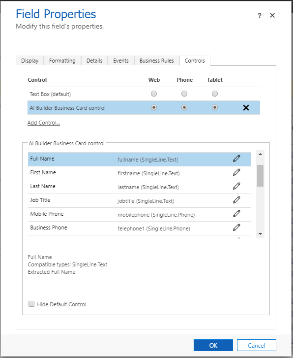

# Use the business card reader in model-driven apps

 The business card reader takes a photo or loads an image from the local device, and then scans it to find a business card. If it detects a business card, it extracts the information it finds.

> [!NOTE]
> For information about model-driven apps, see [What are model-driven apps in PowerApps?](/powerapps/maker/model-driven-apps/model-driven-app-overview)

## Licensing requirements

AI Builder is licensed as an add-on to your PowerApps or Power Automate licenses. For information about license capacity, pricing, and restrictions, see [AI Builder licensing](/ai-builder/administer-licensing).

## Role requirements

<!--from editor: Suggest changing the following sentence to "You need a Common Data Service user role to use the business card reader." --> 

You need the **common data service user** role to use the business card reader.

## Add the business card reader

Add the business card reader to an existing contact or lead form in the form editor, and through binding to a placeholder **SingleLine.Text** or **Multiple** field.

<!--from editor:
Looking at the image - Shoulud step 1 below say "Field Properties" instead of "Properties"?
Reason for removing the ellipsis: The style guide says if an option label ends with an ellipsis, don't include that end punctuation in instructions. -->

<!--v-dehaas:
The image isn't showing the UI element that gets selected. This is the resulting screen. -->

1. Select the placeholder field, and then select **Properties**.
2. Select the **Controls** tab.
3. Select **Add Control**.
4. Select **AI Builder Business Card Control**.

> [!div class="mx-imgBorder"]
> 

## Configure the business card reader

After you select the platform (web, phone, tablet) where the business card reader should appear, you can bind the component properties that you need.

> [!div class="mx-imgBorder"]
> 

> [!NOTE]
> - The **Company Name** property cannot be bound to a field of type **Lookup.Customer**. The only supported type is **SingleLine.Text**.
> - Find more information about [adding components to model-driven apps](/powerapps/developer/component-framework/add-custom-controls-to-a-field-or-entity).

## Key properties

If a business card is detected, the business card reader will try to extract information that it finds based on the following properties:

|Property |Definition  |Type  |
|---------|---------|---------|
 |**Full Name**| The contact full name| **SingleLine.Text**|
 |**First Name**| The contact first name|**SingleLine.Text**|
 |**Last Name**| The contact last name|**SingleLine.Text**|
 |**Job Title**| The contact job title|**SingleLine.Text**|
 |**Mobile Phone**| The mobile phone number detected| **SingleLine.Phone**|
 |**Business Phone**| The business phone number detected| **SingleLine.Phone**|
 |**Fax**| The fax number detected| **SingleLine.Phone**|
 |**Email**| The contact email found in the business card, if any |**SingleLine.Email**|
 |**Company Name**| The company name|**SingleLine.Text**|
 |**Website**| The website detected| **SingleLine.URL**|
 |**Department**| The organization department found|**SingleLine.Text**|
 |**Full Address**| The contact full address|**SingleLine.TextArea, Multiple**|
 |**Address Street**| The street address detected|**SingleLine.Text**|
 |**Address City**| The city address detected|**SingleLine.Text**|
 |**Address PostalCode**| The postal code address detected|**SingleLine.Text**|
 |**Address Country**| The country address detected|**SingleLine.Text**|
 |**Cleaned Image**| The image after processing where the business card appears cropped and enhanced from the original image|**Multiple**|

## Customization properties

The following properties are available for advanced customization:

<!--from editor: Wondering if "overwrite" might be the correct word for the last line. -->
<!--v-dehaas: I don't think so, although it wouldn't be incorrect. "override the default" makes more sense to me.  -->

|Property |Definition  |
|---------|---------|
 |**Default Image**| To replace the default placeholder image with a different one. The image (JPEG or PNG) should be encoded with base-64 digits.
 |**Text**| To override the default button text.
