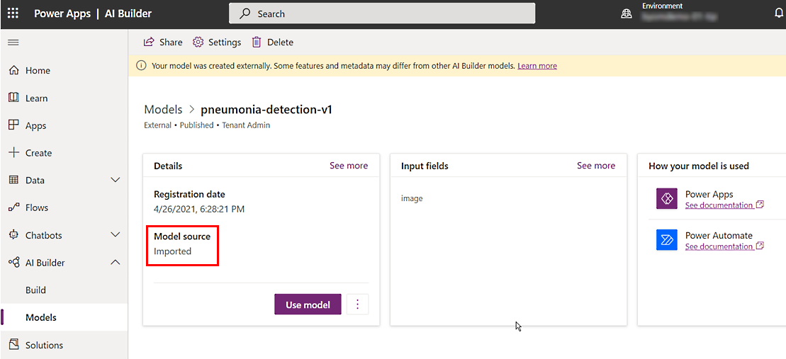

# Bring your own AI model into AI Builder

You can bring your own model into AI Builder so that it can function like any AI Builder custom model. You can use your model in Microsoft Power Platform by using Power Automate, or you can build apps with Power Apps.

When you use your own model, it's sometimes referred to as a *model endpoint*, which enables communication. When you use your own model, limitations apply. These [limitations](#limitations) are described later in this article.

## Create your own model

Outside of AI Builder, you can create your own model by using the Azure Machine Learning platform. To use the model in AI Builder, it must meet certain requirements:

- Your model contains an API definition that adheres to the OpenAPI specification (also known as Swagger).

- You've registered your model in AI Builder by using a Python package.

## Register your own model

The first step in bringing your own model into AI Builder is to register it. Follow the procedure in [Bring your own model tutorial](https://github.com/microsoft/PowerApps-Samples/tree/master/ai-builder/BringYourOwnModelTutorial) (on GitHub).

After you register the model, you'll see it in the list of AI Builder models. On the model details page, the **Model source** will be **Imported** to show that the external model is registered to AI Builder by using your imported model endpoint.

> [!div class="mx-imgBorder"]
> 

## Limitations

- The only supported authentication mechanism is [API keys](/azure/machine-learning/how-to-authenticate-web-service) that use [Azure Machine Learning](/azure/machine-learning/overview-what-is-azure-machine-learning).

- Only Swagger 2.0 is supported.

- The maximum allowed batch size is 500 rows.

- The maximum allowed latency/timeout is 20 seconds.

- The supported OpenAPI data types are:
   - Integer
   - Number
   - Boolean
   - String

- If your model takes an image as an input in Base64, it can be used for real-time prediction only, for consumption in [Power Automate](/power-automate/getting-started) or [Microsoft Power Fx](/power-platform/power-fx/overview). Batch prediction isn't supported.
   - The name of the field must end with **image** (not case-sensitive).
   - The data type must be **String**.

You're now ready to use your own model in AI Builder. You can perform application lifecycle management tasks such as export your own model by using a solution, import your model into the target environment, and upgrade your model in source or target environments.

## Related information

[Package your own model by using solutions](byom-alm.md)
