# Package your own model using solutions

After you've [registered](byo-model.md#register-your-own-model) your own model in AI Builder using a Python package, you can package your model using solutions to perform application lifecycle management (ALM) tasks, such as:

- [Export your own model using a solution](#export-your-own-model-using-a-solution).
- [Import your own model into the target environment](#import-your-own-model-into-the-target-environment).
- [Upgrade your own model in source or target environments](#upgrade-your-own-model).
- [Stage your own model for upgrade](#stage-your-own-model-for-upgrade).

Solutions are used to transport apps and components from one environment to another. They're also used to apply a set of customizations to existing apps. For detailed information about solutions and how they're used to apply ALM concepts across Microsoft Power Platform, go to [Overview of application lifecycle management](/power-platform/alm/overview-alm).

## Export your own model using a solution

In this example, you'll export two solutions:

- The solution that contains only the custom connector
- The solution that contains the model, connection reference, and any other components

1. Make sure you've registered your own model in the source environment using a Python package. If you haven't already registered it, follow the procedure in [Bring your own model tutorial](https://github.com/microsoft/PowerApps-Samples/tree/master/ai-builder/BringYourOwnModelTutorial) (on GitHub).

1. Create a solution to store the custom connector that's associated with the model:
   1. Sign in to [Power Apps](https://make.powerapps.com) or [Power Automate](https://flow.microsoft.com).
   1. On the left pane, select **Solutions** > **New solution**.
   1. In the **New solution** dialog, complete the fields. For detailed information about each field, go to [Create a solution](/powerapps/maker/data-platform/create-solution).
   1. Select **Create**.

   > [!div class="mx-imgBorder"]
   > 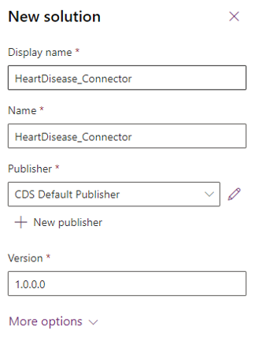

1. Add an existing custom connector by selecting **Add** > **Automation** > **Custom connector**.

   > [!div class="mx-imgBorder"]
   > 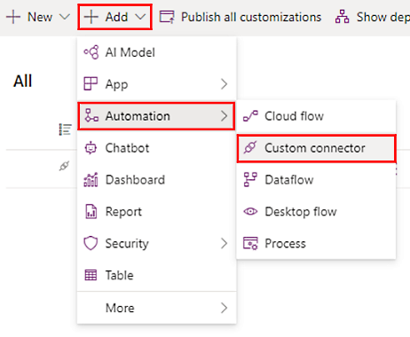

1. Select the custom connector that's associated with the model.

    The name will be in this format: \<model_name>-\<random number>-v\<version>. The version helps distinguish which connector to add when you update the model.

   > [!div class="mx-imgBorder"]
   > 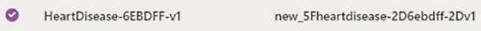

1. Export the solution. For help on how to export solutions, go to [Export solutions for Power Apps](/powerapps/maker/data-platform/export-solutions) or [Export solutions for Power Automate](/power-automate/export-flow-solution).

1. Create a new solution to add the model and any other components:
   1. Select **Solutions** > **New solutions**.
   1. In the **New solution** dialog, complete the fields.
   1. Select **Create**.

    > [!div class="mx-imgBorder"]
    > 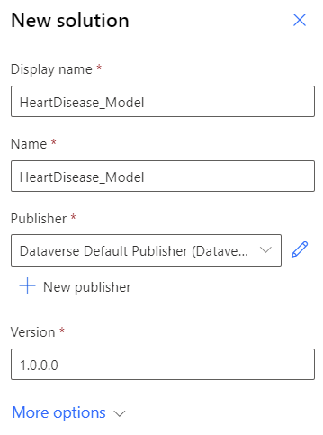

1. Add an existing connection reference by selecting **Add** > **More** > **Connection Reference (preview)**.

   > [!div class="mx-imgBorder"]
   > 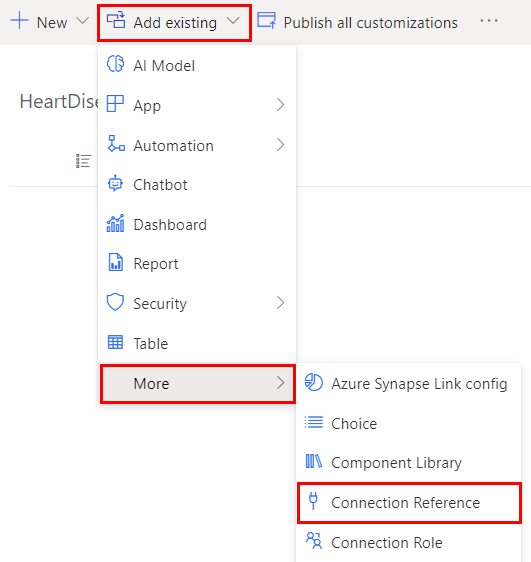

1. Add the existing connection reference associated with the model.

    The naming format is the same as the custom connector in step 4: \<model_name>-\<random number>-v\<version>.

   > [!div class="mx-imgBorder"]
   > 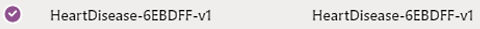

1. Add the AI model by selecting **Add** > **AI Model**.

    > [!div class="mx-imgBorder"]
    > 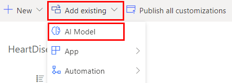

   Your solution should contain the components shown in the following image.

   > [!div class="mx-imgBorder"]
   > 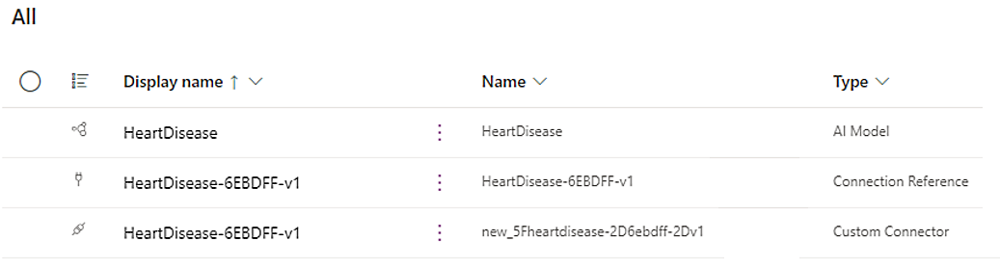

1. (*Optional*) Add any components you want. In this example, we'll add a cloud flow that uses the model.

    > [!div class="mx-imgBorder"]
    > 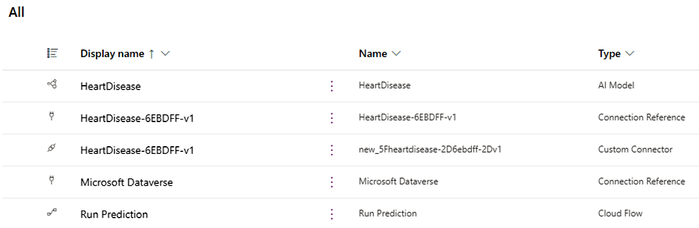

1. Export the solution. For help on how to export solutions, go to [Export solutions for Power Apps](/powerapps/maker/data-platform/export-solutions) or [Export solutions for Power Automate](/power-automate/export-flow-solution).  

## Import your own model into the target environment

In this example, you'll import two solutions that you created in the previous section:

- The solution that contains only the custom connector
- The solution that contains the model, connection reference, and any other components

For help on how to import solutions, go to [Import solutions for Power Apps](/powerapps/maker/data-platform/import-update-export-solutions), or [Import solutions for Power Automate](/power-automate/import-flow-solution).

1. Sign in to [Power Apps](https://make.powerapps.com) or [Power Automate](https://flow.microsoft.com).

1. Import the solution containing only the custom connector.

1. Import the solution containing the model, connection reference, and any other components.

1.	During the import process, create the connection to your external endpoint:

      - If your endpoint is not secured, select **Create**.
      - If your endpoint is secured with an API key, enter it in the **API Key** field, and then select **Create**.

    > [!div class="mx-imgBorder"]
    > 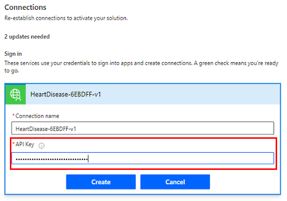

Your model is now ready to be consumed in your target environment.

  > [!div class="mx-imgBorder"]
  > 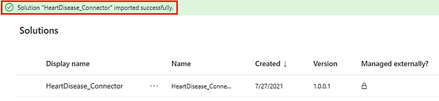

If you experience issues with your import, go to [Troubleshooting solution import](/powerapps/maker/data-platform/import-update-export-solutions).

## Upgrade your own model

Upgrade your solution to the latest version number so that it rolls up all previous patches in one step. Any components that were associated with the previous version of the solution and aren't in the newer version will be deleted. This ensures that outdated components won't be included in the solution.

In the examples, you'll upgrade two solutions:

- The solution that contains only the custom connector
- The solution that contains the model, connection reference, and any other components

For help on how to upgrade, go to [Upgrade or update a solution](/powerapps/maker/data-platform/update-solutions).

### Upgrade your own model in the source environment

1. Make sure you've registered your upgraded model in the source environment by using a Python package. If you haven't already registered it, follow the procedure in [Bring your own model tutorial](https://github.com/microsoft/PowerApps-Samples/tree/master/ai-builder/BringYourOwnModelTutorial) (on GitHub).

1. Sign in to [Power Apps](https://make.powerapps.com) or [Power Automate](https://flow.microsoft.com).

1. In the solution that contains only the custom connector, add a new existing custom connector by selecting **Add**.

1. Complete the fields and enter the new version. In this example, it's v2 because this is the second version.

1. Remove the older version of the custom connector from the solution:
    1. Select the vertical ellipsis (&vellip;) next to the older version.
    1. Select **Remove** > **Remove from this solution**.

   > [!div class="mx-imgBorder"]
   > 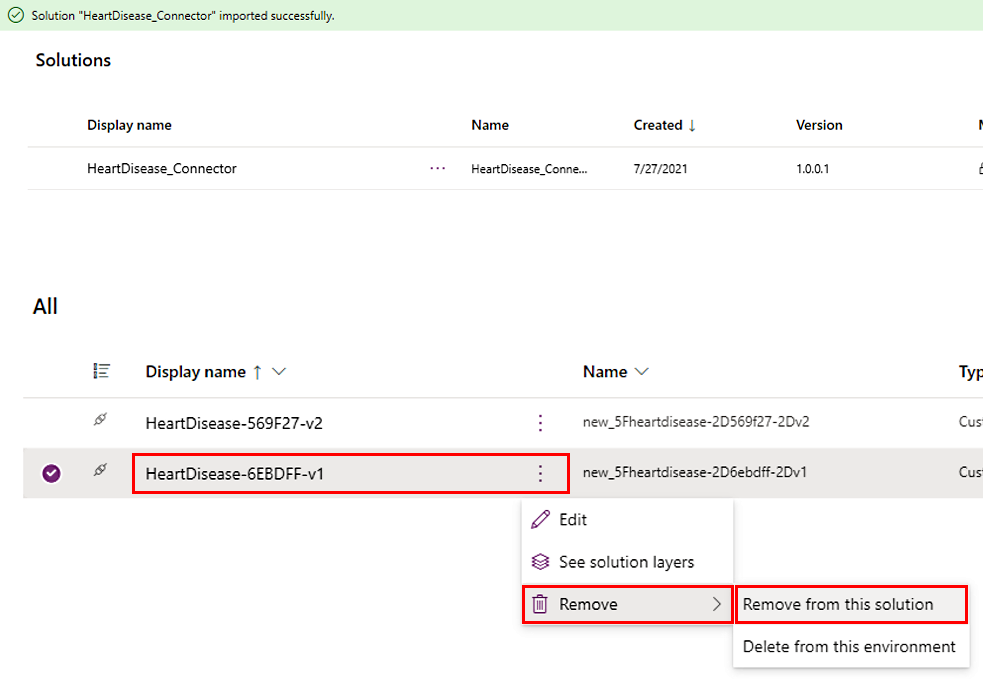

1.	Export the solution by selecting **Export**. By default, the version will be incremented during export.

1.	In the solution that contains the model, connection reference, and any other components, update the connection reference to point to the latest version:

    1. The custom connection will have the same name as the custom connector you added in step 4. In this example, v2 is the latest version.
    1. Remove the older version of the connection reference from the solution by selecting the name to remove (in this example v1), and then selecting **Remove** > **Remove from this solution**.

1. Export the solution by selecting **Export**. The AI model and any component referencing the model are automatically updated to point to the latest version.

### Upgrade your own model in the target environment

1. Sign in to [Power Apps](https://make.powerapps.com) or [Power Automate](https://flow.microsoft.com).

1. Import the solution that contains only the connector by selecting **Import** > **Upgrade**.

1.	Import the solution that contains the model, connection reference, and any other component by selecting **Import** > **Upgrade**.

1. Create new connections to the new endpoint:
    1. If your endpoint is not secured, select **Create**.
    1. If your endpoint is secured with an API key, enter it in the **API Key** field, and then select **Create**.

    > [!div class="mx-imgBorder"]
    > 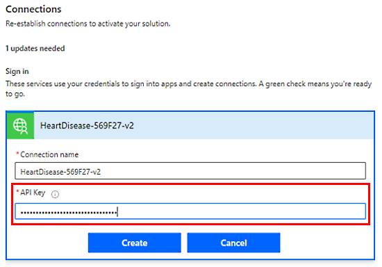

The model now will reference the new endpoint in the target environment.

   > [!div class="mx-imgBorder"]
   > 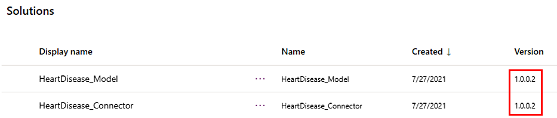

## Stage your own model for upgrade

Staging your model for upgrade only imports it into the organization. It doesn't make it active. In this scenario, components that reference the model in the environment will reference the old version until you complete this procedure by applying the upgrade.

For help on how to import solutions, go to [Import solutions for Power Apps](/powerapps/maker/data-platform/import-update-export-solutions) or [Import solutions for Power Automate](/power-automate/import-flow-solution).

1. Sign in to [Power Apps](https://make.powerapps.com) or [Power Automate](https://flow.microsoft.com).

1. Import the solution that contains only the connector by selecting **Import** > **Upgrade**.

1. Import the solution that contains the model, connection reference, and any other components by selecting **Import** > **Stage for Upgrade**.

1. Create new connections to the new endpoint:
    1. If your endpoint is not secured, select **Create**.
    1. If your endpoint is secured with an API key, enter it in the **API Key** field, and then select **Create**.

    > [!div class="mx-imgBorder"]
    > 

    You'll see two versions of the solution: the *base* and the *upgrade*. Any component in the environment outside of these solutions will still reference the old version of the model. Components inside of these solutions will reference the version of the model contained in the corresponding solution.

    In the following example, the cloud flow in the base solution references the old version and the cloud flow in the new solution references the new version.

   > [!div class="mx-imgBorder"]
   > 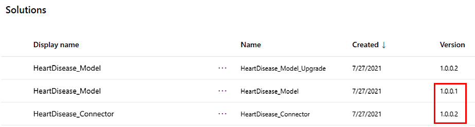

1. To upgrade the old version, select **Apply upgrade**.

   > [!div class="mx-imgBorder"]
   > 

All components in the environment now reference the new version of the model.

### See also

[Overview of application lifecycle management](/power-platform/alm/overview-alm) 
[ALM basics](/power-platform/alm/basics-alm) 
[Import solutions](/powerapps/maker/data-platform/import-update-export-solutions) 
[Upgrade or update a solution](/powerapps/maker/data-platform/update-solutions)
