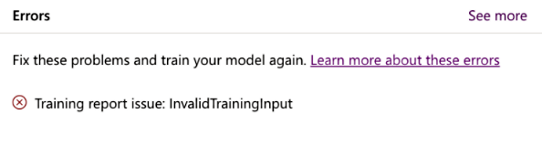
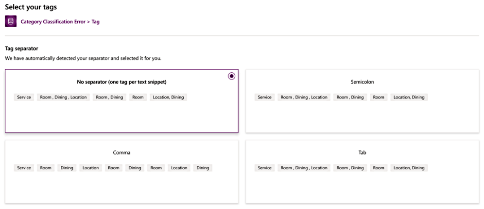

# Category classification model training errors and warnings

While training the category classification model, you might come across the messages in this article that AI Builder might report. Messages are either *errors* or *warnings*. Each is represented by an icon.

|Message |Icon  |
|---------|---------|
|Error   |         |
|Warning | 

When an error occurs, you can't continue until you resolve it. If the system is unable to correct a problem, it will show you an error.

Warnings are messages reported as informational. They don't stop you from proceeding. They warn you of possible performance issues when training the model.

## Error: InvalidTrainingInput

> [!div class="mx-imgBorder"]
> 

### Cause

Following are the possible causes for receiving this error:

- You've supplied fewer than 10 distinct training records per tag in your table.

- You've supplied fewer than two tags, where each has 10 or more distinct training records in your table.

- For each of your tags, you've supplied fewer than 10 distinct training records that don't contain the tag.

### Resolution

Add a minimum of 10 distinct training records for each of the tags to be identified. Follow the guidelines in [Before you build a category classification model](before-you-build-text-classification-model.md#data-preparation) to do the data preparation.

## Error: No tag separator recommended

In the training step, you're prompted to choose **No separator** as the tag separator.

> [!div class="mx-imgBorder"]
> 

### Cause

This error will occur if the tag separator used a mix of more than one separator.

### Resolution

If you know you have data tagged with multiple tags, recheck the tag separator for each. You must use a single tag separator across all data rows.

## Warning: Missing tags for some records

For the new records being created, you find that tags are missing for some records.

### Cause 

This will happen if you didn't provide a minimum of 10 sample text records for the tag while training the model.

### Resolution

Add more sample text for the tag with missing data and retrain the model.

### See also

[Train your category classification model](train-text-classification-model.md)
