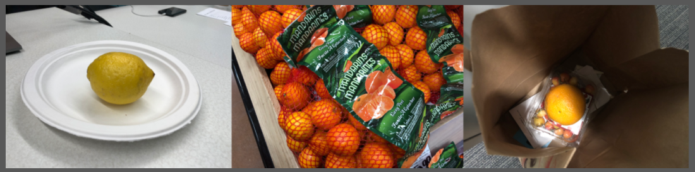
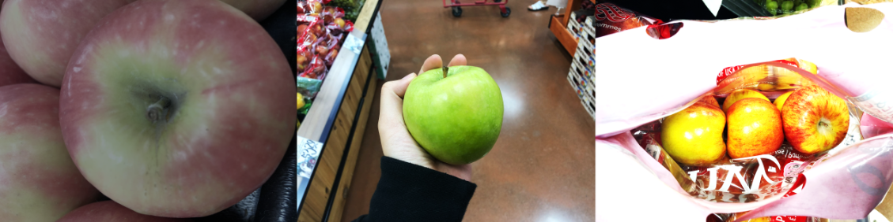
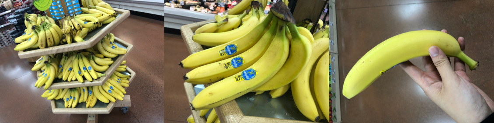
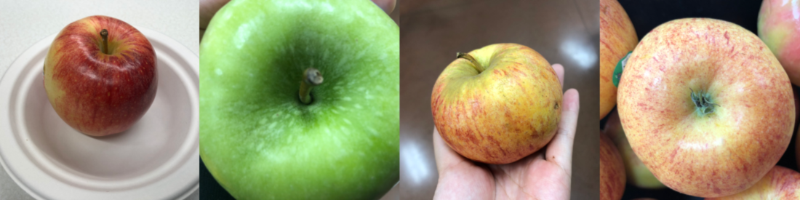
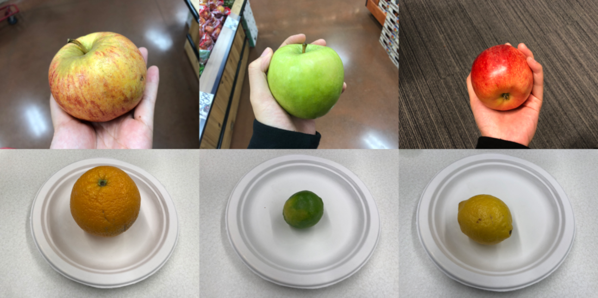

# Collect images

[!INCLUDE[cc-beta-prerelease-disclaimer](./includes/cc-beta-prerelease-disclaimer.md)]

To train an object detection model to recognize your objects, you have to gather images that contain these objects. Adhere to guidelines on the image quantity and quality for better results.

## Format and size

The images you’ll feed your object detection model need these characteristics:

- **Format**:

    - JPG
    - PNG
    - BMP
  
- **Size**:

    - 6 MB maximum

## Data quantity and data balance

It's important to upload enough images to train your AI model. At least 15 images per object for the training set are a starting point. With fewer images, there's a strong risk that your model will learn concepts that are just noise, or not relevant. Training your model with more images should increase the accuracy.

Another consideration is to make sure your data is balanced. If you have 500 images for one object and only 50 images for another, your training dataset isn't balanced. This can cause the model to be better at recognizing one of the objects. For more consistent results, maintain at least a 1:2 ratio between the object with the fewest images vs. the one with the most. For example, if the object with the greatest number of images has 500 images, the object with the fewest images should have at least 250 images for training.

## Use more diverse images

Provide images that are representative of what will be submitted to the model during normal use. For example, let's say you're training a model to recognize apples. If you only train images of apples on plates, it might not consistently recognize apples in trees. Including different kinds of images will make sure that your model isn't biased and can generalize well. Below are some ways you can make your training set more diverse.

### Background

Use images of your objects in front of different backgrounds. For example, fruit on plates, in hands, and on trees. Photos in context are better than photos in front of neutral backgrounds because they provide more information for the classifier.

> [!div class="mx-imgBorder"]
> 

### Lighting

Use training images that have different lighting, especially if the images used for detection might have different lighting. For example, do your images include images taken with flash, high exposure, and so on. It's also helpful to include images with varied saturation, hue, and brightness. Your device camera probably lets you control these settings.

> [!div class="mx-imgBorder"]
> 

### Object size

Provide images in which the objects are of varied sizes, capturing different parts of the object. For example, a photo of bunches of bananas and a closeup of a single banana. Different sizing helps the AI generalize better.

> [!div class="mx-imgBorder"]
> 

### Camera angle

Try to provide images taken from different angles. If all your photos are from a set of fixed cameras such as surveillance cameras, assign a different label to each camera. This can help avoid modeling unrelated objects such as lampposts as the key feature. Assign camera labels even if the cameras capture the same objects

> [!div class="mx-imgBorder"]
> 

### Unexpected results

AI models can incorrectly learn characteristics that your images have in common. Let's say you want to create an AI model to distinguish apples from citrus. If you use images of apples in hands and of citrus on white plates, the AI model might train for hands versus white plates instead of apples versus citrus.

> [!div class="mx-imgBorder"]
> 

To correct this, use the above guidance on training with more varied images: provide images with different angles, backgrounds, object size, groups, and other variants.

### Next step

[Get started](get-started-with-object-detection.md) with object detection.
