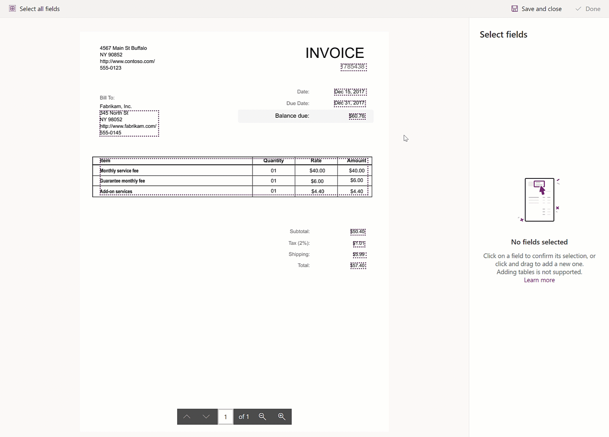
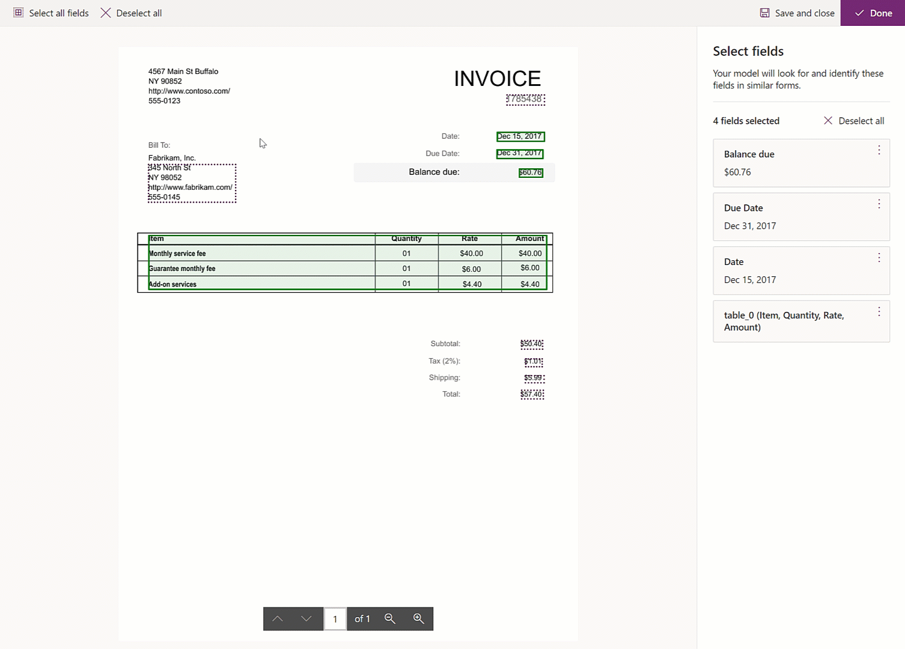
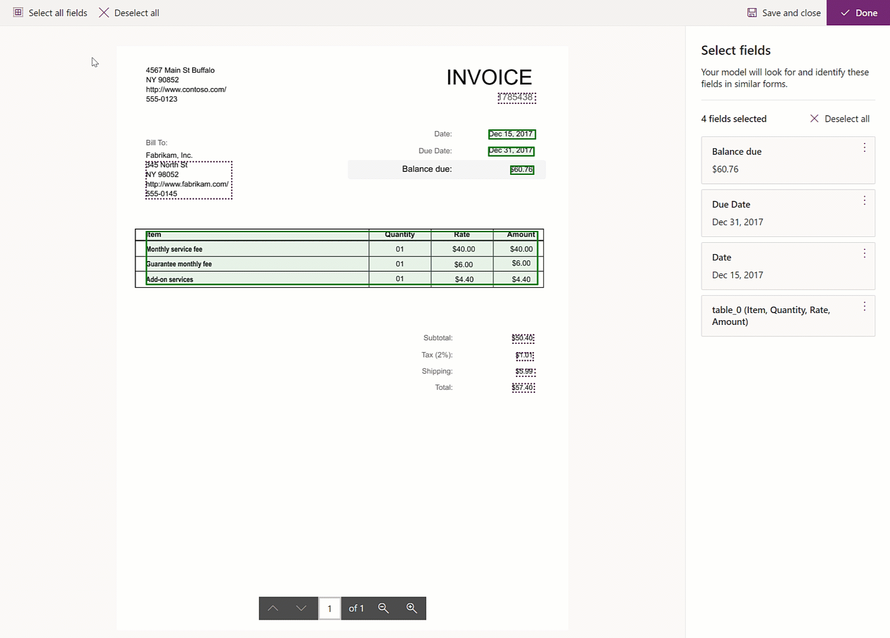
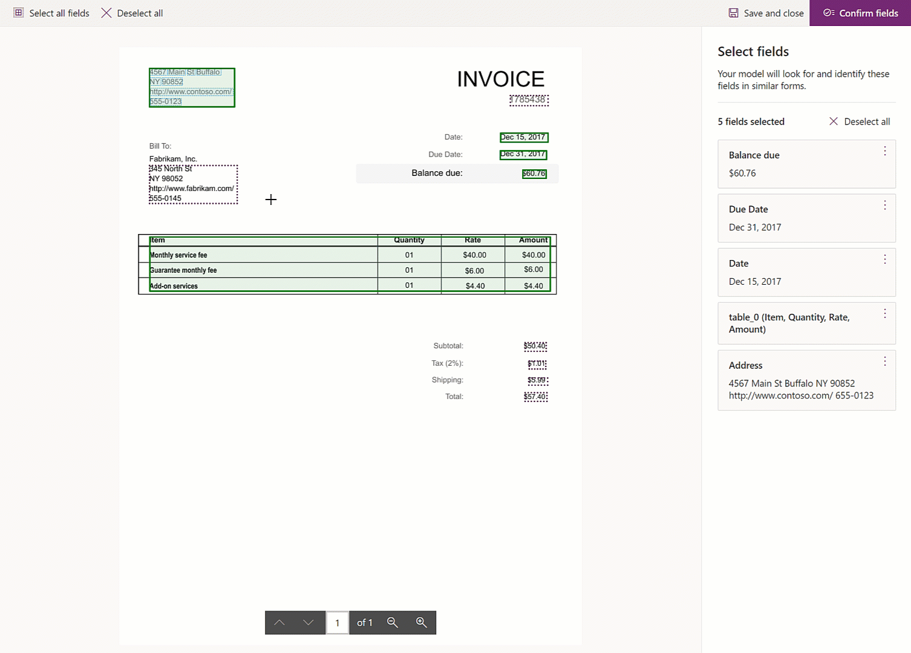
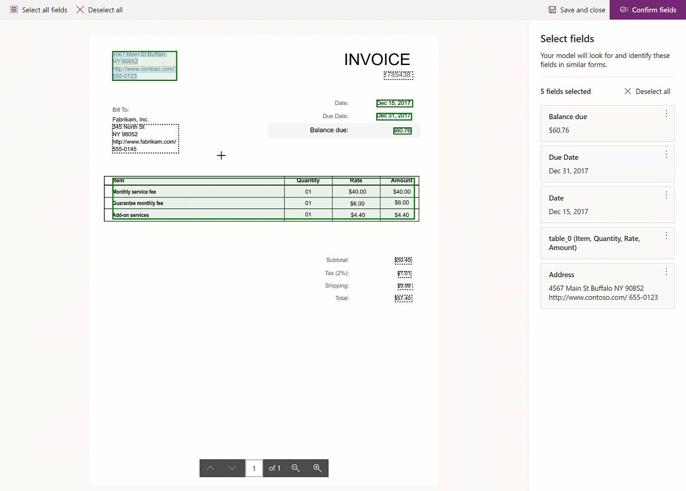
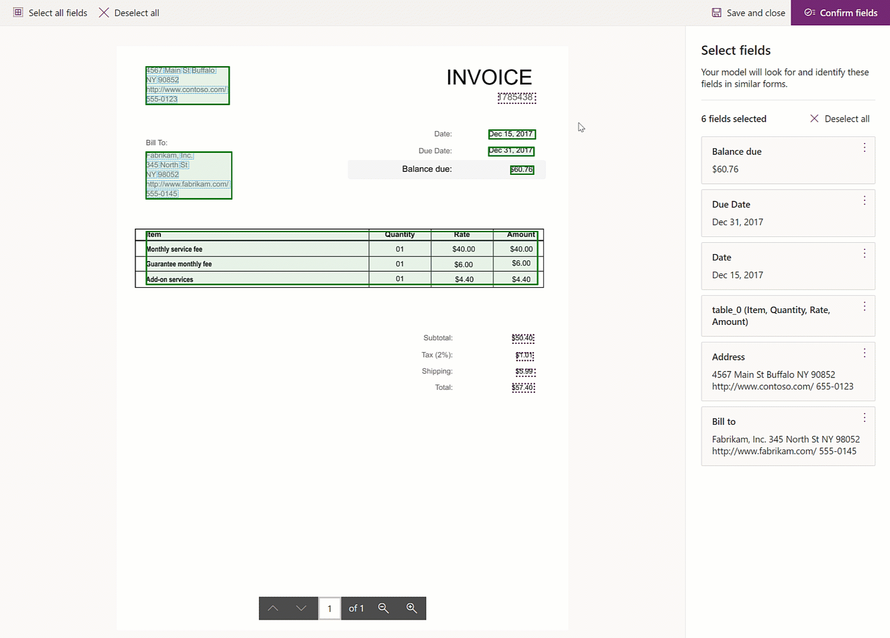
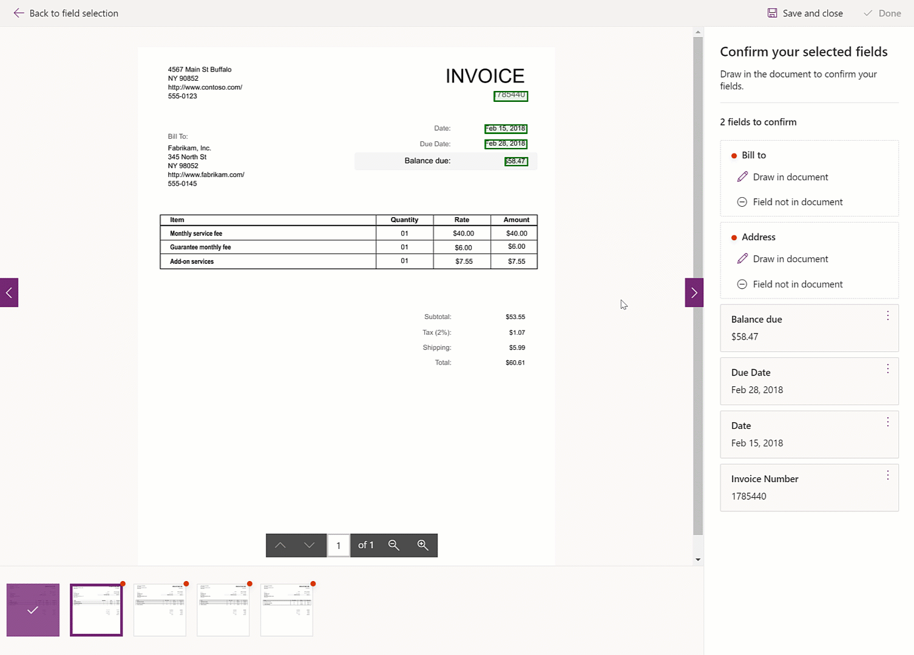

# Create a form processing model

After you review the [requirements](form-processing-model-requirements.md), you can get started creating your form processing model

## Sign into AI Builder

Follow these steps to sign into AI Builder:
1. Go to [Power Apps](https://make.powerapps.com/) or [Power Automate](https://flow.microsoft.com/signin) and sign in with your organizational account.
1. In the left pane, select **AI Builder** > **Build**.
1. Select **Form processing**.
1. Enter a name for your model.
1. If you want to create your model by using your own documents, make sure that you have at least five examples that use the same layout. Otherwise, you can use sample data to create the model.
1. Select **Create**.

## Upload and analyze documents

You need some sample documents to train your model for the type of forms you'll be working with.

1. Select **Add documents**.
 
   > [!div class="mx-imgBorder"]
   > 

1. Select at least five sample documents of the type of form you want to train the model for. Only JPG, PNG, and PDF files are accepted. For more information about requirements the documents, see [Requirements and limitations](form-processing-model-requirements.md).
1. Verify the selection, and then select **Upload documents**.
1. After the upload has completed, select **Close**.
1. Select **Analyze**.

   > [!div class="mx-imgBorder"]
   > 

### Analyze

During the analysis step, AI Builder examines the documents that you upload, and detects the fields and tables in your document. The time to complete this operation depends on the number of documents provided, but in most cases, it should only take a few minutes.

When the analysis has finished, select the thumbnail to open the field selection experience.

## Select form fields

### Fields and tables that are automatically detected

To help you get started, some fields and tables have been automatically detected for you. They're shown by dotted rectangles. If you want your model to return those fields, you just have to click to select them and validate the selection. 

   > [!div class="mx-imgBorder"]
   > 

### Fields that are not detected automatically

Some fields in your document might not have been automatically detected by AI Builder. Draw a rectangle around the field you're interested in, give it a name, and validate the selection. 

   > [!div class="mx-imgBorder"]
   > 

When you hover over different words in your documents, light blue boxes will be shown. This indicates that you can draw a rectangle around those words to select a field.

   > [!div class="mx-imgBorder"]
   > 

When you draw a rectangle to indicate a field, if your initial selection didn't pick all the words you wanted or picked additional ones, you can adjust your selection.

   > [!div class="mx-imgBorder"]
   > 

> [!NOTE] 
> Adding tables that haven't been detected is currently not supported today.

### Resizing fields that are automatically detected

If a field that you want your model to return has been automatically detected, but does not contain all the values for that field, you can adjust the selection by selecting the field, resizing the selection and validating the selection.

   > [!div class="mx-imgBorder"]
   > 

### Hiding fields

If you're finding it difficult to select fields because of automated detected field suggestions that are incorrect, or fields that are too close to each other, you can click on a selected or suggested field and hide it. To show all the hidden fields, click on the option for this that will appear on the top as you hide fields. 

   > [!div class="mx-imgBorder"]
   > 

### Rename fields

Both for automatically detected fields and fields that you manually draw, you have the option to rename them so they're easier to reference.

   > [!div class="mx-imgBorder"]
   > 

> [!NOTE] 
> Only fields can be renamed. Tables can't be renamed as of today.

### Confirming fields

If you've drawn new fields, or resized automatically detected fields, you'll be presented with all the documents that you've uploaded. In this step you'll need to draw the fields that are marked as pending on the right panel. By doing this, you're teaching your AI Builder model to recognize these fields in documents of this type.

To draw a field on a document, just start drawing a selection on the document and you'll be asked to which field it corresponds to. You can also select **Draw in document** on the fields list to the right to star the selection process for that field.

If a field isn't present on one of the documents, select **Field not in document**. 

   > [!div class="mx-imgBorder"]
   > 

### Next step

[Train and publish your form processing model](form-processing-train.md)

### Related topics

[Form processing model in Power Automate](form-processing-model-in-flow.md)  
[Form processing model in Power Apps](form-processor-component-in-powerapps.md)
