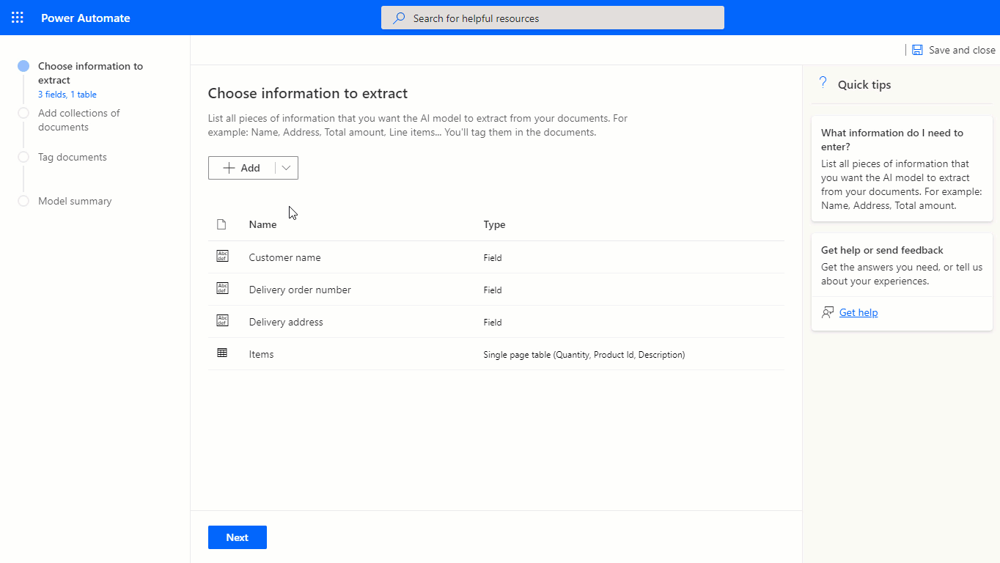
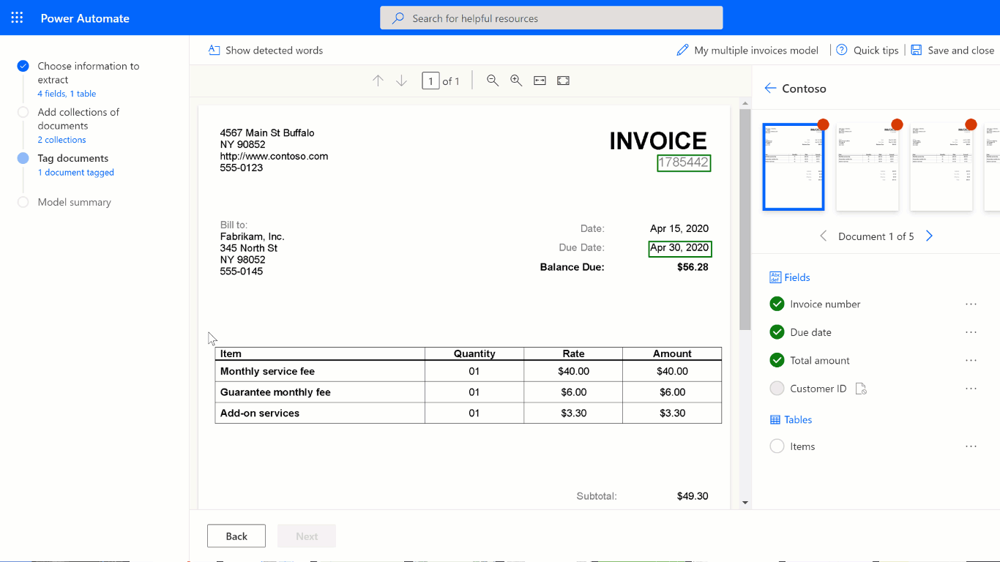
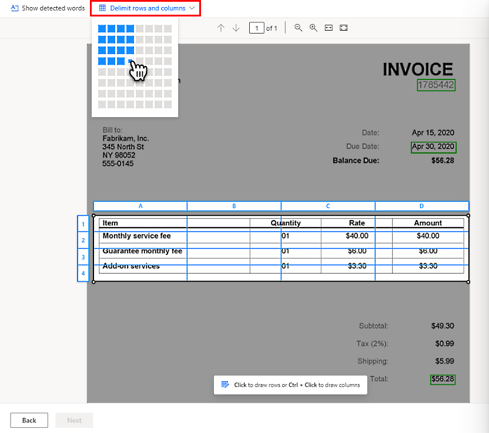
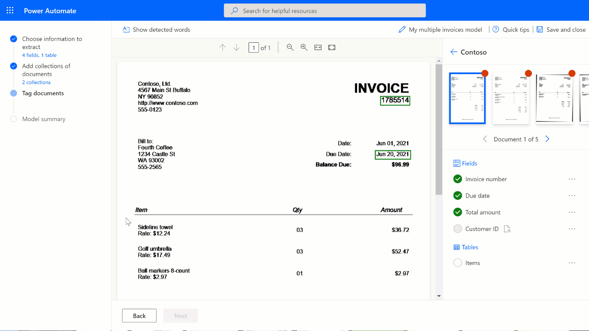
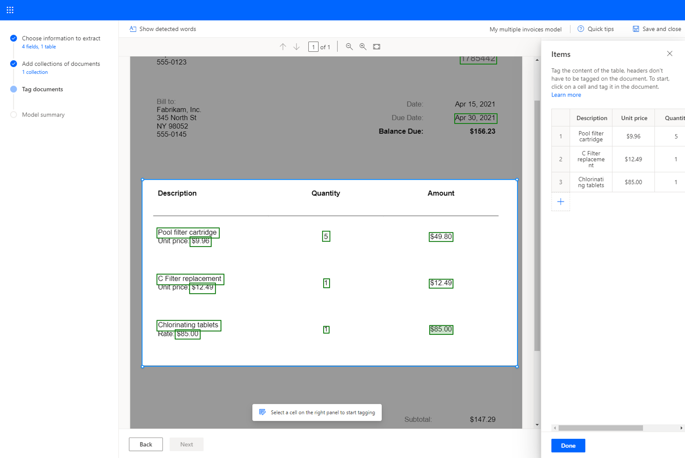
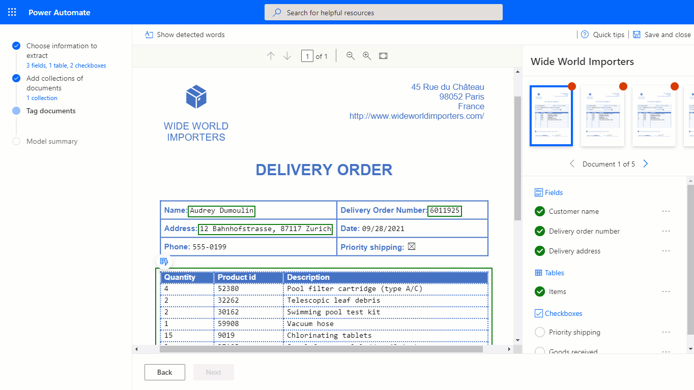

# Create a form processing custom model

After you review the [requirements](form-processing-model-requirements.md), you can get started creating your form processing model.

## Sign in to AI Builder

1. Sign in to [Power Apps](https://make.powerapps.com/) or [Power Automate](https://flow.microsoft.com/signin).

1. From the left panel, select AI Builder > Explore.

1. Select Extract custom information from documents.

1. Click on Get Started..

1. A step-by-step wizard will walk you through the process by asking you to list all data you want to extract from your document, make sure that you have at least five examples that use the same layout. Otherwise, you can [use sample data](form-processing-sample-data.md) to create the model.

1. Click on Train.
 
1. Test the model by selecting Quick test.

## Define information to extract

On the **Choose information to extract** screen, you define the fields, tables, and checkboxes you want to teach your model to extract. Select the **+Add** button to start defining these.

- For each field, provide a name you would like the field to have in the model.

   > [!div class="mx-imgBorder"]
   > 

- For each table, provide the name you would like the table to have. Also, define the different columns that the model should extract.

   > [!div class="mx-imgBorder"]
   > 

- For each checkbox, provide a name you would like the checkbox to have in the model. Define separate checkboxes for each item that can be checked in a document.

   > [!div class="mx-imgBorder"]
   > 

## Group documents by collections

A collection is a group of documents that share the same layout. Create as many collections as document layouts that you want your model to process. For example, if you're building an AI model to process invoices from two different vendors, each having their own invoice template, create two collections.

   > [!div class="mx-imgBorder"]
   > 

For each collection that you create, you need to upload at least five sample documents per collection. Files with formats JPG, PNG, and PDF files are currently accepted.

   > [!div class="mx-imgBorder"]
   > 

 > [!NOTE]
 > You can create up to 200 collections per model.

## Tag documents

By tagging the documents you've uploaded, you're teaching your AI Builder model to extract the fields and tables you've specified.

To start tagging, select one of the collections on the right panel.

### Tag fields

To tag a field, draw a rectangle around the field you're interested in and select the field name that it corresponds to.

   > [!div class="mx-imgBorder"]
   > 

At any time, you can resize to adjust your selection.

When you hover over words in your documents, light blue boxes may appear. These indicate that you can draw a rectangle around those words to select a field.

   > [!div class="mx-imgBorder"]
   > 

### Tag tables

1. Draw a rectangle around the table in the document you're interested in, and then select the table name that it corresponds to. The content of the panel on the right will change.

1. Draw *rows* by left-clicking between row separators.

1. Draw *columns* by pressing **Ctrl** + left-click.

1. Once the rows and columns have been set, assign the headers to extract by selecting the header column and mapping it to the desired one.

1. A preview of how the table will be extracted appears on the panel on the right.

1. If the header of the table has been tagged, select **Ignore first row** so the header of the table isn't extracted as the table content.

The following animation illustrates the process:

   > [!div class="mx-imgBorder"]
   > 

An alternative way to define the rows and columns for a table is by selecting **Delimit rows and columns** at the top of the screen.

   > [!div class="mx-imgBorder"]
   > 

### Use the advanced tagging mode

Advanced tagging mode allows you to tag tables at the cell level. Use this mode for complex tables like:

- Tables that are skewed, where tagging with a grid is not possible.
- When you need to extract nested items, like an item within a cell. 

Given the table from the following example, to extract the unit price, we'll define it as a separate column on the [Choose information to extract step](create-form-processing-model.md#define-information-to-extract). We define **Description**, **Unit price**, **Quantity**, and **Amount** each as a column of the table and tag them accordingly using advanced tagging mode. See the animation below.

   > [!div class="mx-imgBorder"]
   > 

You can start tagging in the default mode to quickly capture all rows and columns. Then switch to advanced mode to adjust each cell and tag nested items.

### Nested items in tables

You can tag items that are nested within a row by defining these as columns. Given the table from the example below, to extract the unit price, define it as a separate column on the [Choose information to extract step](create-form-processing-model.md#define-information-to-extract) earlier in this topic. Define **Description**, **Unit price**, **Quantity**, and **Amount** each as a column of the table and then tag them accordingly.

   > [!div class="mx-imgBorder"]
   > 

### Multipage tables

AI Builder supports extracting tables that span across multiple pages as a single table with an experimental feature. For details, go to [Process multipage tables in form processor (experimental)](form-processing-multipage.md).

If you don't want to try the experimental feature, you can extract tables from different pages by defining each page as a separate table in the [Choose information to extract step](create-form-processing-model.md#define-information-to-extract). For example, if you have a document with a table that spans over two pages, you'll need to define them as two separate tables.

### Tag checkboxes

To tag a checkbox, draw a rectangle around the checkbox you're interested in extracting and select the checkbox name that it corresponds to.

   > [!div class="mx-imgBorder"]
   > 

If the quality of the document is low, AI Builder might not be able to detect the checkbox. If you're unable to tag a checkbox, do the following:

1. On the panel on the right, select the three dots next to the checkbox you want to extract.

1. Select **Not available in document**.

AI Builder supports detection and extraction of selection marks such as checkboxes and radio buttons, with different markers to indicate whether the selection is marked or not.

### Field, checkbox, or table not in document

If a field, checkbox, or table isn't present in one of the documents you've uploaded for training, select **Not available in document** on the panel to the right, next to a field, checkbox, or table.

   > [!div class="mx-imgBorder"]
   > 

## Tag all documents across all collections

All the documents that you've uploaded are presented for you to tag. Some of the fields might be automatically detected in successive documents. In that case, confirm that the selection is correct.

If you've created multiple collections, tag all documents across all the collections.

### Next step

[Train and publish your form processing model](form-processing-train.md)

[!INCLUDE[footer-include](includes/footer-banner.md)]
