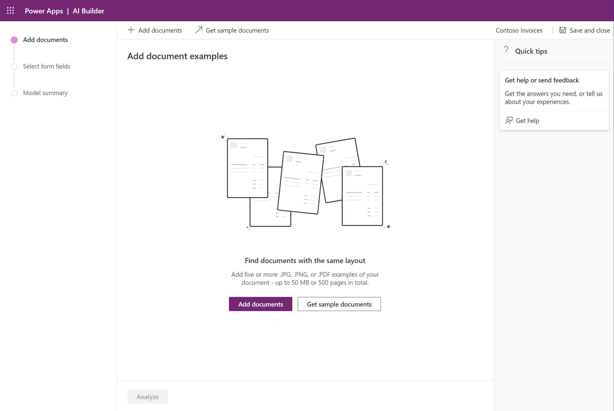
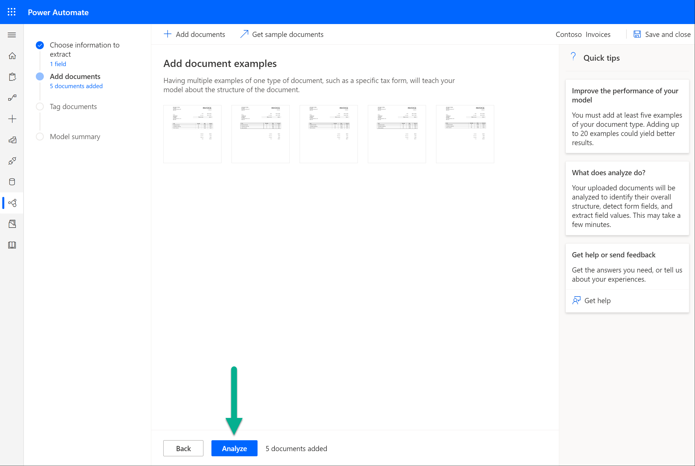
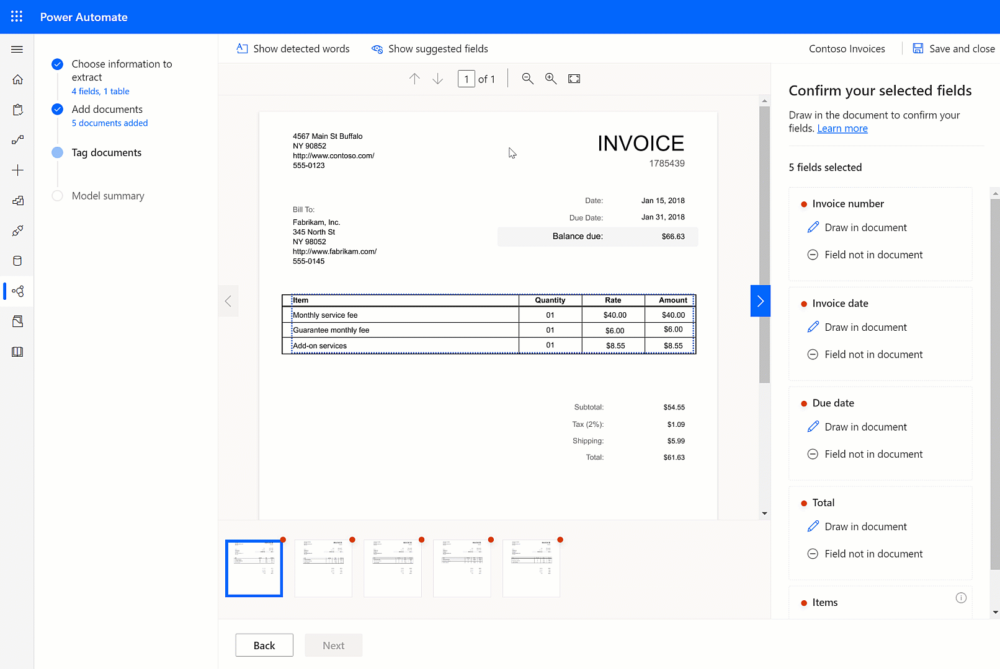
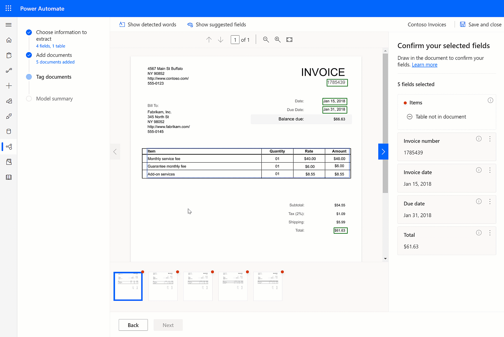

# Create a form processing model

After you review the [requirements](form-processing-model-requirements.md), you can get started creating your form-processing model.

## Sign in to AI Builder

1. Go to [Power Apps](https://make.powerapps.com/) or [Power Automate](https://flow.microsoft.com/signin), and sign in with your organizational account.
1. In the left pane, select **AI Builder** > **Build**.
1. Select **Form processing**.
1. Type a name for your model.
1. If you want to create your model by using your own documents, make sure that you have at least five examples that use the same layout. Otherwise, you can use sample data to create the model.
1. Select **Create**.

## Define fields and tables to extract

In this step you define the fields and tables you want to teach your model how to extract.

   > [!div class="mx-imgBorder"]
   > 

## Upload and analyze documents

You need some sample documents to train your model for the type of forms you'll be working with.

1. Select **Add documents**.
 
   > [!div class="mx-imgBorder"]
   > 

1. Select at least five sample documents that represent the type of forms you you want to train the model for. Only JPG, PNG, and PDF files are accepted. 
1. Verify the selection, and then select **Upload documents**.
1. After the upload is completed, select **Close**.
1. Select **Analyze**.

   > [!div class="mx-imgBorder"]
   > 

### Analyze

During the analysis step, AI Builder examines the documents that you uploaded, and detects the fields and tables in your document. The time it takes to complete this operation depends on the number of documents provided, but in most cases, it should only take a few minutes.

When the analysis has finished, select the thumbnail to open the field selection experience.

## Tag documents

### Tag fields

To tag a field, simply draw a rectangle around the field you're interested in and select to which field name it corresponds to. 

   > [!div class="mx-imgBorder"]
   > 

At anytime you can resize to adjust your selection.

When you hover over different words in your documents, light blue boxes appear. These indicate that you can draw a rectangle around those words to select a field.

   > [!div class="mx-imgBorder"]
   > 

### Tag tables

AI Builder can detect tables in your documents. These are highlighted on a dotted rectangle. Select the detected table you want and assign it to the table you have defined on the previous step.

   > [!div class="mx-imgBorder"]
   > 

> [!NOTE] 
> Drawing tables that haven't been automatically detected isn't currently supported. If you defined a table that is not automatically detected, go back to the **Choose information to extract** step and remove that table.

### Field or table not in document

If a field or table is not present in one of the documents you have uploaded for training, just use the **Field not in document** (or Table not in document) option. 

   > [!div class="mx-imgBorder"]
   > 

### Tag all documents 

All the documents that you have uploaded are presented for you to tag. Some of the fields might be automatically detected in successive documents, in that case confirm that the selection is correct.

### Next step

[Train and publish your form-processing model](form-processing-train.md)

### See also

[Use a form-processing model in Power Automate](form-processing-model-in-flow.md)  
[Use the form-processor component in Power Apps](form-processor-component-in-powerapps.md)
