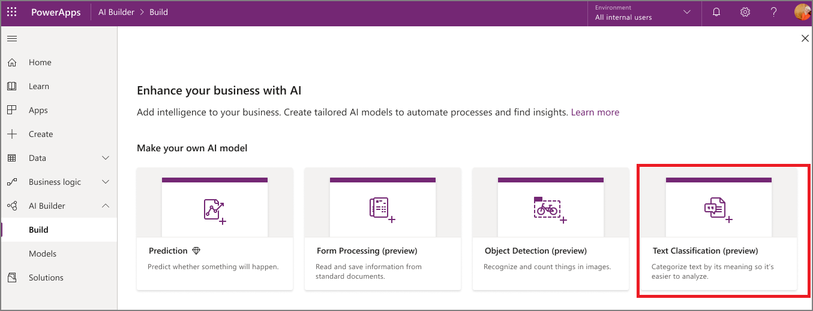

# Create a category classification model

Now that you have your training data in Common Data Service, you can create a new model and configure it.

1. Sign in to [Power Apps](https://make.powerapps.com/), and then select **AI Builder** > **Build**.

    > [!div class="mx-imgBorder"]
    > 

2. Select the **Category classification** AI Builder AI model type, name your model, and then select **Create**.
3. Select **Select text**, select the entity, and then select the field where your training text is stored.
4. Select **Select tags**, select the field where the tags are stored, and then select the separator you used for your tags.
5. Preview your selection to verify the data and the configuration you applied.
6. Select the language you want to use for training, and then select **Next**.

That's it! Now you can train your AI model.

### Next step

[Train your category classification model](train-text-classification-model.md)
