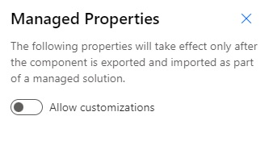

# Distribute your AI model
You can distribute an AI model as a **solution component**. After you create a model in AI Builder, make it available for other environments to use by packaging it into a solution and then exporting it into a zip file. After the solution is imported in the target environment, the packaged AI model is available for use. More information: [Introduction to solutions](/powerapps/developer/common-data-service/introduction-solutions)

## Solution explorer
Use the Power Apps solution explorer to create solutions and add components&mdash;such as AI models&mdash;to them. You can also export and import solutions by using the solution explorer. More information: [Use solutions in Power Apps](/powerapps/maker/common-data-service/use-solution-explorer)

## Recommended process
It's a good idea to **develop AI models in a sandbox or development environment first**. Then deploy them to a production environment by using managed solutions. If you need to copy your production environment into a sandbox environment, you can follow [these instructions](/power-platform/admin/copy-environment).

Using this process, you can use the model immediately after you import it. No additional action is required to use it in Power Apps or Power Automate, but it's a good idea to perform a quick test in AI Builder first.

**A model can only be added in a solution when it has a published version**. When the solution is exported and imported in a new environment, only the published version of the model is installed in the new environment.

> [!NOTE]
> When adding an AI model in a solution, only the model "executable" is inluded, **the training data is not included with the model**.

## Automating the process
As AI models can be distributed across environment using solutions, you can automate your model lifecyle the same way you would do for other platform components. Learn more about [Application lifecycle management (ALM) with Microsoft Power Platform](/power-platform/alm).

## Changing imported models
Generally, **we don't recommend doing any change on imported models**, because it generates unmanaged customizations that can prevent the model from being properly updated in the future. Changes include: updating model information, creating and training new versions, or republishing the model. 

**For some models, creating and training new versions has even been disabled** because training data is not moved alongside the model. That's the case for document processing, object detection and entity extraction models.

If you accidentally perform actions after you've imported, just delete the imported solution and then import the solution again.

To avoid accidental modification of a model after import, a good idea could be to disable customization in the managed properties of the model before importing it: From within the solution, select **Managed properties** in the top menu and turn off **Allow customizations**:
> [!div class="mx-imgBorder"]
> 

After you've disabled customization, your model will include a note that you have limited the possible actions on it.

## Importing status
For document processing and object detection models, the import process might continue after the import action is finished. In this case, "Importing" appears on the list page of the AI Builder model. This is normal and can last several minutes.

## Limitations
* Document processing models where **Unstructured and free-form documents** has been selected as document type cannot be exported while the functionality is in preview. 
* **You can't create and train a new version of an imported document processing, object detection or entity extraction model**, because the training dataset isn't part of the imported solution. You should create a new model instead.
* You can’t set run schedule on imported category classification models.
* Importing an object detection model or document processing model should be done within one month of export. However, you can still import after that period if the source model remains unchanged after its export.
* If you're using a model within an app or a Power Automate flow, you need to explicitly add the app and the model to the solution. The model isn't considered an app or flow dependency.
* You can't create a new AI Builder model in solution explorer.
* Only models trained after April 2nd, 2020, can be added to a solution.

[!INCLUDE[footer-include](includes/footer-banner.md)]
