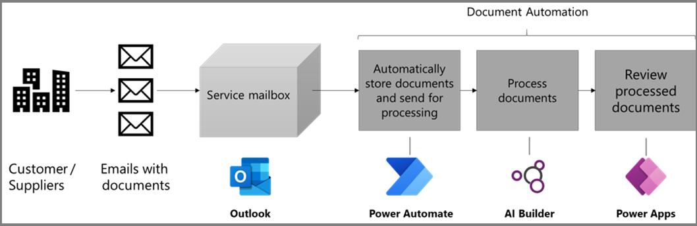

# Document automation toolkit

The Document automation toolkit allows you to easily set up a rich and robust document processing solution using AI Builder, Power Automate, Power Apps, and Microsoft Dataverse.

> [!div class="mx-imgBorder"]
> 

Power Automate will orchestrate the overall process while AI Builder will bring the intelligence required to efficient extract information from documents. Power Apps will allow users to manually review and approve documents, and Dataverse will manage the document queue, store all the data, files, and configuration information.

## Get started

You can access the [document automation toolkit](https://flow.microsoft.com/manage/aibuilder/documentautomation) in Power Automate.

## Learn about the toolkit

To get step-by-step instructions on how to install, configure, and use the document automation kit, go to [Training: Automate the processing of documents with the AI Builder prepackaged solution (module)](/training/modules/get-started-ai-builder-document-automation/).

## Related information

[Create a document processing model](create-form-processing-model.md)

[!INCLUDE[footer-include](includes/footer-banner.md)]
