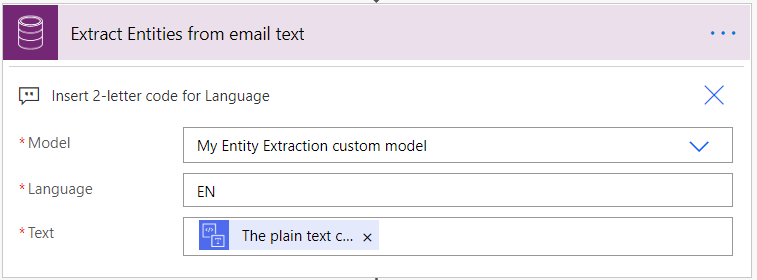
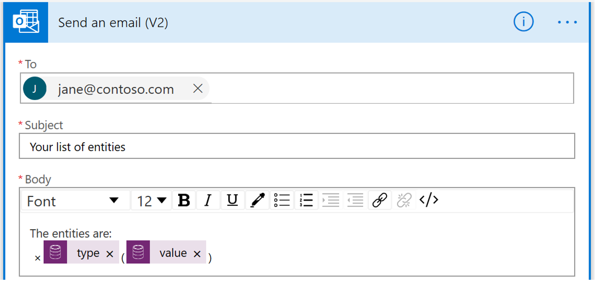

# Use a custom entity extraction AI model in Power Automate (preview)

[!INCLUDE[cc-beta-prerelease-disclaimer](./includes/cc-beta-prerelease-disclaimer.md)]

> [!IMPORTANT]
 > To use AI Builder models in Power Automate, you have to create the flow inside a solution. The steps below won't work if you don't follow these instructions first: [Create a flow in a solution](/flow/create-flow-solution).

1. Sign in to [Power Automate](https://flow.microsoft.com/), select the **My flows** tab, and then select **Automated-from blank**.
1. Search for the term **email**, select **When an email arrives (V3)** in the list of triggers, and then select  **Create**.
1. Select **+ New step**, search for the term *html to text*, and then select **Html to text** in the list of actions.
1. Select the **Body** parameter.  This tells the entity extraction model to only analyze actual email text.

   > [!div class="mx-imgBorder"]
   > 
1. Select **+ New step**, search for *predict*, and then select the **Predict Common Data Service (current Environment)** action.
   > [!div class="mx-imgBorder"]
   > 
1. Select your published custom entity extraction model.
   > [!div class="mx-imgBorder"]
   > 
1.	Select **+ New Step** and search for send email and select the **Send an email** action.
1. Complete the necessary fields to send the list of entities in the email: **To**, **Subject**, and **Body**. In the **Body** field, select from the available dynamic content entities.
   > [!div class="mx-imgBorder"]
   > 

Congratulations! You've created a flow that uses a entity extraction model. Select **Save** on the top right and then select **Test** to try out your flow.
