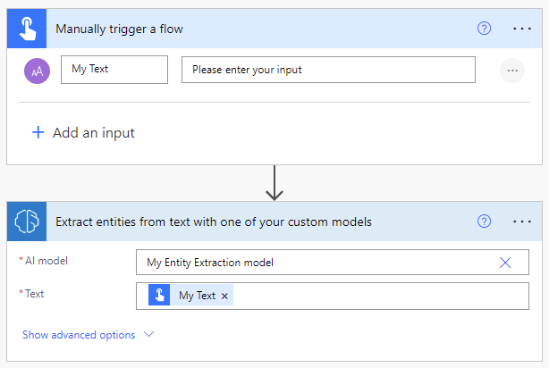
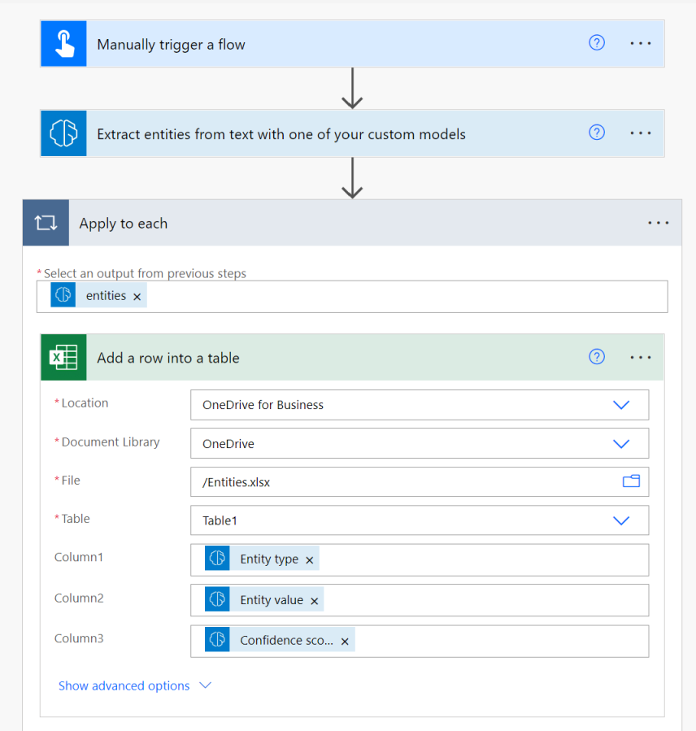

# Use an AI Builder custom entity extraction AI model in Power Automate

1. Sign in to [Power Automate](https://flow.microsoft.com/), select the **My flows** tab, and then select **New > +Instant-from blank**.
1. Name your flow, select **Manually trigger a flow** under **Choose how to trigger this flow**, and then select **Create**.
1. Expand **Manually trigger a flow**, select **+Add an input**, select **Text** as the input type, and set as input title **My Text**.
1. Select **+ New step**, search for **AI Builder** in the Search for filters and actions box, and then select **Extract entities from text with one of your custom models** in the list of actions.
1. Select the entity extraction model you want to use, and in the **Text** column add **My Text** from the trigger.

    > [!div class="mx-imgBorder"]
    > 

1. In the successive actions, you can use any columns and tables extracted by the AI Builder model. The following example saves each inferred **Entity type**, **Entity value** and **Confidence score** into an Excel table.

    > [!div class="mx-imgBorder"]
    > 

Congratulations! You've created a flow that uses an AI Builder entity extraction model. Select **Save** on the top right, and then select **Test** to try out your flow.

## Parameters

### Input

|Name |Required |Type |Description |Values |
|---------|---------|---------|---------|---------|
|**AI model** |Yes |model |Entity extraction model to use for analysis|Trained and published entity extraction model |
|**Text** |Yes |string |Text to analyze|Text sentences |
|**Language** |Yes |string |Language of the text to analyze|"Detect automatically" or language code (ex.: "en", "fr", "zh_chs", "ru") |

### Output

|Name |Type |Description |Values |
|---------|---------|---------|---------|
|**Entity type** |string |Type of the entity|Example: DateTime or Organization |
|**Entity value** |string |Content of the entity|Example: June 1 or Contoso |
|**Confidence score** |float |How confident the model is in its prediction|Value in the range of 0 to 1. Values close to 1 indicate greater confidence that the extracted value is accurate |
|**Starting location** |integer |Where the entity's first character appear in the line| |
|**Character count** |integer |How long the entity is| |

### See also

[Entity extraction model overview](entity-extraction-overview.md)

