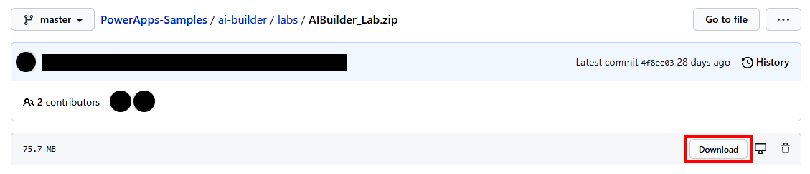
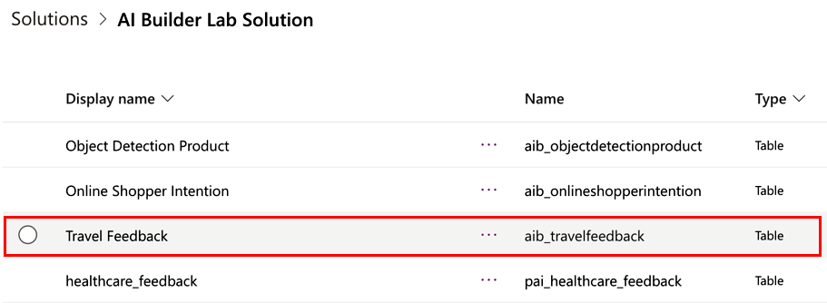
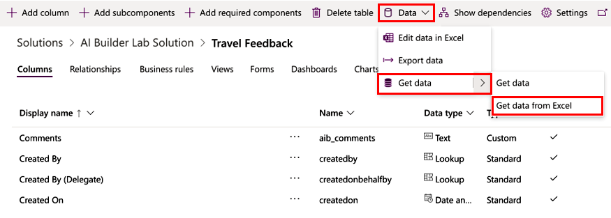
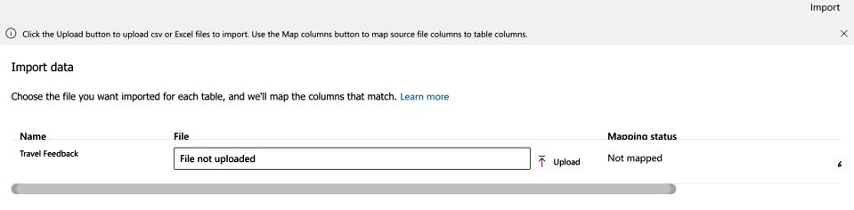
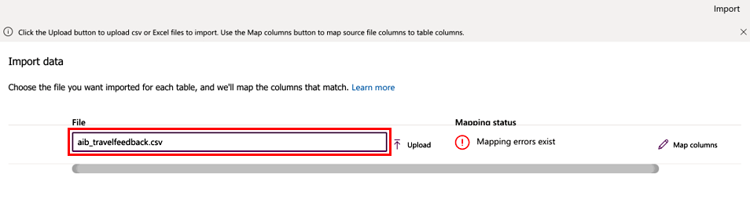
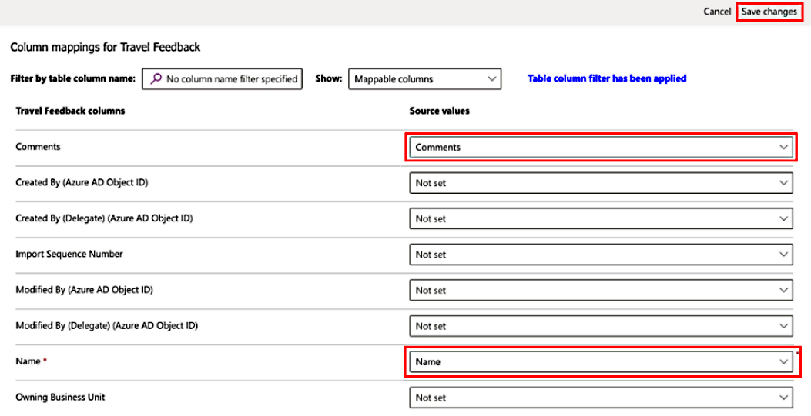
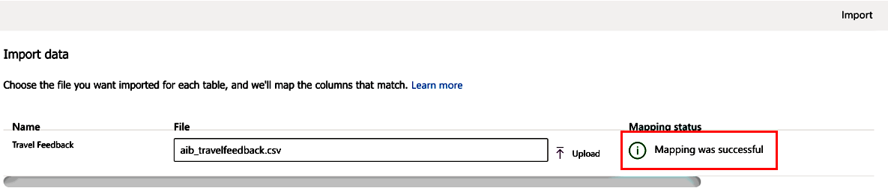

# Use sample data to do entity extraction

You can get started with the entity extraction model using sample data. The sample data provided refers to feedback or conversations related to travel. The intent is to use the entity extraction AI model to extract and identify entities related to places, persons, organizations, date, time, and a custom entity type: **Location Type**.

## Get the sample data

1. Download **AIBuilderLab.zip**.
<!--[AIBuilderLab.zip](https://github.com/microsoft/PowerApps-Samples/blob/master/ai-builder/labs/AIBuilder_Lab.zip). -->

   > [!div class="mx-imgBorder"]
   > 

1. Look for **AIBuilderLabSolution_1_0_0_1.zip** that contains the sample table, *Travel Feedback*.

   Sample data for this table can be found in the Lab Data\EntityClassification\aib_travelfeedback.csv.

1. Sign in to [Power Apps](https://make.powerapps.com/) and choose the environment where you've imported the solution from step 1.

1. Select **Solutions** > **AIBuilderLabs** > **Tables** > **Travel Feedback**.

   > [!div class="mx-imgBorder"]
   > 

1. Select **Data** > **Get data** > **Get data from Excel** from the ribbon.

   > [!div class="mx-imgBorder"]
   > 

     You'll see the Import data screen:

   > [!div class="mx-imgBorder"]
   > 

1. Select **aib_travelfeedback.csv**, which has the data to be imported in this table.

   > [!div class="mx-imgBorder"]
   > 

## Map the data

1. Review the column mappings by selecting **Map columns**.

1. Map the **Name** and **Comments** columns in the **Source values** column, and select **Save changes**.

   > [!div class="mx-imgBorder"]
   > 

   You'll return to the Import data screen with status updated to reflect that the mappings are complete.

   > [!div class="mx-imgBorder"]
   > 

## Import the data

1. Select **Import** on the top right for the import process to begin.

   It might take a few minutes for the import process to complete, depending on the rows included in the file provided.

1. Select the **Data** tab for the Travel Feedback table in the solution to view all the records imported.

   > [!div class="mx-imgBorder"]
   > 

## Related information

[Use Power Fx in AI Builder models in Power Apps (preview)](powerfx-in-powerapps.md)
