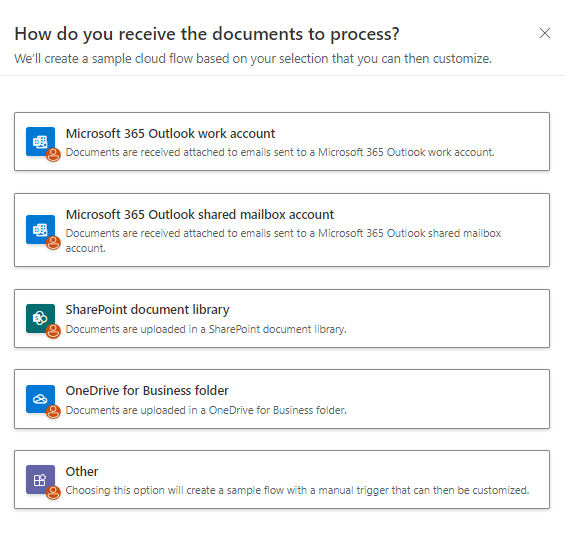
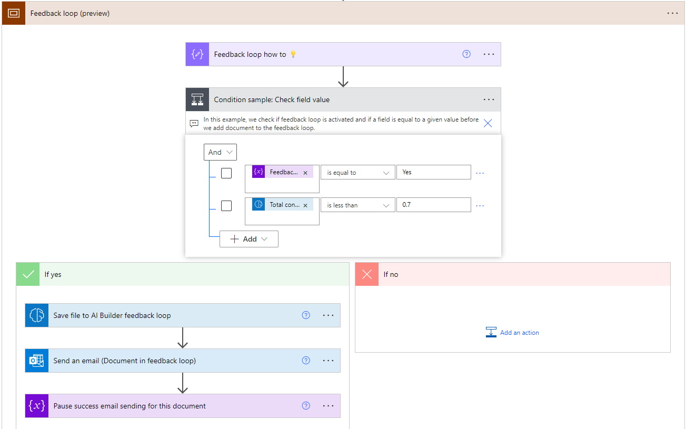
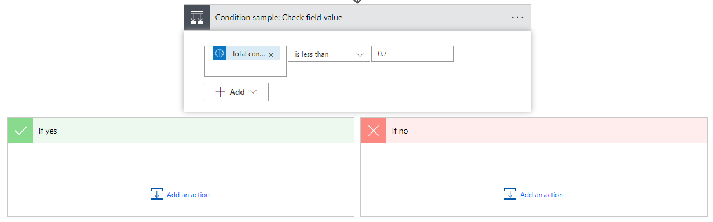
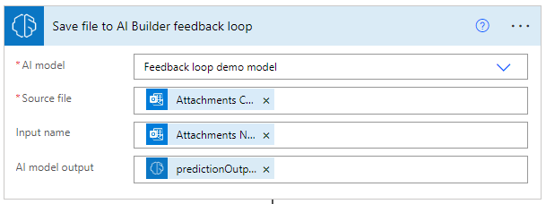
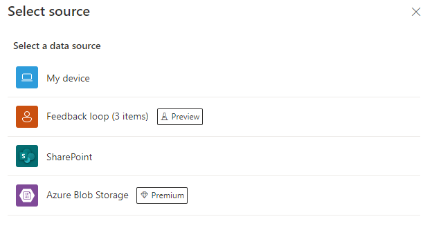

# Continuously improve your model (preview)

[!INCLUDE[cc-beta-prerelease-disclaimer](./includes/cc-beta-prerelease-disclaimer.md)]

After the model creation, it's likely that you'll need to improve your model regularly using production data. The *feedback loop* feature will help you automate this continuous process.

> [!IMPORTANT]
> - This is a preview feature.
>
> - [!INCLUDE[cc_preview_features_definition](includes/cc-preview-features-definition.md)]
>
> - Only custom document processing models are supported by the feedback loop feature.

## Select documents to add in the feedback loop

The first thing you'll have to do is select the data eligible for the feedback loop. This has to be done from within the Power Automate flow that runs your model.

### New Power Automate flow

If you don't have a Power Automate flow to run your model yet, you can create a new one from the model detail page after publishing the model.

1. Sign in to [Power Apps](https://make.powerapps.com/) or [Power Automate](https://flow.microsoft.com/signin).

1. On the left pane, select **AI Builder** > **Models**.

1. Select the model for which you'd like to set up the feedback loop.

    If your model isn't published yet, select **Publish** before continuing.

1. Select **Use model** > **Build intelligent automations**.

1. Select the template that best fits your needs.

    > [!div class="mx-imgBorder"]
    > 

1. Validate the template connections to land in the Power Automate flow authoring experience.

1. Go to the **Feedback loop (preview)** section to edit the conditions that will allow you to add data in the feedback loop storage.

    > [!div class="mx-imgBorder"]
    > 

In this example, we updated the condition stating that confidence score of the **Total** field should be less than 0.7 (70%). If it is, the data goes in the feedback loop storage.

> [!NOTE]
> The feedback loop storage is a Microsoft Dataverse table within the the same environment in which the flow runs. The table is called **AI Builder Feedback Loop**. Unless you need to delete records in the table, you don't need to access it directly to make the feedback loop work.

### Existing Power Automate flow

If you already have a flow running with your AI Builder model, you'll be able to add the feedback loop storage functionality within.

1. Sign in to [Power Automate](https://flow.microsoft.com/signin).

1. On the left pane, select **My flows**.

1. Select your Power Automate flow.

1. On the toolbar, select **Edit**.

1. After the AI Builder action card, insert a new step:
    1. Select the plus sign (+) that appears when you hover over the arrow.
    1. Select **Add an action**.

1. In the **Actions** list, select **Condition**. This is where you'll enter the condition that defines if the data needs to go in the feedback loop (yes) or not (no).

    > [!div class="mx-imgBorder"]
    > 

In this example, we added a condition stating that confidence score of the **Total** field should be less than 0.7 (70%). If it is, the data goes in the feedback loop storage.

1. In the **If yes** section:
    1. Add the action **Save file to AI Builder feedback loop**.
    1. Select the model you're using to place it in the **AI model** field.
    1. Select the source file to place it in the **Source file** field.
    1. Select the expression **predictionOutput** to place it in the **AI model output** field.

    > [!div class="mx-imgBorder"]
    > 

## Use data in the feedback loop to improve your model

Now that you have data in the AI Builder feedback loop, you can use it to improve your model.

1. Sign in to [Power Apps](https://make.powerapps.com/) or [Power Automate](https://flow.microsoft.com/signin).

1. On the left pane, select **AI Builder** > **Models**.

1. Select the model to improve using data in the feedback loop. Models that can be improved have the status **Documents to review**.

1. Select **Edit model** and continue to the wizard section to add new training data.

1. For document processing models, select the desired collection and select **Add documents**. You'll get the **Feedback loop** data source option. If documents have been added to the feedback loop, they'll appear there.

    > [!div class="mx-imgBorder"]
    > 

1. Select **Feedback loop** and add the documents that could improve your model.

1. Tag these new documents and retrain the model.

Your model is now improved with new documents coming from the feedback loop.

## Limitations

- The feedback loop feature is limited to custom document processing models.

- Feedback loop data can be added only from Power Automate flows.

- Feedback loop data can't transit between environments currently.

- The owner of the model and owner of the flow containing the feedback loop logic should be the same person.
