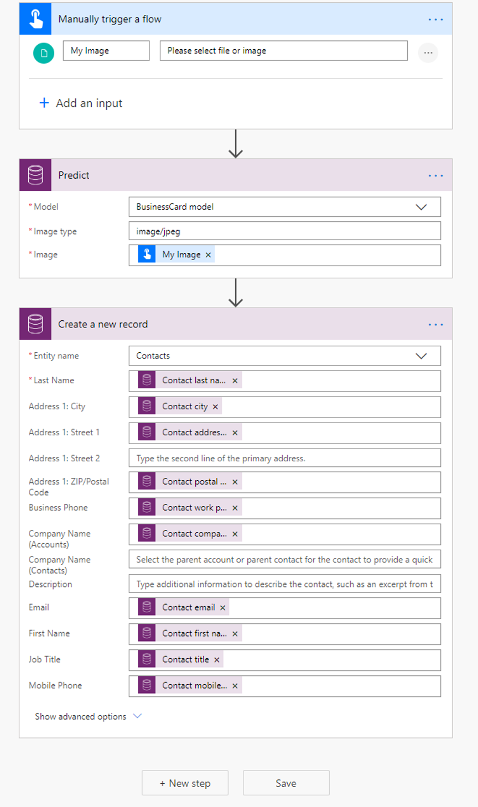

# Use the business card reader prebuilt model in Power Automate

> [!IMPORTANT]
 > To use AI Builder models in Power Automate, you have to create the flow inside a solution. The steps below won't work if you don't follow these instructions first: [Create a flow in a solution](/flow/create-flow-solution).

1. [Sign in](https://flow.microsoft.com/signin) to Power Automate, select the **My flows** tab, and then select **Create from blank**.

1. Search for the term *manually*, select  **Manually trigger a flow** in the list of triggers, and then select **+ Add an input**.
1. Select **File**, and set **My Image** as the input title.
1. Select **+ New step**, search for the term *Predict*, and then select  **Predict - Common Data Service (Current Environment)**  in the list of actions.
    >[!NOTE]
    > **Predict Common Data Service (current Environment)** does not appear if you don't follow these instructions first: [Create a flow in a solution](/flow/create-flow-solution)
1. Select the **BusinessCard model** and specify one of the following under **Image type**:
    - image/jpeg
    - image/png
    - image/bmp
1. Specify the **My Image** field from the trigger in the Image input for your flow.

Congratulations! You've created a flow that uses the business card reader AI model. Select  **Save**  on the top right, and then select  **Test**  to try out your flow.

This procedure should give you the basis from which to continue building a flow that suits your needs. The following example shows a new contact being created in Common Data Service using the business card data.

   > 
