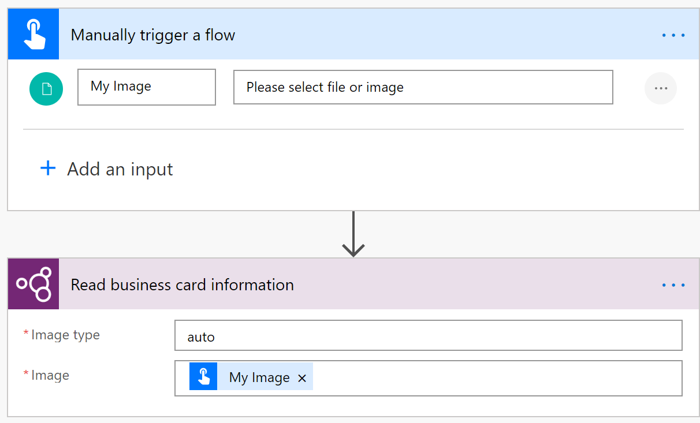
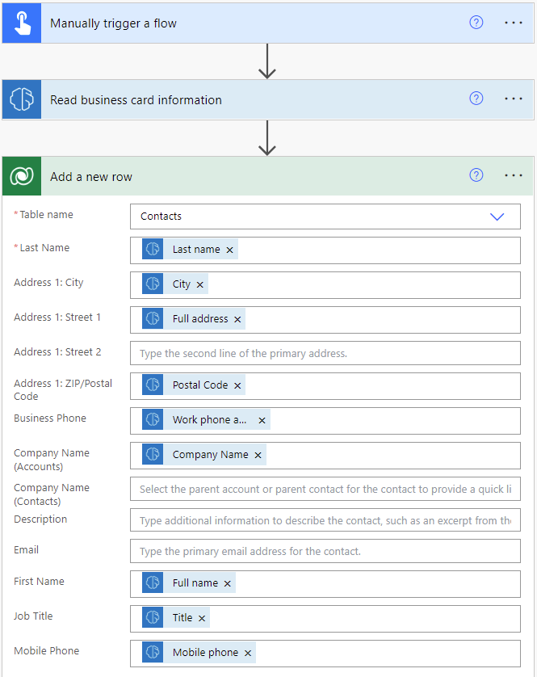

# Use the business card reader prebuilt model in Power Automate

1. Sign in to [Power Automate](https://flow.microsoft.com/).

1. Select **My flows** in the left pane, and then select **New flow** > **Instant cloud flow**.

1. Name your flow, select **Manually trigger a flow** under **Choose how to trigger this flow**, and then select **Create**.

1. Expand **Manually trigger a flow**, and then select **+Add an input** > **File** as the input type.

1. Replace  **File Content** with **My image** (also known as the title).

1. Select **+ New step** > **AI Builder**, and then select **Read business card information** in the list of actions.

1. Specify **My Image** from the trigger in the **Business card** input for your flow.

1. Select **Show advanced options** and verify that **Detect automatically** is in the **Image type** input.

    > [!div class="mx-imgBorder"]
    > 

Congratulations! You've created a flow that uses the business card reader AI model. Select **Save**, and then select **Test** in the upper-right corner to try out your flow.

## Example business card reader flow

The following example shows a new contact being created in Microsoft Dataverse using the business card data.

To add the **Add a new row** step, select **+ New step** > **Microsoft Dataverse** > **Add a new row**.

   > [!div class="mx-imgBorder"]
   > 

## Parameters

### Input

|Name |Required |Type |Description |Values |
|---------|---------|---------|---------|---------|
|**Image type** |Yes |string |Mime type of the image|"auto" as default value. This column being obsolete, any value will be accepted. |
|**Image** |Yes |file |Image file to analyze| |

### Output

|Name |Type |Description |
|---------|---------|---------|
|**City** |string |The city address|
|**Country** |string |The country address|
|**Postal Code** |string |The postal code address|
|**PO Box** |string |The post office box address|
|**State** |string |The state address|
|**Street** |string |The street address|
|**Work phone or other phone** |string |The first phone or fax number|
|**Cleaned image** |file |The image after processing where the business card appears cropped and enhanced from the original image|
|**Cleaned image type** |string |Type of the cleaned image|
|**Company name** |string |The company name|
|**Department** |string |The organization department found|
|**Email** |string |The contact email found in the business card, if any|
|**Fax** |string |The third phone or fax number|
|**First name** |string |The contact first name|
|**Full address** |string |The contact full address|
|**Full name** |string |The contact full name|
|**Title** |string |The contact job title|
|**Last name** |string |The contact last name|
|**Mobile phone** |string |The second phone or fax number|
|**Website** |string |The website|

## See also

[Business card reader overview](prebuilt-business-card.md)

[!INCLUDE[footer-include](includes/footer-banner.md)]