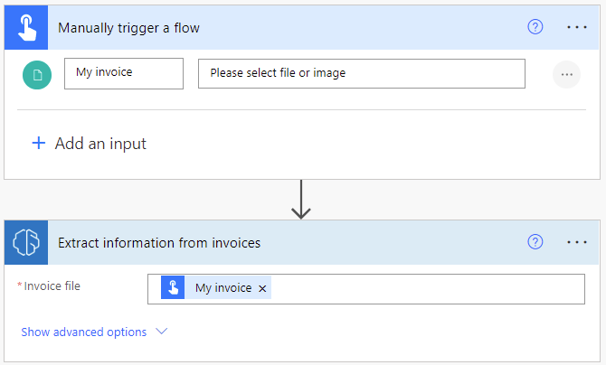
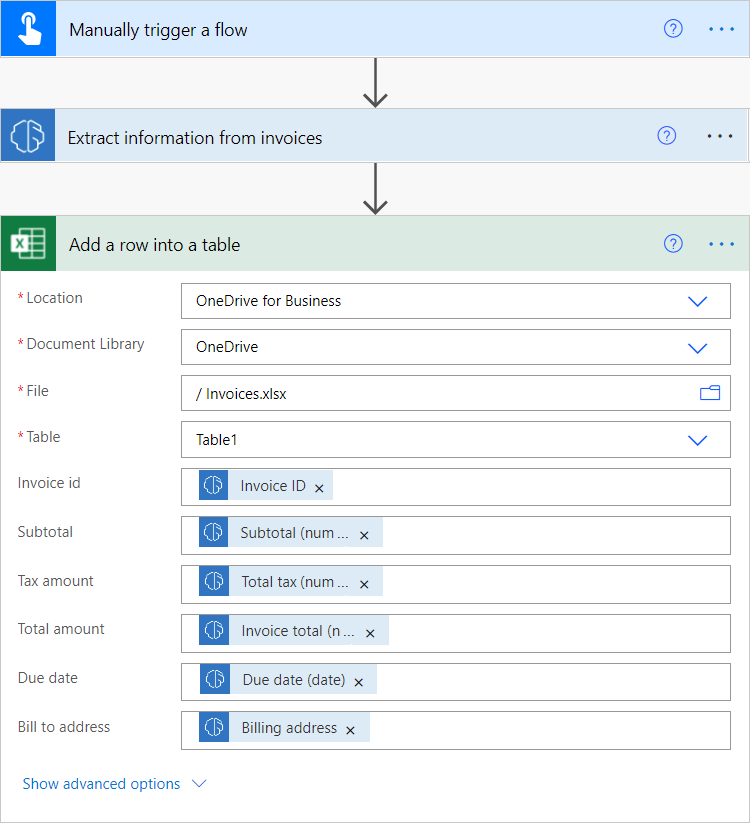
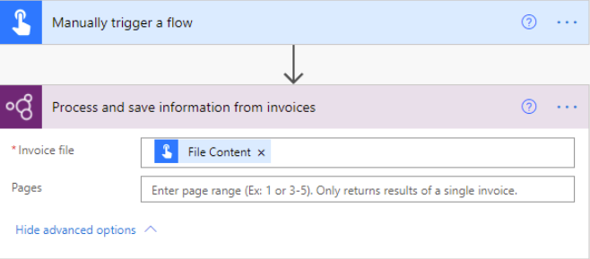

# Use the invoice processing prebuilt model in Power Automate

1. Sign in to [Power Automate](https://flow.microsoft.com/).

1. Select **My flows** in the left pane, and then select **New flow** > **Instant cloud flow**.

1. Name your flow, select **Manually trigger a flow** under **Choose how to trigger this flow**, and then select **Create**.

1. Expand **Manually trigger a flow**, and then select **+Add an input** > **File** as the input type.

1. Replace  **File Content** with **My invoice** (also known as the title).

1. Select **+ New step** > **AI Builder**, and then select **Process and save information from invoices (preview)** in the list of actions.

1. Specify **My invoice** from the trigger in the **Invoice file** input.

    > [!div class="mx-imgBorder"]
    > 

1. In the successive actions, you can use any of the invoice values from the [model output](#output).

    > [!div class="mx-imgBorder"]
    > 

Congratulations! You've created a flow that uses the AI Builder invoice processing model. Select **Save** on the top right, and then select **Test** to try out your flow.

## Page range

For large documents, it's possible to specify the page range to process.

   > [!div class="mx-imgBorder"]
   > 

You can enter a page value or page range in the **Pages** parameter. Example: 1 or 3-5.

>[!NOTE]
> If you have a large document with only one invoice, we strongly recommend to **use the Pages parameter to aim at your invoice, and therefore reduce the cost of model prediction and increase performance**. However, the page range should contain a **unique invoice** for the action to return correct data.
> 
> Example: A document contains a first invoice in page 2 and a second invoice that spans over pages 3 and 4:
> - If you enter page range 2, it will return the data of the first invoice.
> - If you enter page range 3-4, it will only return the data of the second invoice.
> - If you enter page range 2-4, it will return partial data of the first and second invoices (should be avoided).

## Parameters

### Input

|Name|Required|Type|Description|
|---------|---------|---------|---------|
|Receipt file|Yes|file|The invoice file to process|
|Pages|No|string|Page range to process|

### Output

|     Name                                            |     Type       |     Definition                                                                                                      |
|-----------------------------------------------------|----------------|---------------------------------------------------------------------------------------------------------------------|
|     Amount due   (text)                             |     string     |     Amount due as it's written on the invoice                                                                       |
|     Amount due   (number)                           |     float      |     Amount due in standardized number format. Example: 1234.98                                                    |
|     Confidence of amount due                      |     float      |     How confident the model is in its prediction. Score between 0 (low confidence)   and 1 (high confidence).    |
|     Billing   address                               |     string     |     Billing   address                                                                                               |
|     Confidence   of billing address                 |     float      |     How confident the model is in its prediction. Score between 0 (low confidence)   and 1 (high confidence).    |
|     Billing   address recipient                     |     string     |     Billing   address recipient                                                                                     |
|     Confidence   of billing address recipient       |     float      |     How confident the model is in its prediction. Score between 0 (low confidence)   and 1 (high confidence).    |
|     Customer   address                              |     string     |     Customer address     |
|     Confidence   of customer address                |     float      |     How confident the model is in its prediction. Score between 0 (low confidence) and 1 (high   confidence).    |
|     Customer   address recipient                    |     string     |     Customer address recipient             |
|     Confidence   of customer address recipient      |     float      |     How confident the model is in its prediction. Score between 0 (low confidence)   and 1 (high confidence).    |
|     Customer   ID                                   |     string     |     Customer ID         |
|     Confidence   of customer ID                     |     float      |     How confident the model is in its prediction. Score between 0 (low confidence)   and 1 (high confidence).    |
|     Customer   name           |     string     |     Customer name        |
|     Confidence   of customer name                   |     float      |     How confident the model is in its prediction. Score between 0 (low confidence)   and 1 (high confidence).    |
|     Due date   (text)                               |     string     |     Due date as it's written on the invoice             |
|     Due date   (date)                               |                |     Due date in standardized date format. Example: 2019-05-31T00:00:00Z        |
|     Confidence   of due date                        |     float      |     How confident the model is in its prediction. Score between 0 (low confidence)   and 1 (high confidence).    |
|     Invoice   date (text)       |     string     |     Invoice date as it's written on the invoice         |
|     Invoice   date (date)                           |     date       |     Invoice date in standardized date format. Example: 2019-05-31T00:00:00Z                                       |
|     Confidence of invoice date                    |     float      |     How confident the model is in its prediction. Score between 0 (low confidence)   and 1 (high confidence).    |
|     Invoice ID                                      |     string     |     Invoice ID   |
|     Confidence   of invoice ID                      |     float      |     How confident the model is in its prediction. Score between 0 (low confidence) and 1 (high confidence).    |
|     Invoice   total (text)                          |     string     |     Invoice total as it's written on the invoice                                                                       |
|     Invoice   total (number)                        |     float      |     Invoice total in standardized date format. Example: 2019-05-31T00:00:00Z                                      |
|     Confidence   of invoice total                   |     float      |     How confident the model is in its prediction. Score between 0 (low confidence) and 1 (high confidence).    |
|     Purchase   order                                |     string     |     Purchase   order           | 
|     Confidence   of purchase order                  |     float      |     How confident the model is in its prediction. Score between 0 (low confidence)   and 1 (high confidence).    |
|     Remittance   address                            |     string     |     Remittance   address                                                                                            |
|     Confidence of remittance address              |     float      |     How confident the model is in its prediction. Score between 0 (low confidence) and 1 (high   confidence).    |
|     Remittance address recipient                  |     string     |     Remittance address recipient                                                                                  |
|     Confidence   of remittance address recipient    |     float      |     How confident the model is in its prediction. Score between 0 (low confidence) and 1 (high confidence).    |
|     Service address                               |     string     |     Service   address                                                                                               |
|     Confidence of service address                 |     float      |     How confident the model is in its prediction. Score between 0 (low confidence)   and 1 (high confidence).    |
|     Service   address recipient                     |     string     |     Service address recipient                                                                                     |
|     Confidence   of service address recipient       |     float      |     How confident the model is in its prediction. Score between 0 (low confidence) and 1 (high confidence).    |
|     Shipping   address                              |     string     |     Shipping   address                                                                                              |
|     Confidence   of shipping address                |     float      |     How confident the model is in its prediction. Score between 0 (low confidence) and 1 (high confidence).    |
|     Shipping   address recipient                    |     string     |     Shipping address recipient                                                                                    |
|     Confidence of shipping address recipient      |     float      |     How confident the model is in its prediction. Score between 0 (low confidence) and 1 (high confidence).    |
|     Subtotal   (text)                               |     string     |     Subtotal as it's written on the invoice         |
|     Subtotal   (number)                             |     float      |     Subtotal in standardized number format. Example: 1234.98                                                      |
|     Confidence of subtotal                        |     float      |     How confident the model is in its prediction. Score between 0 (low confidence) and 1 (high confidence).    |
|     Total tax   (text)         |     string     |     Total tax as it's written on the invoice                                                                        |
|     Total tax (number)                            |     float      |     Total tax in standardized number format. Example: 1234.98                                                     |
|     Confidence of total tax                       |     float      |     How confident the model is in its prediction. Score between 0 (low confidence) and 1 (high confidence).    |
|     Vendor   address                                |     string     |     Vendor   address                                                                                                |
|     Confidence of vendor address                  |     float      |     How confident the model is in its prediction. Score between 0 (low confidence) and 1 (high confidence).    |
|     Vendor   address recipient                      |     string     |     Vendor address recipient                                                                                      |
|     Confidence of vendor address recipient        |     float      |     How confident the model is in its prediction. Score between 0 (low confidence) and 1 (high confidence).    |
|     Vendor name                                   |     string     |     Vendor name                                                                                                     |
|     Confidence of vendor name                     |     float      |     How confident the model is in its prediction. Score between 0 (low confidence) and 1 (high confidence).    |
|     Detected text                                 |     string     |     Line of recognized text from running OCR on an invoice. Returned as a part of a list of text.               |
|     Page number of detected text                  |     integer    |     Which page the line of recognized text is found on. Returned as a part of a list of text.                   |

### Related topics

[Invoice processing overview](prebuilt-invoice-processing.md)

[!INCLUDE[footer-include](includes/footer-banner.md)]
