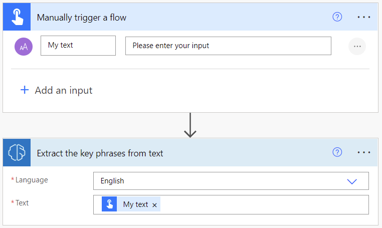
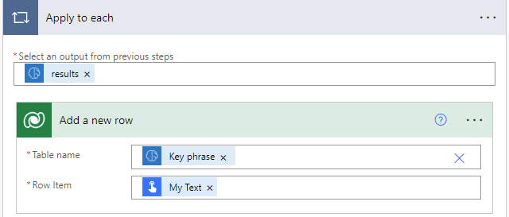

# Use the key phrase extraction prebuilt model in Power Automate

1. Sign in to [Power Automate](https://flow.microsoft.com/).

1. Select **My flows** in the left pane, and then select **New flow** > **Instant cloud flow**.

1. Name your flow, select **Manually trigger a flow** under **Choose how to trigger this flow**, and then select **Create**.

1. Expand **Manually trigger a flow**, and then select **+Add an input** > **Text** as the input type.

1. Replace **Input** with **My Text** (also known as the title).

1. Select **+ New step** > **AI Builder**, and then select **Extract the key phrases from text** in the list of actions.

1. In the **Language** input, select or enter your language.

1. In the **Text** input, select **My Text** from the **Dynamic content** list:

    > [!div class="mx-imgBorder"]
    > 

1. In the successive actions, you can use any columns extracted by the AI Builder model. For example, you can create a Microsoft Dataverse row for each **Key phrase**.

    > [!div class="mx-imgBorder"]
    > 

## Parameters

### Input

|Name |Required |Type |Description |Values |
|---------|---------|---------|---------|---------|
|**Text** |Yes |string |Text to analyze |Text sentences |
|**Language** |Yes |string | Language of the text to analyze | Item in a list of predefined languages or a language code (ex.: "en", "fr", "zh_chs", "ru")

### Output

|Name |Type |Description |
|---------|---------|---------|
|**Key phrase** |string |String denoting a key talking points in the analyzed text. As there could be multiple key phrases, selecting this parameter will create an apply to each loop |

Congratulations! You have created a flow that uses your key phrase extraction AI model. Select **Save** on the top right and then select **Test** to try out your flow.

### See also

[Key phrase extraction overview](prebuilt-key-phrase.md)
