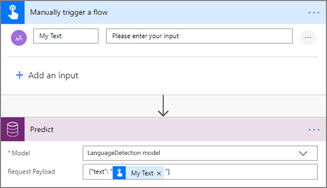

# Use the language detection prebuilt model in Microsoft Flow

1. [Sign in](https://flow.microsoft.com/signin) to Microsoft Flow, select the **My flows** tab, and then select **Create from blank**.
1. Search for the term *manually*, select **Manually trigger a flow** in the list of triggers, and then select **+ Add an input**.
1. Select **Text** and set as input title: **My Text**.
1. Select **+ New step**, search for the term *Predict*, and then select **Predict Common Data Service (current Environment)** in the list of actions.
1. Select  **LanguageDetection model**, and in the **Request Payload** field, enter *{“text”:”My Text”}*. Add the **My Text** field from the trigger: 
   > 
1. Select **+ New step**, search for Parse JSON, and then select **Parse JSON – Data Operations** in the lists of actions.
1. In the **Content** field, select **Response Payload**.
1. Copy the following JSON code and paste it into the **Schema** box: 

    ```JSON
          { 
              "type": "object", 
              "properties": { 
                  "predictionOutput": { 
                      "type": "object", 
                      "properties": { 
                          "results": { 
                              "type": "array", 
                              "items": { 
                                  "type": "object", 
                                  "properties": { 
                                      "type": { 
                                          "type": "string" 
                                      }, 
                                      "score": { 
                                          "type": "number" 
                                      } 
                                  }, 
                                  "required": [ 
                                      "type", 
                                      "score" 
                                  ] 
                              } 
                          } 
                      } 
                  }, 
                  "operationStatus": { 
                      "type": "string" 
                  }, 
                  "error": {} 
              } 
        }
    ```

Now you can iterate through the detected languages returned by the language detection model. In the following example, we add the detected languages to an existing CDS record. 

   > 

Congratulations! You have created a flow that leverages a language detection model. Select **Save** on the top right and then select **Test** to try out your flow.
