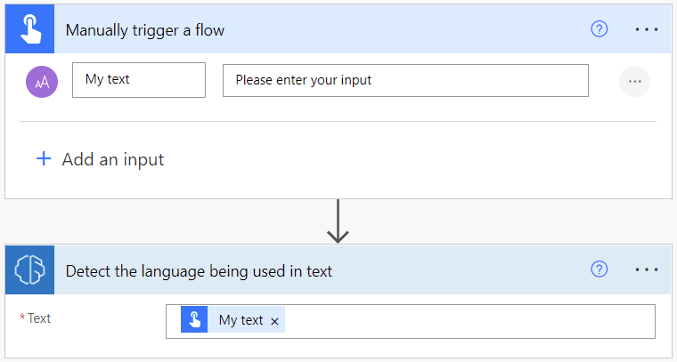
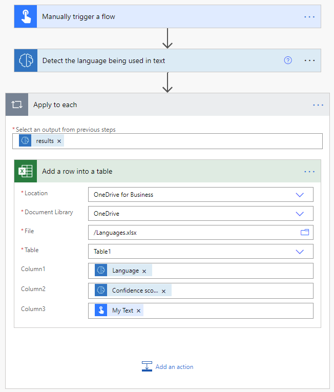

# Use the language detection prebuilt model in Power Automate

1. Sign in to [Power Automate](https://flow.microsoft.com/).

1. Select **My flows** in the left pane, and then select **New flow** > **Instant cloud flow**.

1. Name your flow, select **Manually trigger a flow** under **Choose how to trigger this flow**, and then select **Create**.

1. Expand **Manually trigger a flow**, and then select **+Add an input** > **Text** as the input type.

1. Replace  **Input** with **My Text** (also known as the title).

1. Select **+ New step** > **AI Builder**, and then select **Detect the language being used in text** in the list of actions.

1. Select the **Text** input, and then select **My Text** from the **Dynamic content** list:

    > [!div class="mx-imgBorder"]
    > 

1. In the successive actions, you can use any columns extracted by the AI Builder model. For example, you can add lines to an Excel file using **Language** and **Confidence score**:

    > [!div class="mx-imgBorder"]
    > 

Congratulations! You've created a flow that uses a language detection model. Select **Save** on the top right and then select **Test** to try out your flow.

## Parameters

### Input
|Name |Required |Type |Description |Values |
|---------|---------|---------|---------|---------|
|**Text** |Yes |string |Text to analyze|Text sentences |

### Output
|Name |Type |Description |Values |
|---------|---------|---------|---------|
|**results** |list |A list of languages detected in the input text |List of score and languages |
|**Confidence score** |float |How confident the model is in its prediction|Value in the range of 0 to 1. Values close to 1 indicate greater confidence that the identified sentiment is accurate |
|**Language** |string |Language inferred from the text| Language code (ex.: "en", "fr", "zh_chs", "ru") |

## Related information

[Language detection overview](prebuilt-language-detection.md)

[!INCLUDE[footer-include](includes/footer-banner.md)]