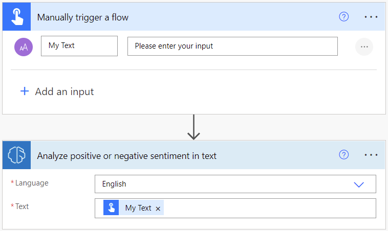
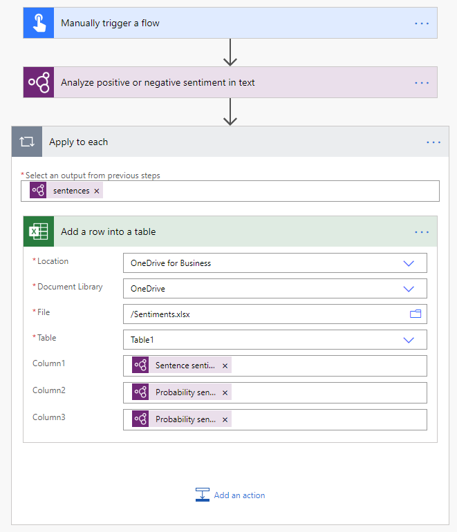
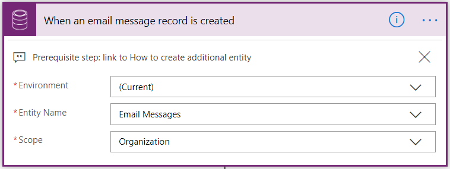
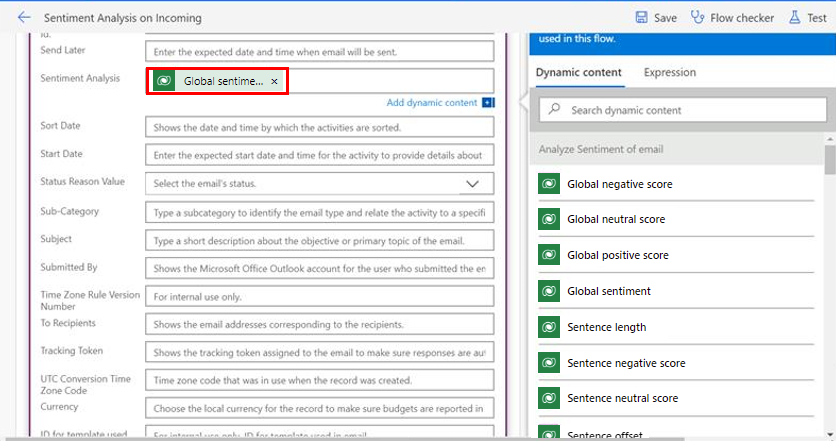

# Use the sentiment analysis prebuilt model in Power Automate

[!INCLUDE [cc-data-platform-banner](includes/cc-data-platform-banner.md)]

## Create a flow that uses the AI Builder sentiment analysis prebuilt model

1. Sign in to [Power Automate](https://flow.microsoft.com/), select the **My flows** tab, and then select **New > +Instant-from blank**.
1. Name your flow, select **Manually trigger a flow** under **Choose how to trigger this flow**, and then select **Create**.
1. Expand **Manually trigger a flow**, select **+Add an input**, select **Text** as the input type, and set as input title **My Text**.
1. Select **+ New step**, search for the term **AI Builder**, and then select **Analyze positive or negative sentiment** in text in the list of actions.
1. Select the language in the **Language** input and specify the **My Text** field from the trigger in the **Text** input:

    > [!div class="mx-imgBorder"]
    > 

1. In the successive actions, you can use any fields extracted by the AI Builder model. For example, you can add lines to an Excel file for each sentence using **Sentence sentiment**, **Probability sentence is positive** and **Probability sentence is negative**:

    > [!div class="mx-imgBorder"]
    > 

Congratulations! You've created a flow that uses the sentiment analysis model. Select **Save** in the upper-right corner, and then select **Test** to try out your flow.

## Parameters

### Input

|Name |Required |Type |Description |Values |
|---------|---------|---------|---------|---------|
|**Text** |Yes |string |Text to analyze |Text sentences |
|**Language** |Yes |string | Language of the text to analyze | Item in a list of predefined languages or a language code (ex.: "en", "fr", "zh_chs", "ru")

### Output

|Name |Type |Description |Values |
|---------|---------|---------|---------|
|**Overall text sentiment** |string |Overall sentiment of the analyzed text|Positive, neutral or negative |
|**Probability overall text is positive** |float |Probability of the positive sentiment in the analyzed text|Value in the range of 0 to 1. Values close to 1 indicate greater confidence that the identified sentiment is accurate |
|**Probability overall text is negative** |float |Probability of the negative sentiment in the analyzed text|Value in the range of 0 to 1. Values close to 1 indicate greater confidence that the identified sentiment is accurate |
|**Probability overall text is neutral** |float |Probability of the neutral sentiment in the analyzed text|Value in the range of 0 to 1. Values close to 1 indicate greater confidence that the identified sentiment is accurate |
|**documentScores** |object |Object containing overall scores|Positive, neutral and negative scores |
|**sentences** |List |List of sentence data structures containing sentences overall sentiment and scores |Sentence sentiment, positive, neutral and negative scores |
|**Sentence sentiment** |string |Sentiment of the analyzed sentence|Positive, neutral or negative |
|**Probability sentence is positive** |float |Probability of the positive sentiment in the analyzed sentence|Value in the range of 0 to 1. Values close to 1 indicate greater confidence that the identified sentiment is accurate |
|**Probability sentence is negative** |float |Probability of the negative sentiment in the analyzed sentence|Value in the range of 0 to 1. Values close to 1 indicate greater confidence that the identified sentiment is accurate |
|**Probability sentence is neutral** |float |Probability of the neutral sentiment in the analyzed sentence|Value in the range of 0 to 1. Values close to 1 indicate greater confidence that the identified sentiment is accurate |
|**sentenceScores** |object |Data structure containing sentence scores|Positive, neutral and negative scores |

## Use sentiment analysis to analyze incoming Dynamics 365 emails

Power Automate provides a template that enables you to analyze incoming Dynamics 365 emails by using AI Builder sentiment analysis. This template requires some customization of your Microsoft Dataverse email entity before you can use it.

1. Create an attribute in your Email Messages entity in which to save the sentiment analysis results.

   For information about how to create an attribute, see [Create and edit fields for Dataverse using Power Apps portal](https://docs.microsoft.com/powerapps/maker/common-data-service/create-edit-field-portal).

1. Sign in to [Power Automate](https://flow.microsoft.com/signin).
1. In the left pane, select **Templates**, and then search for **AI Builder sentiment**.
1. Select **Analyze sentiment of Dynamics emails using AI Builder**.
1. Select your environment, then type **Email Messages** in the **Entity Name** field, and type **Organization** in the **Scope** field.

   > 

1. Next, the template shows messages from **draft emails** and **received emails**. You can filter these if you want to perform sentiment analysis only on selected email statuses. For a list of status codes, see [email EntityType](/dynamics365/customer-engagement/web-api/email?view=dynamics-ce-odata-9).
1. Select **Add sentiment to CDS Email Entity**, select **Show advanced options**, and then locate the attribute you added in step 1.
1. Finally, add **Global sentiment** from the **Dynamic content** list.<!--Can you make this alt text different from the last image?-->

   > 

If you want this field to be visible in your email grid view, follow these steps:

1. Go to the view/form designer, and add the custom field you created in step 1 of the preceding procedure<!--Is this what "prerequisite step" means?-->. For information about how to add the column to your view, see [Add a column to your view](/dynamics365/customerengagement/on-premises/customize/create-edit-views-app-designer#add-a-column-to-your-view).

1. Then add a field to the form. For details, see [Add a field to a form](/dynamics365/customerengagement/on-premises/customize/add-field-form).

### See also

[Sentiment analysis overview](prebuilt-sentiment-analysis.md)
