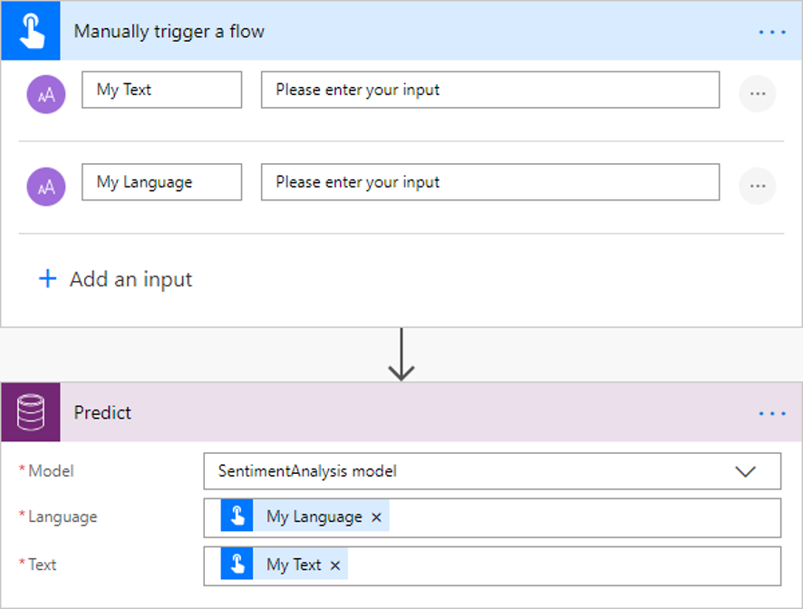
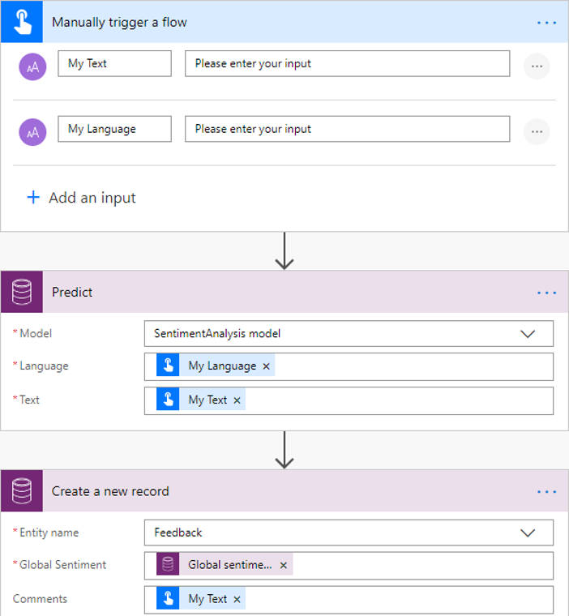

# Use the sentiment analysis prebuilt model in Power Automate

[!INCLUDE[cc-beta-prerelease-disclaimer](./includes/cc-beta-prerelease-disclaimer.md)]

1. [Sign in](https://flow.microsoft.com/signin) to Power Automate, select the **My flows** tab, and then select **Create from blank**.
1. Search for the term *manually*, select **Manually trigger a flow** in the list of triggers, and then select **+ Add an input**.
1. Select **Text**, and set as input title: **My Text**.
1. Select **+Add an input** again.
1. Select **Text** and set as input title: *My Language*.
1. Select **+ New step**, search for *Predict*, and then select **Predict Common Data Service (current Environment)** in the list of actions.
1. Select **SentimentAnalyses model**, and in the **Request Payload** field, enter *{“text”:”My Text”, “language”:”My Language”}*. Add the **My Text** and **My Language** fields from the trigger.
   > 
1. Select **+ New step**, search for Parse JSON, and then select **Parse JSON – Data Operations** in the lists of actions.
1. In the **Content** field, select **Response Payload**.
1. Copy the following JSON code and paste it into the **Schema** box: 
 
    ```JSON
        { 
            "type": "object", 
            "properties": { 
                "predictionOutput": { 
                    "type": "object", 
                    "properties": { 
                        "result": { 
                            "type": "object", 
                            "properties": { 
                                "sentiment": { 
                                    "type": "string", 
                                    "title": "documentSentiment" 
                                }, 
                                "documentScores": { 
                                    "type": "object", 
                                    "properties": { 
                                        "positive": { 
                                            "type": "number" 
                                        }, 
                                        "neutral": { 
                                            "type": "number" 
                                        }, 
                                        "negative": { 
                                            "type": "number" 
                                        } 
                                    } 
                                }, 
                                "sentences": { 
                                    "type": "array", 
                                    "items": { 
                                        "type": "object", 
                                        "properties": { 
                                            "sentiment": { 
                                                "type": "string" 
                                            }, 
                                            "sentenceScores": { 
                                                "type": "object", 
                                                "properties": { 
                                                    "positive": { 
                                                        "type": "number" 
                                                    }, 
                                                    "neutral": { 
                                                        "type": "number" 
                                                    }, 
                                                    "negative": { 
                                                        "type": "number" 
                                                    } 
                                                } 
                                            }, 
                                            "offset": { 
                                                "type": "integer" 
                                            }, 
                                            "length": { 
                                                "type": "integer" 
                                            } 
                                        }, 
                                        "required": [ 
                                            "sentiment", 
                                            "sentenceScores", 
                                            "offset", 
                                            "length" 
                                        ] 
                                    } 
                                } 
                            } 
                        } 
                    } 
                }, 
                "operationStatus": { 
                    "type": "string" 
                }, 
                "error": {} 
            } 
        }
    ```

   > 

Now you can use the sentiment properties detected by the sentiment analysis model. In the following example, we update the Sentiment property existing Common Data Service record. 

   > 

Congratulations! You have created a flow that leverages a sentiment analysis model. Select **Save** on the top right and then select **Test** to try out your flow.