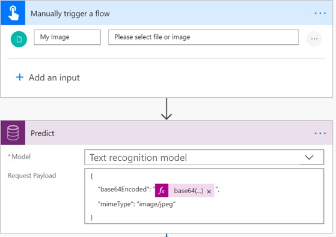
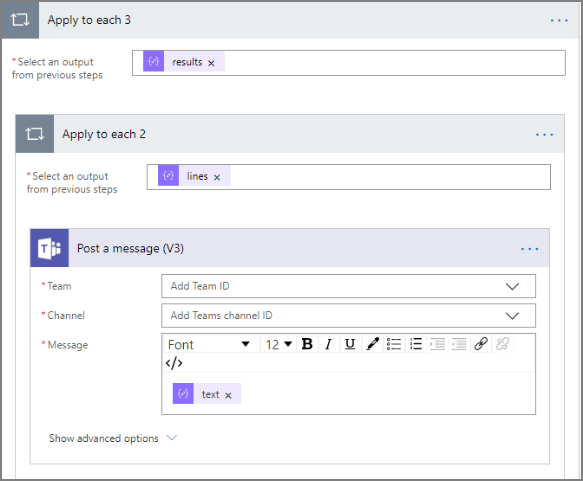

# Use the text recognition prebuilt model in Power Automate

[!INCLUDE[cc-beta-prerelease-disclaimer](./includes/cc-beta-prerelease-disclaimer.md)]

1. [Sign in](https://flow.microsoft.com/signin) to Power Automate, select the **My flows** tab, and then select **Create from blank**.
1. Search for the term *manually*, select **Manually trigger a flow** in the list of triggers, and then select **+ Add an input**.
1. Select **File**, and set **My Image** as the input title.
1. Select **+ New step**, search for the term *Predict*, and then select **Predict - Common Data Service (Current Environment)** in the list of actions.
1. Select **Text recognition model**, and specify the following as **Request Payload**:

    ```json
    { 
    "base64Encoded": "EXPRESSION", 
    "mimeType": "image/jpeg" 
    }
    ```

1. Replace *EXPRESSION* with the following expression string on the formula bar on the right:

    ```json
    string(triggerBody()?['file']?['contentBytes'])
    ```

     > 

 > [!NOTE]
 > Depending on which connector the file comes from, the expression may need to be enclosed by base64() instead of string().

7. Select **+ New step**, search for *Parse JSON*, and then select  **Parse JSON – Data Operations**  in the lists of actions.
8. In the **Parse JSON** screen, next to **Content**, select **Response Payload**.
9. Copy and paste the following JSON code into the **Schema** box:
 
    ```JSON
        { 
            "type": "object", 
            "properties": { 
                "predictionOutput": { 
                    "type": "object", 
                    "properties": { 
                        "results": { 
                            "type": "array", 
                            "items": { 
                                "type": "object", 
                                "properties": { 
                                    "lines": { 
                                        "type": "array", 
                                        "items": { 
                                            "type": "object", 
                                            "properties": { 
                                                "boundingBox": { 
                                                    "type": "object", 
                                                    "properties": { 
                                                        "left": { 
                                                            "type": "number" 
                                                        }, 
                                                        "top": { 
                                                            "type": "number" 
                                                        }, 
                                                        "width": { 
                                                            "type": "number" 
                                                        }, 
                                                        "height": { 
                                                            "type": "number" 
                                                        } 
                                                    } 
                                                }, 
                                                "text": { 
                                                    "type": "string" 
                                                } 
                                            }, 
                                            "required": [ 
                                                "boundingBox", 
                                                "text" 
                                            ] 
                                        } 
                                    }, 
                                    "page": { 
                                        "type": "integer" 
                                    } 
                                }, 
                                "required": [ 
                                    "lines", 
                                    "page" 
                                ] 
                            } 
                        } 
                    } 
                }, 
                "operationStatus": { 
                    "type": "string" 
                }, 
                "error": {} 
            } 
        } 
    ```

     > 

10. To retrieve the text from the lines recognized in the image, add the  **Apply to each**  action control to iterate through the results.

      > 

Congratulations! You have created a flow that leverages the text recognition model. You can continue to build on this to suit your needs. Select **Save** on the top right, and then select **Test** to try out your flow. 
