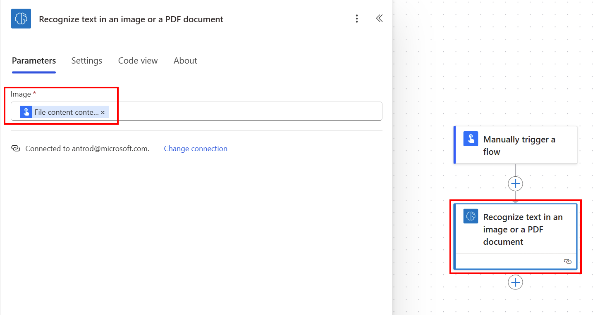

# Use the text recognition prebuilt model in Power Automate

### Initialize the Power Automate flow

1. Sign in to [Power Automate](https://flow.microsoft.com/).

1. Select **My flows** in the left pane, and then select **New flow** > **Instant cloud flow**.

1. Name your flow, select **Manually trigger a flow** under **Choose how to trigger this flow**, and then select **Create**.

1. Expand **Manually trigger a flow**, and then select **+Add an input** > **File** as the input type.

1. Select **+New step** > **AI Builder**, and then select **Recognize text in an image or a PDF document** in the list of actions.

1. Select the **Image** input, and then select **File Content** from the **Dynamic content** list:

    > [!div class="mx-imgBorder"]
    > 

1. To process results, your can either use the full document text, a page text or the document text line by line.

### Get the full document text or a full page text
It can be useful if you need to perfom an action on the full document text or on a specific page text such as searching for a substring or passing it to a downstream action. You can for example post all the extracted text in a Teams channel using **Full text of the document** from the Dynamic content list.

> [!div class="mx-imgBorder"]
> 

### Get the document text line by line
It can be useful if you need to isolate a specific line of text or reformat the text at your convenience.

1. Select **+New step** > **Control**, and then select **Initialize variable** to create a string variable and name it **Extracted text** for example.
  
1. Select **+New step** > **Control**, and then select **Append to string variable**. In the **value** field, select **Text** from the Dynamic content list. It will auto generate 2 **Apply to each** actions as it is reading a list of lines text in a list of pages. You can then post all the extracted text in a Teams channel:

    > [!div class="mx-imgBorder"]
    > 

Congratulations! You've created a flow that uses a text recognition model. You can continue to build on this flow until it suits your needs. Select **Save** on the top right, and then select **Test** to try out your flow. 

## Parameters
### Input
|Name |Required |Type |Description |
|---------|---------|---------|---------|
|**Image** |Yes |file |Image to analyze|

### Output

The detected text is embedded into **lines** sub list of the **results** list. You first need to select the **lines** column from an **Apply to each** action to view all the following columns.

|Name |Type |Description |
|---------|---------|---------|
|**Text** |string |Strings containing the line of text detected |
|**Page number** |string |Page number of the text detected |
|**Coordinates** |float |Coordinates of the text detected |
|**Full text of the document** |string |Full text detected |
|**Full text of the page** |string |Full page text detected |

## Related information

[Text recognition overview](prebuilt-text-recognition.md)

[!INCLUDE[footer-include](includes/footer-banner.md)]
