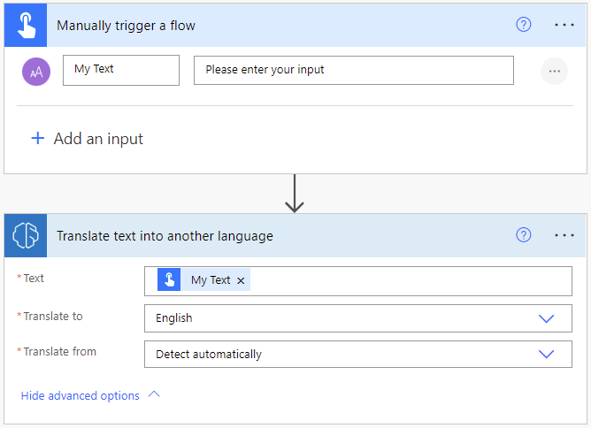
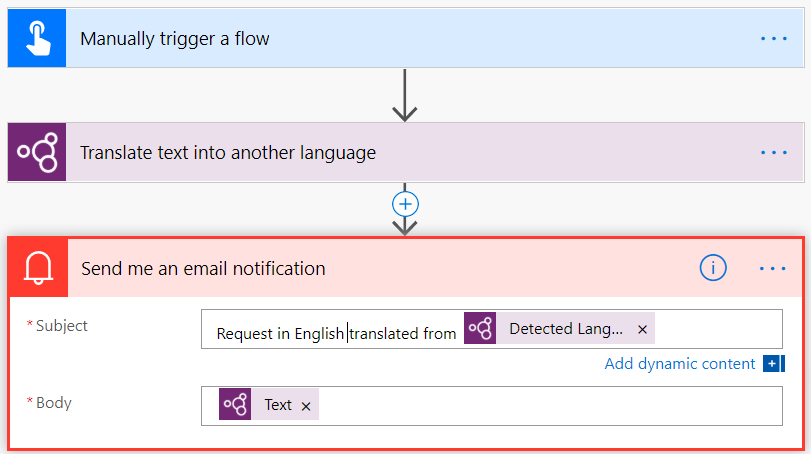

# Use the text translation prebuilt model in Power Automate

1. Sign in to [Power Automate](https://flow.microsoft.com/).

1. Select **My flows** in the left pane, and then select **New flow** > **Instant cloud flow**.

1. Name your flow, select **Manually trigger a flow** under **Choose how to trigger this flow**, and then select **Create**.

1. Expand **Manually trigger a flow**, and then select **+Add an input** > **Text** as the input type.

1. Replace  **Input** with **My Text** (also known as the title).

1. Select **+ New step** > **AI Builder**, and then select **Translate text into another language** in the list of actions.

1. Select **My Text** from the **Dynamic content** list.

1. Select the target language in the **Translate to** input.

1. Optionally, select the source language in the **Translate from** input to specify the language of the text in **My Text** input. If you don't specify this input, the model will automatically detect the source language for you.

    > [!div class="mx-imgBorder"]
    > 

1. In the successive actions, you can use any columns extracted by the AI Builder model. For example, you can use get a notification of the translated text sent out to your email using the **Send me an email notification** and the output property **Text** from the text translation model.

    > [!div class="mx-imgBorder"]
    > 
    
Congratulations! You've created a flow that uses a text translation model. Select **Save** on the top right and then select **Test** to try out your flow.

## Parameters
### Input
|Name |Required |Description |Values |
|---------|---------|---------|---------|
|Text |Yes |Text to translate |Text sentences |
|Translate to |Yes |Target language of the translated text | Item in a list of predefined languages or a language code (ex.: "en", "fr", "zh_chs", "ru")
|Translate from |No |Language of the text to be translated | Item in a list of predefined languages or a language code (ex.: "en", "fr", "zh_chs", "ru")

### Output
|Name |Description |Values |
|---------|---------|---------|
|Text |Translated version of the input text|Text sentences |
|Detected language |Detected language of the input text if the column "Translated from" wasn't specified |Language code (ex.: "en", "fr", "zh_chs", "ru")|

### Related topic

[Text translation overview](prebuilt-text-translation.md)

[!INCLUDE[footer-include](includes/footer-banner.md)]
