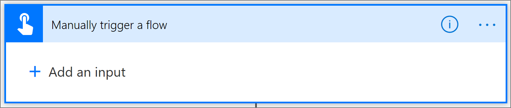
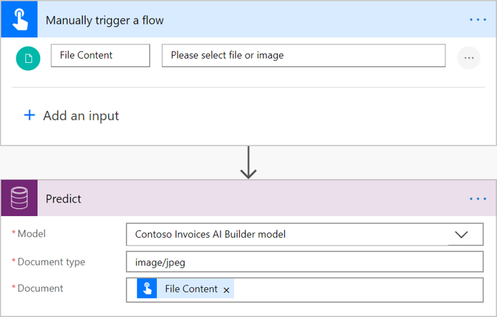
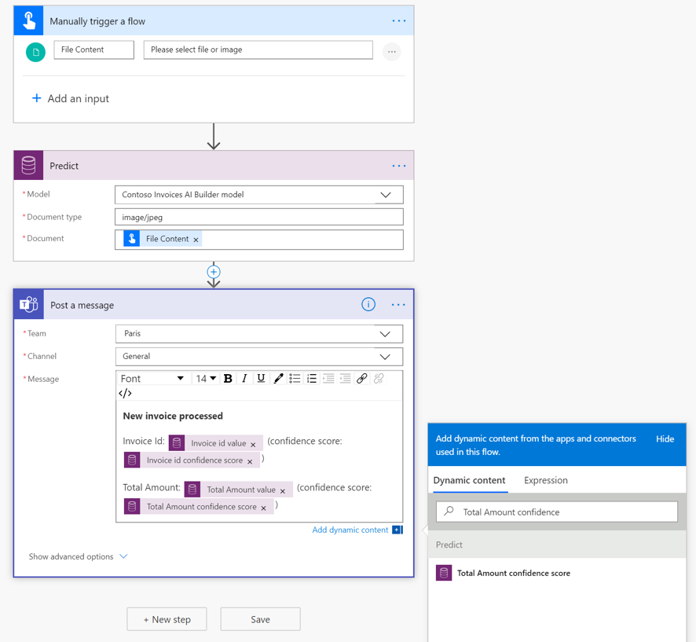

# Use form processing model in Power Automate

[!INCLUDE[cc-beta-prerelease-disclaimer](./includes/cc-beta-prerelease-disclaimer.md)]

 > [!IMPORTANT]
 > To use AI Builder models in Power Automate, you have to create the flow inside a solution. The steps below won't work if you don't follow these instructions first: [Create a flow in a solution](/flow/create-flow-solution).

## Create your flow

1. Sign in to [Power Automate](https://flow.microsoft.com/).

1. Select **My flows** in the left-side navigation pane, and then select **Create from blank**.

1. Select **+New** > **+Instant-from blank**.

1. Name your flow, select **Manually trigger a flow** under **Choose how to trigger this flow**, and then select **Create**.

1. Expand **Manually trigger a flow**, select **+Add an input**, and then select **File** as the input type.

1. Select **+ New step**. Don't worry about the file information fields at this point - that comes later.

    

1. Search for **Predict** in the **Search for filters and actions** box, and then select **Predict Common Data Service (current Environment)** in the list of actions. If this action doesn't appear, make sure you're working with a solution as described in [Create a flow in a solution](/flow/create-flow-solution).

1. Select the form processing model you want to use, and select the **Document type**:

    - For a .jpeg image of the form: image/jpeg
    - For a .png image of the form: image/png
    - For a .pdf document of the form: application/pdf

1. In the **Document** field in the Predict window, select **File Content**:

    > [!div class="mx-imgBorder"]
    > 

1. In the successive actions, you can use any fields and tables extracted by the AI Builder model. For example, let’s say that our model is trained to extract the *Invoice Id* and the *Total Amount* value, and we want to post those to a Microsoft Teams channel. Just add the **Post a message to Teams** action, and then select your fields in the list of tokens  .

    > [!NOTE]
    >
    >- To retrieve a field name and it's value followed by it's value, select **<field_name> value** . For example, for the *Invoice Id* field, select **Invoice Id value**.
    >- To retrieve the confidence score, , select **<field_name> confidence score** . For example, for the *Invoice Id* field, select **Invoice Id confidence score**.
    
    > [!div class="mx-imgBorder"]
    > 

Congratulations! You've created a flow that uses an AI Builder form processing model. Select **Save** on the top right, and then select **Test** to try out your flow.

### Related topic
[Form processing model overview](form-processing-model-overview.md)
