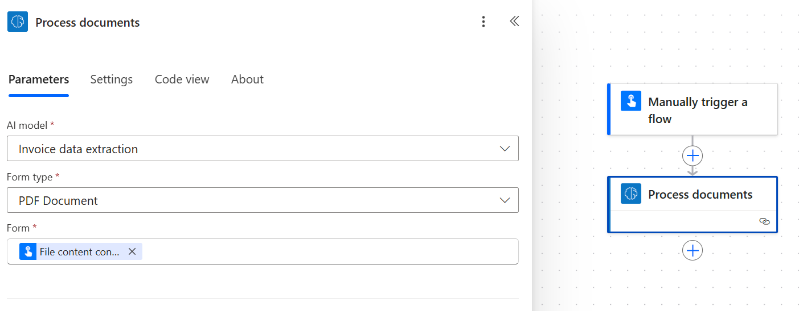
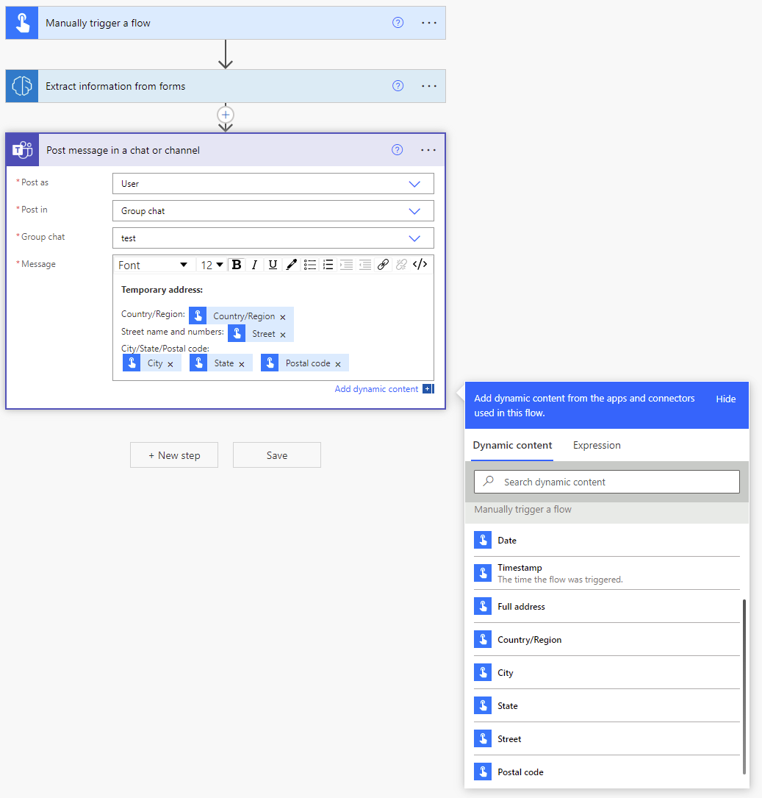
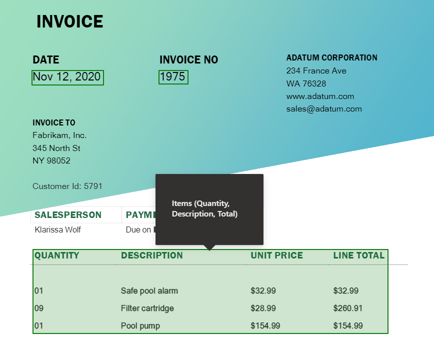
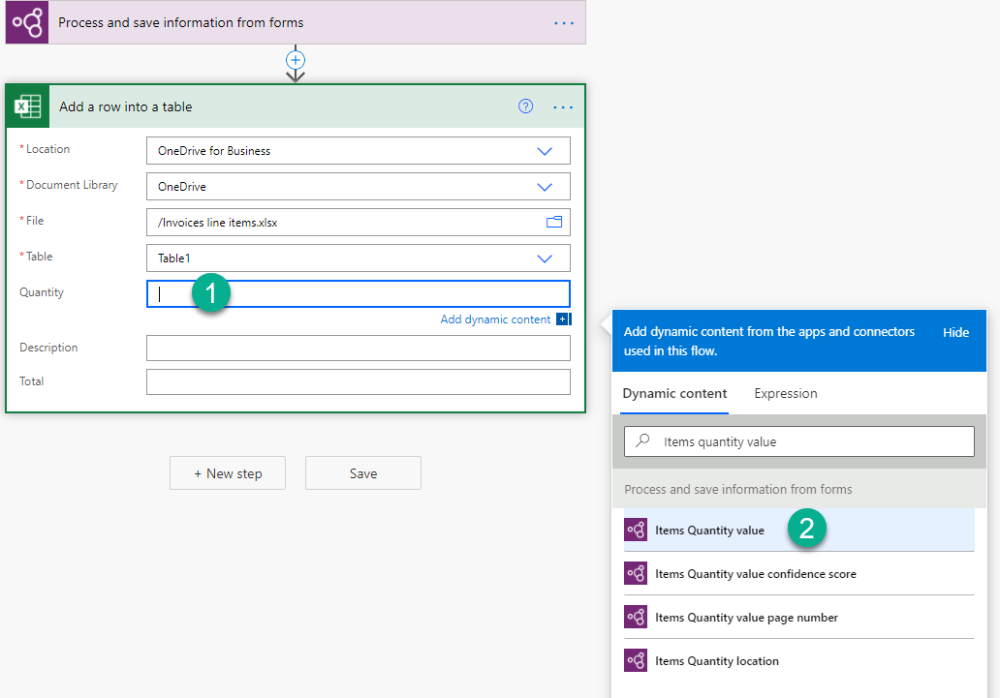
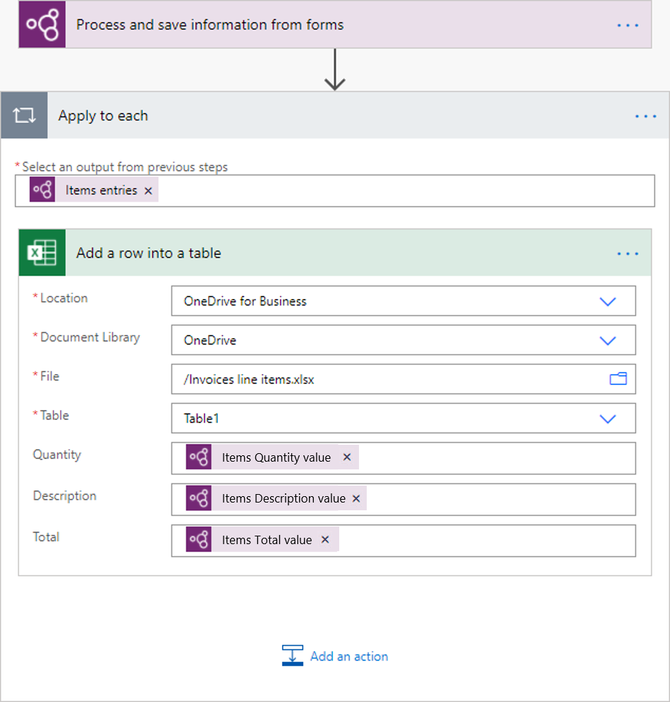
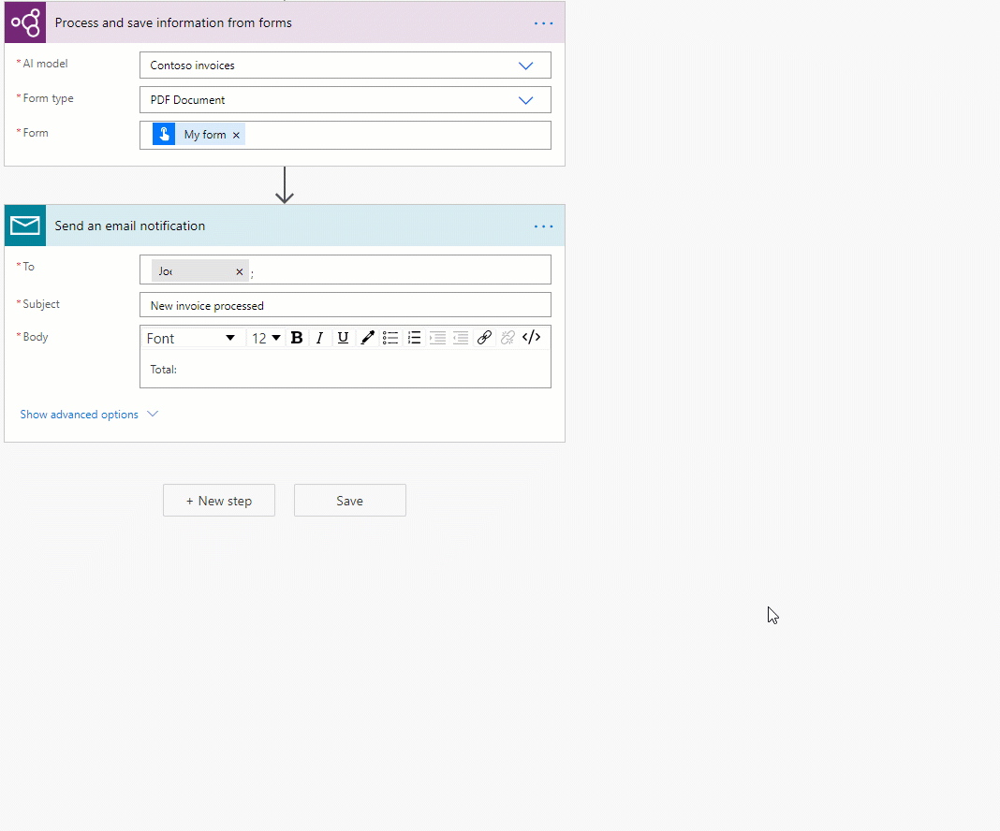
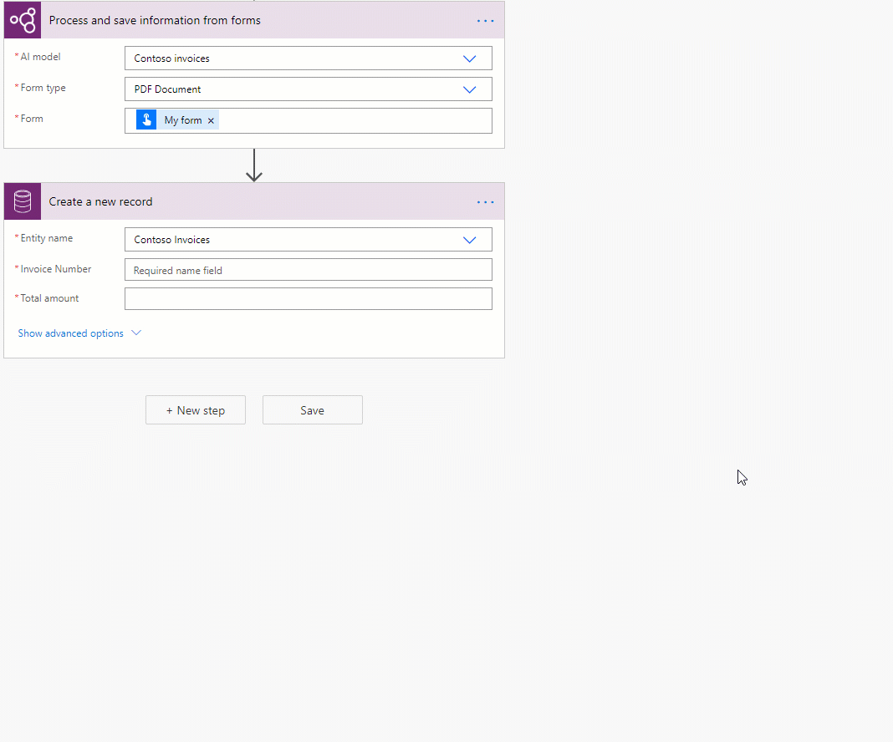
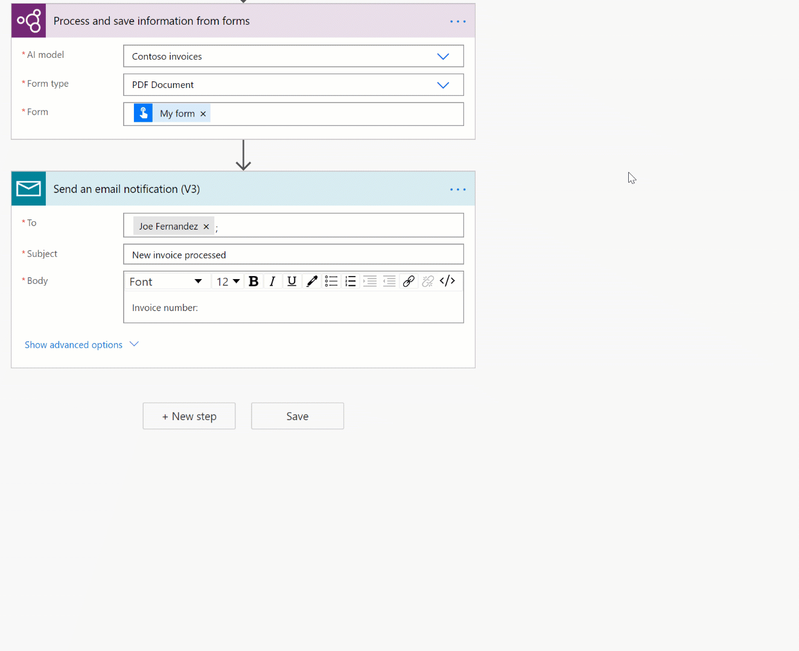
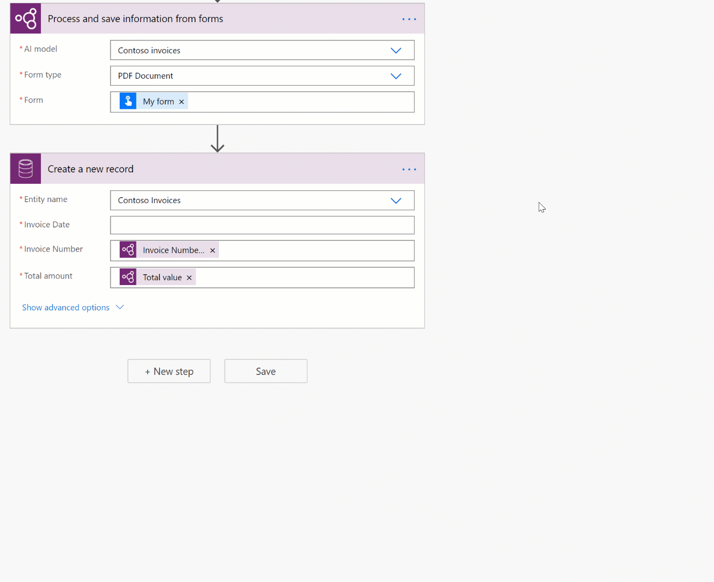
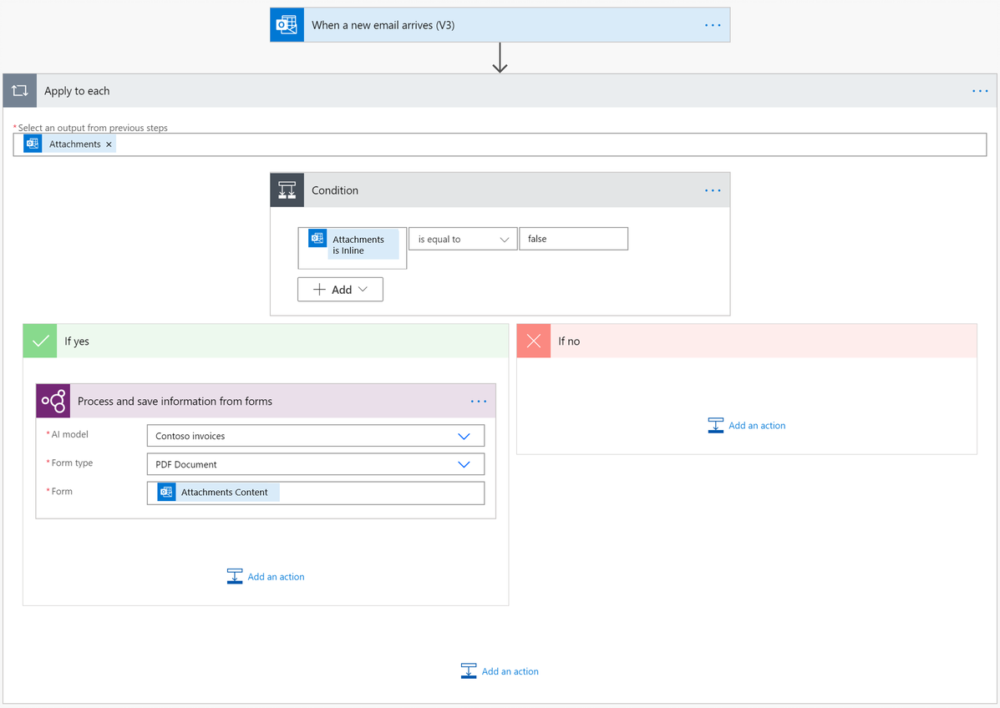

# Use a form-processing model in Power Automate

1. Sign in to [Power Automate](https://flow.microsoft.com/), select the **My flows** tab, and then select **New > +Instant-from blank**.
1. Name your flow, select **Manually trigger a flow** under **Choose how to trigger this flow**, and then select **Create**.
1. Expand **Manually trigger a flow**, select **+Add an input**, select **File** as the input type, and set as input title **File Content**.
1. Select **+ New step**, search for **AI Builder** in the Search for filters and actions box, and then select **Process and save information from forms** in the list of actions.
1. Select the form processing model you want to use, select the Document type, and in the **Document** field add **File Content** from the trigger:

    > [!div class="mx-imgBorder"]
    > 

1. In the successive actions, you can use any fields and tables extracted by the AI Builder model. For example, let's say that our model is trained to extract the *Invoice Id* and the *Total Amount* value, and we want to post those to a Microsoft Teams channel. Just add the **Post a message to Teams** action, and then select your fields from the list of tokens.

    > [!NOTE]
    >
    >- To retrieve the value for a field, select **<field_name> value** . For example, for the *INVOICE* field, select **INVOICE value**.
    >- To retrieve the confidence score for a field, select **<field_name> confidence score** . For example, for the *INVOICE* field, select **INVOICE confidence score**.

    > [!div class="mx-imgBorder"]
    > 

## Parameters
### Input
|Name |Required |Type |Description |Values |
|---------|---------|---------|---------|---------|
|**AI Model** |Yes |model |Form processing model to use for analysis|Trained and published form processing models |
|**Document type** |Yes |list |The file type of the form to analyze|PDF Document (.pdf), JPEG Image (.jpeg), PNG Image (.png) |
|**Form** |Yes |file |Form to process| |

### Output
|Name |Type |Description |Values |
|---------|---------|---------|---------|
|**{field} value** |string |The value extracted by the AI model| |
|**{field} confidence score** |float |How confident the model is in its prediction |Value in the range of 0 to 1. Values close to 1 indicate greater confidence that the extracted value is accurate |
|**{table}{column} value** |string |The value extracted by the AI model for a cell in a table| |
|**{table}{column} confidence score** |float |How confident the model is in its prediction |Value in the range of 0 to 1. Values close to 1 indicate greater confidence that the extracted cell value is accurate |

**Note:** More output parameters may be proposed such as field coordinates, polygons, bounding boxes and page numbers. These are not listed on purpose as mainly intended to advanced usage.

## Common use cases

### Iterate a form processing table output in Power Automate 

To illustrate this procedure, we use the following example where we have trained a form processing model to extract a table that we have named **Items** with three columns: **Quantity**, **Description** and **Total**. We wish to store each line item from the table into an excel file. 

> [!div class="mx-imgBorder"]
> 

1. Click on the field you wish to write the cell for a table, the dynamic content panel will open showing everything that the form processing model knows how to extract. Search for **{your table name} {you column name} value**. In our example from above it’s *Items Quantity value*.

> [!div class="mx-imgBorder"]
> 

2. Once you add this value, the action where you added it is automatically inserted into an **Apply to each** control. This way, every row in the table will be processed when the flow is run.

3. Keep adding any additional columns you want to iterate. 

> [!div class="mx-imgBorder"]
> 

### Remove currency symbols (€, $,…) in a form processing output in Power Automate

Let’s imagine that the *Total* value extracted by the form processing model has a currency symbol, for example: $54. To remove the *$* sign, or any other symbols you want to omit, use the [replace](/azure/logic-apps/workflow-definition-language-functions-reference#replace) expression to remove it. Here is how to do it:

`replace(<form processing output>, '$', '')`

> [!div class="mx-imgBorder"]
> 

### Convert a form processing output string to a number in Power Automate

AI Builder form processing returns all extracted values as strings. If the destination where you want to save a value extracted by AI Builder form processing requires a number, you can convert a value to number using the [int](/azure/logic-apps/workflow-definition-language-functions-reference#int) or [float](/azure/logic-apps/workflow-definition-language-functions-reference#float) expressions. Use int if the number has no decimals, use float if instead the number has decimals. Here is how to do it:

`float('<form processing output>')`

> [!div class="mx-imgBorder"]
> 

### Remove blank spaces in a form processing output in Power Automate

To remove blank spaces from output values, use the [replace](/azure/logic-apps/workflow-definition-language-functions-reference#replace) function:

`replace(<form processing output>, ' ', '')`

> [!div class="mx-imgBorder"]
> 

### Convert a form processing output string to a date in Power Automate

AI Builder form processing returns all outputs as strings. If the destination where you want to save a value extracted by form processing requires to be in date format, you can convert a value that contains a date into date format by using the [formatDateTime](/azure/logic-apps/workflow-definition-language-functions-reference#formatDateTime) expression. Here is how to do it:

`formatDateTime(<form processing output>)`

> [!div class="mx-imgBorder"]
> 

### Filter email signature from a flow so that is is not processed by the form processing model (Office 365 Outlook)

For incoming emails from the Office 365 Outlook connector, email signatures are picked up by Power Automate as attachments. To keep these from being processed by the form processing model add a condition to your flow that checks if the output from the Office 365 Outlook connector named **Attachments is Inline** is equal to false. In the **If yes** branch of the condition add the form processing action. With this only email attachments that are not inline signatures will be processed. 

> [!div class="mx-imgBorder"]
> 

### See also

[Overview of the form-processing model](form-processing-model-overview.md)

[!INCLUDE[footer-include](includes/footer-banner.md)]