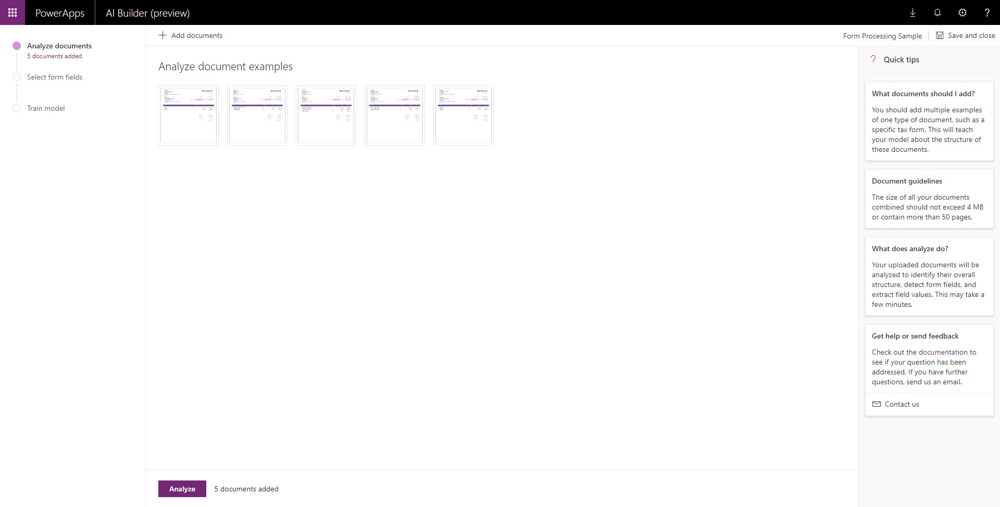
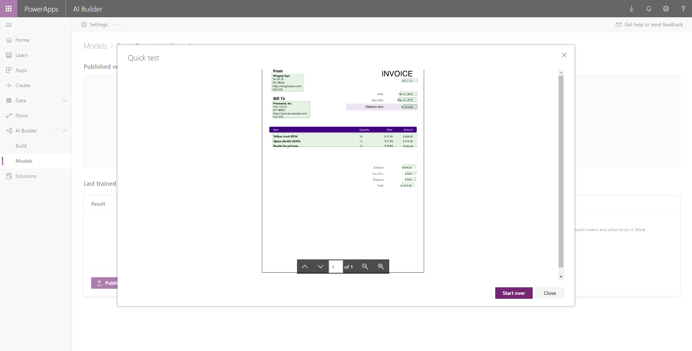

# Use sample data to do form processing

[!INCLUDE[cc-beta-prerelease-disclaimer](./includes/cc-beta-prerelease-disclaimer.md)]

To explore the possibilities of form processing, you can get started by building and training a form processing model using  [sample invoices](https://go.microsoft.com/fwlink/?linkid=2103171). 

## Get the sample data

Download [AIBuilder_Lab.zip](https://go.microsoft.com/fwlink/?linkid=2103171), which contains sample invoices.

> [!NOTE]
> The [AIBuilder_Lab.zip](https://go.microsoft.com/fwlink/?linkid=2103171) file also contains sample files for working with other AI Builder model types, as well as some hands-on labs that you can use to learn more about AI Builder. More information about the contents of the zip file is available in the [readme.txt](https://go.microsoft.com/fwlink/?linkid=2108226) file, available [here](https://go.microsoft.com/fwlink/?linkid=2108226) and also contained in the zip file.

## Build your model

1. Unzip the downloaded files, and then navigate to **AIBuilder_Lab\Lab Images\FormProcessing_Invoices**, where you will see two folders: **Train** and **Test**.
2. On the AI Builder Build screen, select **Form processing model**.
3. Choose a name for the form processing model and then create your model.
4. When you are prompted to upload data, upload the five invoices from the **Train** folder.

   > [!div class="mx-imgBorder"]
   > 

5. Next, select the detected fields you want your model to return.

   > [!div class="mx-imgBorder"]
   > 

6. After you train your model, you can see how it works by doing a quick test using the invoice in the **Test** folder that you downloaded.

   > [!div class="mx-imgBorder"]
   > 

### Related topics
[Form processing model in Power Automate](form-processing-model-in-flow.md)  
[Form processing model in PowerApps](form-processor-component-in-powerapps.md)
