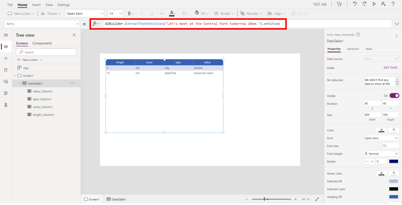
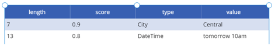
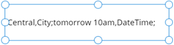
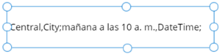
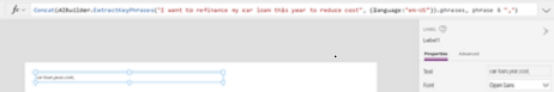
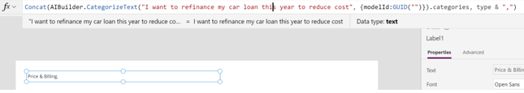
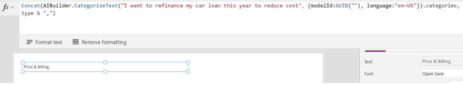

# Use formulas for text AI models in Power Apps (preview)

[!INCLUDE[cc-beta-prerelease-disclaimer](./includes/cc-beta-prerelease-disclaimer.md)]

You can integrate some AI Builder models in [Power Apps Studio](https://create.powerapps.com) by using the formula bar. This functionality is available only for the following AI Builder model types:

|Model type | Build type  |
|---------|---------|
|[Sentiment analysis](#sentiment-analysis)  | Prebuilt     |
|[Entity extraction](#entity-extraction)    | Prebuilt and Custom    |
|[Key phrase extraction](#key-phrase-extraction)   | Prebuilt        |
|[Language detection](#language-detection)   | Prebuilt     |
|[Category classification](#category-classification)  | Prebuilt and Custom   |

> [!IMPORTANT]
 >* This is a preview feature. [!INCLUDE [cc-preview-features-definition](includes/cc-preview-features-definition.md)]
>
 >* [Data loss prevention policies](/power-platform/admin/wp-data-loss-prevention) that apply to Dataverse also apply to AI Builder.
 >* To use formulas in an app that was created before May 7, 2020, go to **Settings** > **Advance Settings** > **Preview Features**, and set **AI Builder formulas** to **ON**. This step isn't necessary for newly created apps.

When you enter **AIBuilder** in an app, it might take a few seconds to load its functions. After it loads, enter a period (**.**) to view the available functions. For detailed information about how to use formulas in canvas apps, see [Get started with canvas-app formulas in Power Apps](/powerapps/maker/canvas-apps/working-with-formulas).

To enable or disable this feature (for example, for data loss prevention), see **AI Builder formulas** under **Advanced Settings**. More information, see [Controlling which features are enabled](/powerapps/maker/canvas-apps/working-with-experimental-preview#controlling-which-features-are-enabled).

 > [!NOTE]
 > To improve the prediction score of the text AI models listed above and to narrow down the language in which they are interpreted, you can provide language code as an additional parameter. The language code needs to be provided in IETF [BCP-47 format](/openspecs/office_standards/ms-oe376/6c085406-a698-4e12-9d4d-c3b0ee3dbc4a).
>
> For a complete list of languages supported for these models, see [Text Analytics v3 language support](/azure/cognitive-services/text-analytics/language-support?tabs=sentiment-analysis).

**Example**:

If you want, you can select the **Label** control, enter **AIBuilder**, and try out the various AI models, using **TextInput1** as the text.

> [!div class="mx-imgBorder"]
> 

## Sentiment analysis

If you specify a single string as the argument, the return value is the sentiment of the string as a text, such as negative, positive or neutral.

### Syntax

AIBuilder.AnalyzeSentiment(*String*[, *Language*]).sentiment

- **String**: (*Required*) This is the string to analyze sentiment for.
- **Language**: (*Optional*) You can specify the language for your string to get the best result.

### Example

```powerapps-dot
AIBuilder.AnalyzeSentiment(TextInput1.Text).sentiment
```

### Input/output variation

To ensure the text is interpreted in context of a specific language, you can provide the language code in IETF [BCP-47 format](/openspecs/office_standards/ms-oe376/6c085406-a698-4e12-9d4d-c3b0ee3dbc4a).
In the **Input** column, "en-us" is the language code of English (United States):

|Input  |Output  |
|---------|---------|
|AIBuilder.AnalyzeSentiment(TextInput1.Text,{language: "en-us"}).sentiment  |Positive   |

## Entity extraction

If you specify a single string as the argument, the entity extraction formula will extract and return the types of entities present in the string into a list. You can use the following formula to display the result in a **Label** control.

### Syntax

AIBuilder.ExtractTextEntities (*String*[, *ModelId*, *Language*]).entities

- **String**: (*Required*) This is the string to extract entities from.
- **ModelId**: (*Optional*) If you want to use your custom entity extraction model instead of the prebuilt one, you need to include your model GUID in the formula. Model GUID can be found in the URL by visiting your model details page in **AI Builder** > **Models**.
- **Language**: (*Optional*) You can specify the language for your string to get the best result.

### Example

```powerapps-dot
AIBuilder.ExtractTextEntities(“Let’s meet at the Central Park tomorrow 10am.”).entities
```

<br/>

> [!div class="mx-imgBorder"]
> 

### Input/output variations

- This formula uses your custom AI Builder model to return all entities that belong to the text, in list form:

  |Input  |Output  |
  |---------|:---------:|
  | AIBuilder.ExtractTextEntities("Let’s meet at the Central Park tomorrow 10am.", {modelId:GUID("")}).entities  |      |
  | Concat(AIBuilder.ExtractTextEntities("Let’s meet at the Central Park tomorrow 10am.", {modelId:GUID("")}).entities, value & "," & type & ";")  |    |

- This formula uses specific language to interpret the text and return all types of entities into a list. In the **Input** column, "es-ES" is the language code of Spanish. For a complete list of language code in IETF, see [BCP-47 format](/openspecs/office_standards/ms-oe376/6c085406-a698-4e12-9d4d-c3b0ee3dbc4a):<!-- Angie: Update link? -->

  |Input  |Output  |
  |---------|:---------:|
  | Concat(AIBuilder.ExtractTextEntities("Nos vemos en el Central Park mañana a las 10 a. M.", {language:"es-ES"}).entities, value & "," & type & ";") |   |

## Key phrase extraction

If you specify a single string as the argument, the entity extraction formula will extract and return the types of entities present in the string into a list. You can use the following formula to display the result in a **Label** control.

### Syntax

AIBuilder.ExtractTextEntities (*String*[, *Language*]).entities

- **String**: (*Required*) This is the string to extract entities from.
- **Language**: (*Optional*) You can specify the language for your string to get the best result.

### Example

```powerapps-dot
Concat(AIBuilder.ExtractKeyPhrases("I want to refinance my car loan this year to reduce cost").phrases, phrase & ",")
```

### Input/output variation

This formula uses specific language and extracts all key phrases from the text into a list. In the **Input** column, "en-us" is the language code of English (United States). For a complete list of language code IETF, see [BCP-47 format](/openspecs/office_standards/ms-oe376/6c085406-a698-4e12-9d4d-c3b0ee3dbc4a):  

|Input  |Output  |
|---------|---------|
| Concat(AIBuilder.ExtractKeyPhrases("I want to refinance my car loan this year to reduce cost", {language:"en-US"}).phrases, phrase & ",")   |     |

## Language detection

If you specify a single string as the argument, the Language detection formula will detect and return the two-letter language code (ISO 639) of the string. You can use the following formula to display the result in a **Label** control.

### Syntax

AIBuilder.ExtractTextEntities (*String*[, *CountryHint*]).entities

- **String**: (*Required*) This is the string to extract entities from.
- **CountryHint**: (*Optional*) You can provide a country code in ISO-3166 formal to narrow down the prediction in context of a specific country.

### Example

```powerapps-dot
AIBuilder.DetectLanguage("I love Power Apps.").language
```
<br/>

   |String  |Language  |
   |---------|:---------:|
   |How are you    |en   |
   |Comment allez-vous  |fr  |


### Input/output variations

- To narrow down the prediction in context of a specific country, provide the country code in ISO-3166 format:

  |Input  |Output  |
  |---------|---------|
  |AIBuilder.DetectLanguage(TextInput1.Text,{countryHint:"DK"}).language<br/><br/>In this example, country **DK** refers to the ISO-3166 country code for Denmark.   | ***Screenshot***       |
  |If you provide **hvordan har du det** in **textinput1**, it returns **da** which is the<br/>language code for Danish. Without country code provided it would return **no**,<br/>which is the language code for Norwegian where this text is also valid.     | ***Screenshot***       |

- This formula returns the confidence score of the detected language. This returns a number in the range of 0 to 1. The greater the value, the higher the confidence is in the predictions made by the AI model:

  |Input  |Output  |
  |---------|---------|
  | AIBuilder.DetectLanguage(TextInput1.Text).score | ***Screenshot***  | 

## Category classification

If you specify a single string as the argument, the Category classification formula will predict and return all categories present in the string into a list. You can use the following formula to display the result in a **Label** control.

### Syntax

AIBuilder.CategorizeText (*String*[, *ModelId*, *Language*]).categories

- **String**: (*Required*) This is the string to predict categories for.
- **ModelId**: (*Optional*) If you want to use your custom category classification model instead of the prebuilt one, you need to include your model GUID in the formula. Model GUID can be found in the URL by visiting your model details page in **AI Builder** > **Models**.
- **Language**: (*Optional*) You can specify the language for your string to narrow down the prediction.

### Example

```powerapps-dot
Concat(AIBuilder.CategorizeText("I want to refinance my car loan this year to reduce cost").categories, type & ",")
```

### Input/output variations

- This formula uses your custom AI Builder model to return all categories that belong to the text, in list form:

  |Input  |Output  |
  |---------|---------|
    | Concat(AIBuilder.CategorizeText("I want to refinance my car loan this year to reduce cost", {modelId:GUID("")}).categories, type & ",")   |       |

- This formula uses English (United States) as the language for interpretation to return all categories that belong to the text, in list form:

  |Input  |Output  |
  |---------|---------|
  | Concat(AIBuilder.CategorizeText("I want to refinance my car loan this year to reduce cost", {modelId:GUID(""), language:"en-US"}).categories, type & ",")  |  |

### See also

[Sentiment analysis model](prebuilt-sentiment-analysis.md)<br/>
[Entity extraction prebuilt model](prebuilt-entity-extraction.md)<br/>
[Key phrase extraction model](prebuilt-key-phrase.md)<br/>
[Language detection model](prebuilt-language-detection.md)<br/>
[Category classification model](prebuilt-category-classification.md)

[!INCLUDE[footer-include](includes/footer-banner.md)]
