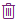
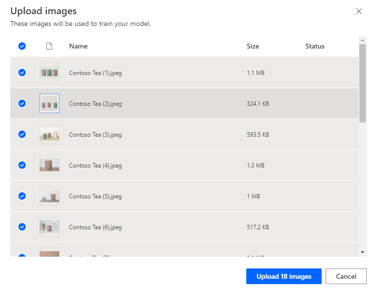
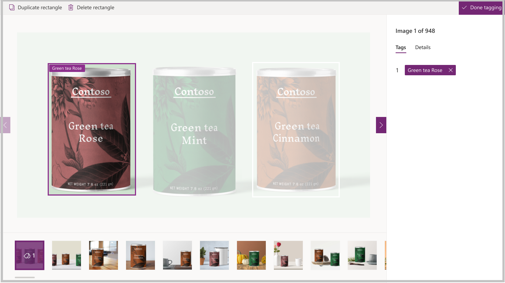
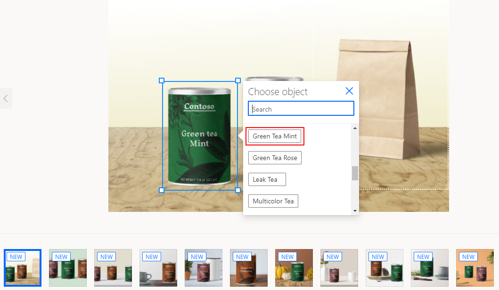
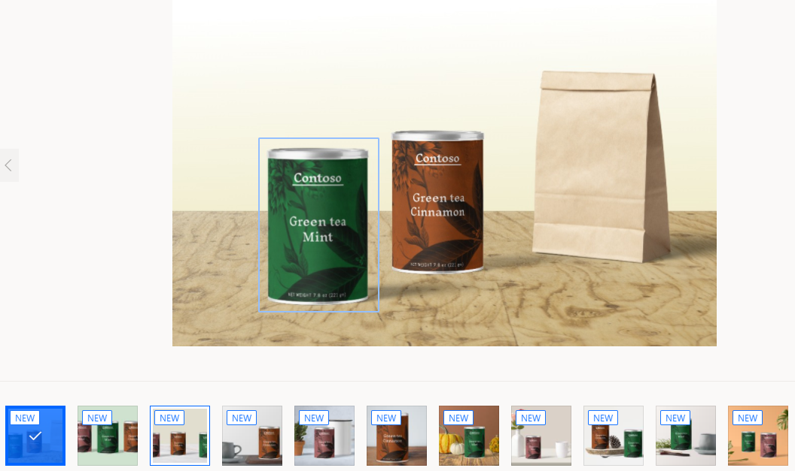

# Get started with object detection

[!INCLUDE[cc-beta-prerelease-disclaimer](./includes/cc-beta-prerelease-disclaimer.md)]

1. Sign in to [Power Apps](https://make.powerapps.com), and then in the navigation pane, select the down arrow to expand **AI Builder**. Select the **Object Detection** AI model type.
2. Enter a name for your model and then select **Create**.

## Select model domain

The first thing you'll do when you create an AI Builder object detection model is to define its domain. The domain optimizes the model for specific use cases. There are 3 domains:
 - Common objects: The default value. Use this if your use cases doesn't fit the specific applications below. 
 - Objects on retail shelves: Detects products densely packed on shelves.
 - Brand logo: Optimized for logo detection.

## Provide object names
Next, provide the names of the items you want to detect. You can provide up to 500 object names per model.

There are two ways to provide object names:

- Type object names directly in AI Builder.
- Select names from your Common Data Service entity.

As you build your model, you can switch between these two modes. In the top action bar, click on the name of the other input mode.

> [!IMPORTANT]
> When you change input mode, you lose any existing object names. In other words - if you type object names in AI Builder, and then change to selecting from a database, all object names typed and their associated bounding boxes are deleted from your model. This is not recoverable. The same applies if you switch from selecting object names from a database to typing object names.

### Type names in AI Builder

To provide object names directly in AI Builder, just type the name in the space where the object is detected in the image. Then, press **Enter**, or select **Add new object** to continue.

- To edit an object name, select the object name and then make your change.
- To remove an object name, select the **bin** icon. 

### Select names from a database

If your data isn't in Common Data Service, see [Prerequisites](build-model.md#prerequisites) topic for information about how to import data into Common Data Service.

1. Select **Select from database** to see entities in your environment.
2. In the right-side pane, find the entity that contains your object names. Look through the list, or use the search bar, and then select that entity.
3. Locate the field that contains the names of your objects. Select that field, and then select **Select Field** at the bottom of the screen.
4. From the list of strings in your table, select the ones that represent the objects you want to detect. 
5. Select **Next** at the bottom of the screen.

## Upload images
Now let’s move on to the image upload step in building an object detection AI model. The pictures you collected ahead of time will now come in handy because you need to upload them to AI builder.

1. Prepare your images in a folder on your computer, and make sure they follow the qualitative and quantitative [guidance](collect-images.md).
1. In AI Builder, select **Add Images**.
1. Browse your computer file system and select the images that contain your objects.
1. Confirm the images that appear in AI builder before you finish uploading them. Deselect any image you want to exclude.

   > [!div class="mx-imgBorder"]
   > 

1. Select **Upload images** to kick off the upload of your images.
1. When the upload is complete, select **Close**.

## Tag images

This section explains the tagging process that is a key part object detection. You draw rectangles around the objects of interest, and then assign a name to the rectangle that you want the model to associate with this object.

1. On the **Tag object in your images** screen, select the first image in your gallery.
1. To draw a rectangle around an object, press and hold your mouse at the top-left corner of the object and then drag down to the bottom-right corner of the object. The rectangle should fully encompass the object you want your model to recognize.

   > [!div class="mx-imgBorder"]
   > 

1. After you draw a rectangle, you can associate a name to the object from the list of names you already selected.

   > [!div class="mx-imgBorder"]
   > 

1. Your tag is created when you see it surrounding an object.

   > [!div class="mx-imgBorder"]
   > 

1. Navigate from image to image, and tag at least 15 images per object name to build a model.
1. After you are done tagging your images, select **Done Tagging**. Your data is saved as you create rectangles.
1. In the grid view, you can view a summary of all the tags you created, and which images you created. This lets you know how much more work is needed to move forward.
1. Until you reach the minimum for content quantity, you can't move forward. Once you have at least 15 images per object name, you'll be able to select **Next** at the bottom of the screen.

That’s it! Congratulations, you've created a training set for object detection.

### Next step

[Train  your model](object-detection-train-model.md)

### Related topic

[Object detection in Power Automate](object-detection-model-in-flow.md) 
