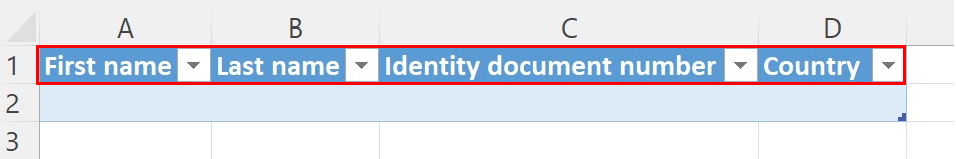
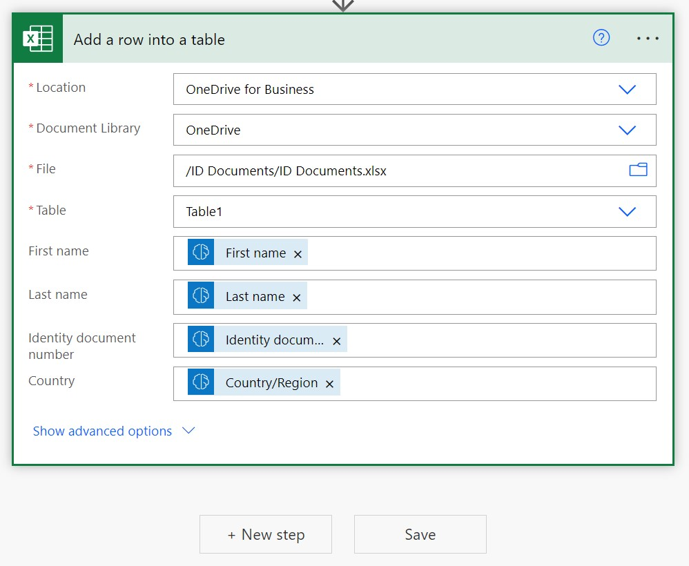
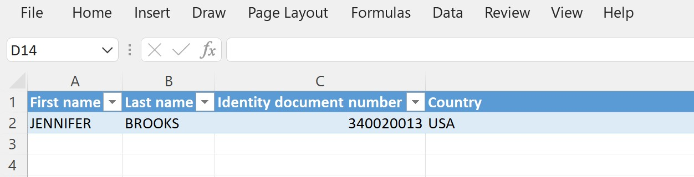

# Use the ID reader prebuilt model in Power Automate

1. Sign in to [Power Automate](https://flow.microsoft.com/).

1. In the left pane, select **My flows**, and then select **New flow** > **Instant cloud flow** in the menu at the top.

1. Name your flow, select **Manually trigger a flow** under **Choose how to trigger this flow**, and then select the **Create** button.

1. Expand **Manually trigger a flow**, select **+Add an input**, and select **File** as the input type.

1. Select **+New step**, search for **AI Builder** in the **Actions** tab, and then select **Extract information from identity documents**.

1. Specify **File Content** as the Identity document file you want to process in your flow.

    > [!div class="mx-imgBorder"]
    > 

Congratulations! You've created a flow that uses the ID reader AI model. Select the **Save** button below the input, and then select **Test**  in the upper-right corner to try out your flow and see information extracted from a file.

## Example ID reader flow

• Using Send an email notification connector

The following example shows how you can set up a flow that sends you an email with extracted information from passports.

> [!div class="mx-imgBorder"]
> 

• Using Excel Online connector

You can also set up a flow that add lines to an Excel spreadsheet with extracted information from identity document
Before you begin writing your data into Excel, make sure that you have created a table that matches the information that you want to store.

**Create an Excel table**

1.	Create a new Excel spreadsheet in a OneDrive or SharePoint folder.

2.	In the first row, enter the following values in their own cells, which will serve as the column headers for your table: First Name, Last Name, Identity document number, and Country.

3.	Select the cells that you entered and then format them as a table, marking the first row as the header.

 > [!div class="mx-imgBorder"]
 > 

**Write the data to Excel**

1.	Now that your table is set up, you can add the extracted identity document information to the Excel spreadsheet.

2.	Select + New step.

3.	Search for the Excel Online (Business) connector or select it from the list of connectors.

4.	Select the Add a row into a table action.

5.	In the Location, Document Library, and File fields, specify the location in OneDrive or SharePoint where your file is stored.

6.	In the Table field, select the table that you created.

7.	In the First name field, select the First name dynamic content from the AI Builder action.

8.	In the Last name field, select the Last name dynamic content from the AI Builder action.

9.	In the Identity document number field, select the Identity document number content from the AI Builder action.

10.	In the Country field, select the Country/Region content from the AI Builder action.

> [!div class="mx-imgBorder"]
> 

**Test the flow**

We're done building the flow. 
Now let's test it. Select the Save button on the top right and then on the Test button next to it. Select Manually and select Test to trigger the action.

Next, select an identity document file or image where your file is stored in File Content, select Import, and then select Run Flow.

> [!div class="mx-imgBorder"]
> 

The flow will get executed after some seconds: AI Builder will extract the data and a new entry will be added to Excel with the extracted information.

> [!div class="mx-imgBorder"]
> 

### See also

[ID reader prebuilt model overview](prebuilt-id-reader.md)
