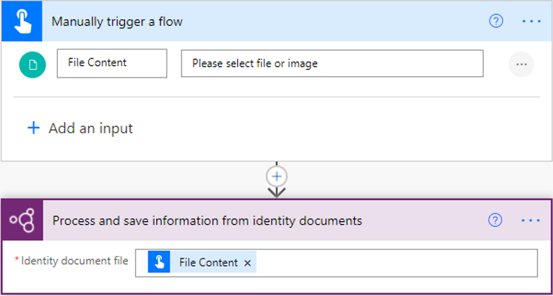
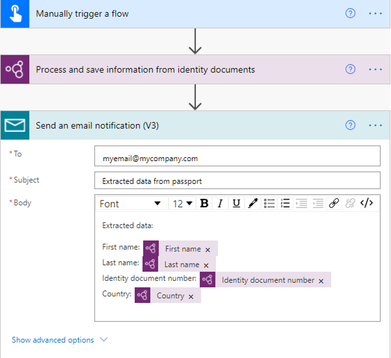

# Use the ID reader model in Power Automate

1. Sign in to [Power Automate](https://flow.microsoft.com/).
1. Select the **My flows** tab, and then select **New > +Instant-from blank**.
1. Name your flow, select **Manually trigger a flow** under **Choose how to trigger this flow**, and then select **Create**.
1. Expand **Manually trigger a flow**, select **+Add an input**, and select **File Content** as the input type.
1. Select **+ New step**, search for **AI Builder** in the Search for filters and actions box, and then select **Process and save information from identity documents** in the list of actions.
1. Specify **File Content** as the Identity document file you want to process in your flow:

    > [!div class="mx-imgBorder"]
    > 

Congratulations! You've created a flow that uses the ID reader AI model. Select **Save** in the upper-right corner, and then select **Test** to try out your flow and see information extracted from a file.

## Example ID reader flow

The following example shows how you can set up a flow that sends you an email with extracted information from passports:

> [!div class="mx-imgBorder"]
> 

## See also

[Identity document reader overview](prebuilt-id-reader.md)