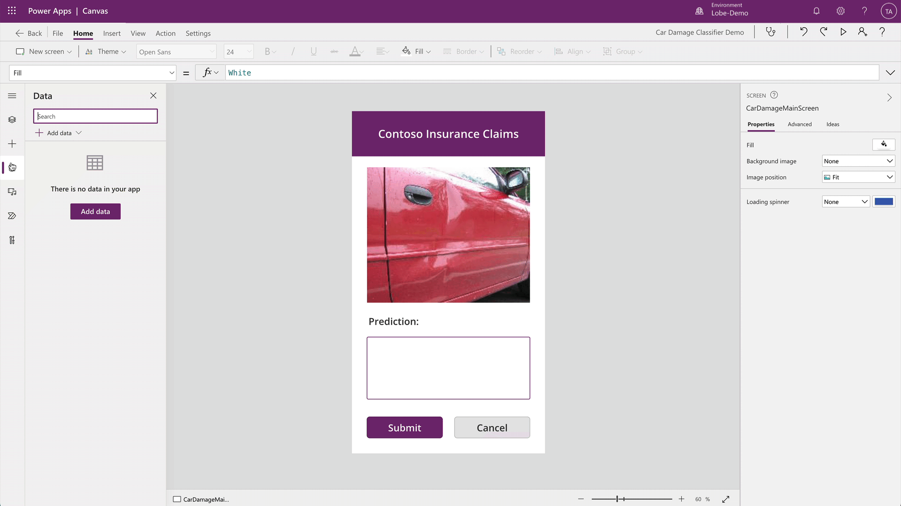

# Use an image classification model by Lobe in Power Apps (preview)

[!INCLUDE[cc-beta-prerelease-disclaimer](./includes/cc-beta-prerelease-disclaimer.md)]

To use your image classification model with Power Fx, you first need to add it as a data source in your app. To learn how to do this, go to [Enable the Power Fx feature](powerfx-in-powerapps.md#enable-the-power-fx-feature).

> [!IMPORTANT]
> - This is a preview feature.
> - [!INCLUDE[cc_preview_features_definition](includes/cc-preview-features-definition.md)]
> - This feature is being gradually rolled out across regions and might not be available yet in your region.

## Create a canvas app

Create a new canvas app for your image classification model. (If your model is already in a canvas app, skip this section and go to [Add the Power Fx Prediction formula](#add-the-power-fx-prediction-formula) later in this topic.)

1. Sign in to [Power Apps](https://make.powerapps.com).

1. Select **Create** > **Canvas app from blank**.

    > [!div class="mx-imgBorder"]
    > 

1. In the **App name** field, enter a name and select **Create**.

1. If you see the **Welcome to Power Apps Studio** screen, select **Skip**.

1. Select **Data** > **Add data** > **AI models**.

1. On the dropdown, select the image classification model you want to add.

    > [!div class="mx-imgBorder"]
    > 

## Add the Power Fx Prediction formula

1. On the image classification model, select the control area next to **Prediction**.

1. On the formula bar, type **'Model Name'.Predict(Image).Prediction**.

    In the following example of car damage, you would type this:

    ````powerapps-dot
    'Car Damage Classifier'.Predict(AddMediaButton.Media).Prediction
    ````
    > [!div class="mx-imgBorder"]
    > 
    
    The last property in the formula, `.Prediction`, will return the predicted label for the image from the model. If you want a list of all the possible labels and their corresponding confidence values from the model, use the `.Labels` property in the following example:

    ````powerapps-dot
    'Model Name'.Predict(Image).Labels
    ````

## Use a canvas app with a classification model

The following animation shows how users of your new app can add their own images in Power Apps and have the appropriate label automatically predicted. For example, if the user is an insurance claim adjuster, they can upload an image of a broken window in a car. The app will then predict and assign the **Broken Glass** label to it. The user might also want to enter more detail on a claim, such as *Window broken on the driver's side*.

> [!div class="mx-imgBorder"]
> 
