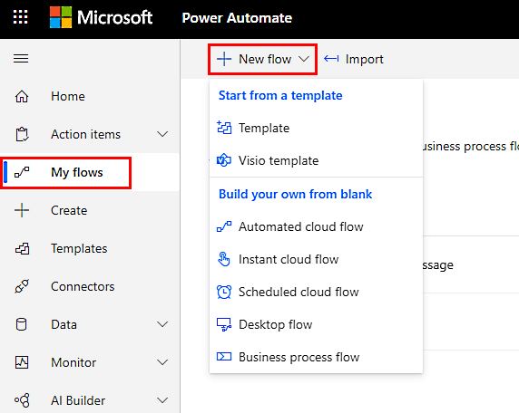
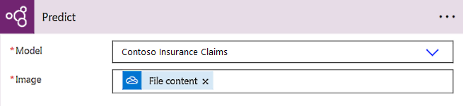

# Use an image classification model by Lobe in Power Automate (preview)

[!INCLUDE[cc-beta-prerelease-disclaimer](./includes/cc-beta-prerelease-disclaimer.md)]

To use your image classification model in a Power Automate flow, you'll need to create a new model or edit an existing model. Then you can add the Power Fx `Prediction` formula to generate results that can help you solve a variety of business problems.

> [!IMPORTANT]
> - This is a preview feature.
> - [!INCLUDE[cc_preview_features_definition](includes/cc-preview-features-definition.md)]
> - This feature is being gradually rolled out across regions and might not be available yet in your region.

## Create a flow in Power Automate

This section describes how to create a flow in your image classification model. If you are editing an existing flow type with images, go to [Add the Power Fx Prediction formula](#add-the-power-fx-prediction-formula).

1. Sign in to [Power Automate](https://flow.microsoft.com/).

1. Select **My flows** > **New flow**.

1. Select the type of flow you want to create.

    > [!div class="mx-imgBorder"]
    > 

1. Name your flow, select how to trigger your flow under **Choose how to trigger this flow**, and then select **Create**.

## Add the Power Fx Prediction formula

1. Select **+New step**, and then type **predict** on the **Choose your operation** search bar.

1. Select **Predict AI Builder**.

    > [!div class="mx-imgBorder"]
    > 

1. In the **Model** field, choose the model you exported from the dropdown.

1. Select the image content from your flow to predict the labels and confidences.

    > [!div class="mx-imgBorder"]
    > 

## Use a flow with a classification model

A flow that uses a classification model can help you solve a variety of business problems.

The output of your flow contains *prediction* and *label*. A prediction is the predicted label of the input image from your model (text). Labels is the list of *labels* (text) and *confidence* (number) for each label you have. This shows the model’s resulting confidence for each label on the image. You'll need to loop this output to process the individual labels and confidences.

When you use the *prediction* output, you can:

- Arrange images into folders by label.

- Create an Excel spreadsheet to send out as a report.

- Apply filtering.

When you use the *labels* output, you can:

- Determine actions of images with certain confidence scores.

- Send alerts based on confidence scores. For example, you might want to send an alert if scores are above 90 percent and a different alert if they are below 90 percent.

- Send an email with various images.

