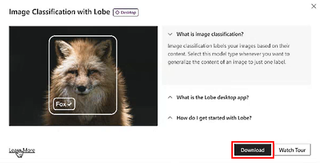
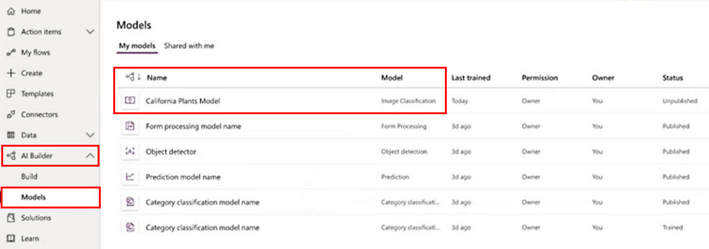
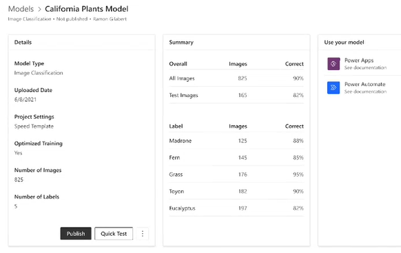

# Use an image classification model by Lobe in Power Automate (preview)

[!INCLUDE[cc-beta-prerelease-disclaimer](./includes/cc-beta-prerelease-disclaimer.md)]

To use your image classification model in a Power Automate flow, you'll need to either create a new model or edit an existing model.

*(Markus: No need to register as in Power Apps?)*

> [!IMPORTANT]
> - This is a preview feature.
>
> - [!INCLUDE[cc_preview_features_definition](includes/cc-preview-features-definition.md)]

## Download the Lobe application on your desktop

*(Markus: Can you download from Power Apps?)*

1. Sign in to [Power Automate](https://flow.microsoft.com/).

1. On the left navigation pane, select **AI Builder** > **Build**.

1. On the right pane, select **Image Classification**.

    > [!div class="mx-imgBorder"]
    > 

1. On the Image Classification with Lobe screen, you can:
    1. Download the Lobe app to your desktop.
    1. Learn about Lobe.
    1. Watch a tour of Lobe.
    1. Close the screen.

    > [!div class="mx-imgBorder"]
    > 

## Use an image classification model by Lobe in Power Automate

1. Sign in to [Power Automate](https://flow.microsoft.com/).

1. *(Markus-Are steps 2&3 accurate?)* If you have an existing flow, select **AI Builder** > **Models**, and then go to step 6.

1. If you are creating a new flow, select **My flows** on the left pane and then go to step 4.

1. Select **New flow** > **Instant cloud flow**.

1. Name your flow, select **Manually trigger a flow** under **Choose how to trigger this flow**, and then select **Create**.

1. Select **+New step**, and then type **predict** on the **Choose your operation** search bar.

1. Select **Predict AI Builder**.

    > [!div class="mx-imgBorder"]
    > 

1. In the **Model** field, choose the model you exported from the dropdown.

1. Select the image content from your flow to predict the labels and confidences.

    > [!div class="mx-imgBorder"]
    > 

*(Marcus/Angie: Find a better place for the following.)* 

The output contains:

- **Prediction:** The predicted label of the input image from your model (text).

- **Labels:** The list of *label* (text) and *confidence* (number) for each label you have, showing the model’s resulting confidence for that label on the image. You will need to loop over this output to process the individual labels and confidences.

## View your Lobe models in AI Builder

*(Markus - Is this leftover from the old doc & does it still belong?)*

If you already exported your image classification model from the Lobe application, it exists in your list of AI Builder models and an image classification model type.

### View your list of models

1. Sign in to [Power Automate](https://flow.microsoft.com/).

1. On the left navigation pane, select **AI Builder** > **Models**.
 
    You'll see a list of you models. Models that were exported from Lobe are listed in the **Model** column as **Image Classification**.

    > [!div class="mx-imgBorder"]
    > 

### View model detail

You'll see the details page. This is where you can... *(Markus: if we use this, let's add more)*.

> [!div class="mx-imgBorder"]
> 

