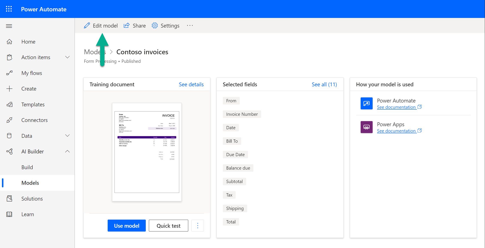

# Improve the performance of your form processing model

If your model performance isn't where you want it to be, for example you're getting bad results or low confidence scores, there are a few things you can try.

## Add more documents to the training data

The more documents you tag, the more AI Builder will learn how to better recognize the fields. To add more documents, edit your form processing model and upload more documents. You will find the option to edit the model on the details page of the model.

> [!div class="mx-imgBorder"]
> 

## More tips

- If possible, use text-based PDF documents instead of image-based documents. Scanned PDFs are handled as images.
- For filled-in forms, use examples that have all of their fields filled in.
- Use forms with different values in each field.
- If your form images are of lower quality, use a larger data set (10-15 images, for example).
- When you create a form processing model, upload documents with the same layout where each document is a separate instance. For example, invoices from different months should be in separate documents and not all in the same one.

### See also

- [Invoice processing prebuilt model](prebuilt-invoice-processing.md)
- [Receipt processing prebuilt model](prebuilt-receipt-processing.md)