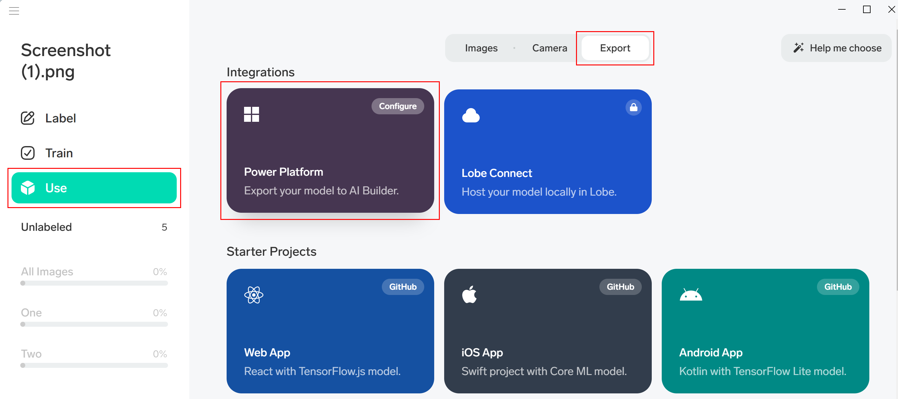

# Export your image classification model from Lobe to AI Builder (preview)

[!INCLUDE[cc-beta-prerelease-disclaimer](./includes/cc-beta-prerelease-disclaimer.md)]

You'll need to export your image classification model from Lobe to Microsoft Power Platform so that you can use it in [Power Apps](https://make.powerapps.com) and [Power Automate](https://flow.microsoft.com/).

> [!IMPORTANT]
> - This is a preview feature.
>
> - [!INCLUDE[cc_preview_features_definition](includes/cc-preview-features-definition.md)]

## Export a model to Power Platform

1. In Lobe, select **Use** > **Export** > **Power Platform**.

    > [!div class="mx-imgBorder"]
    > 

    You'll be taken to a Power Platform environment where you'll be asked for sign-in credentials. If you have access to multiple environments, you'll also need to make sure you're in the correct environment for your model to be exported.

1. Sign in with the credentials you use to sign in to the Power Platform environment.

1. Name your model, and then choose the environment where you'll use your model.

1. Select **Export**.

### For Application Lifecycle Management (ALM) users

For [ALM](/power-platform/alm/overview-alm) users, you can [create a solution from the model in AI Builder](byom-alm.md) to transfer it between environments. As an alternative, you can re-export the model to your environment of choice after validation in your app or flow.

## Next step

After you exported an image classification model to your Power Platform environment, you can use it in Power Apps or Power Automate.

- [Use an image classification model by Lobe in Power Apps](image-classification-component-in-powerapps.md)
- [Use an image classification model by Lobe in Power Automate](image-classification-model-in-flow.md)
