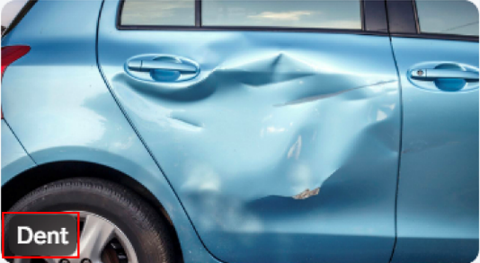
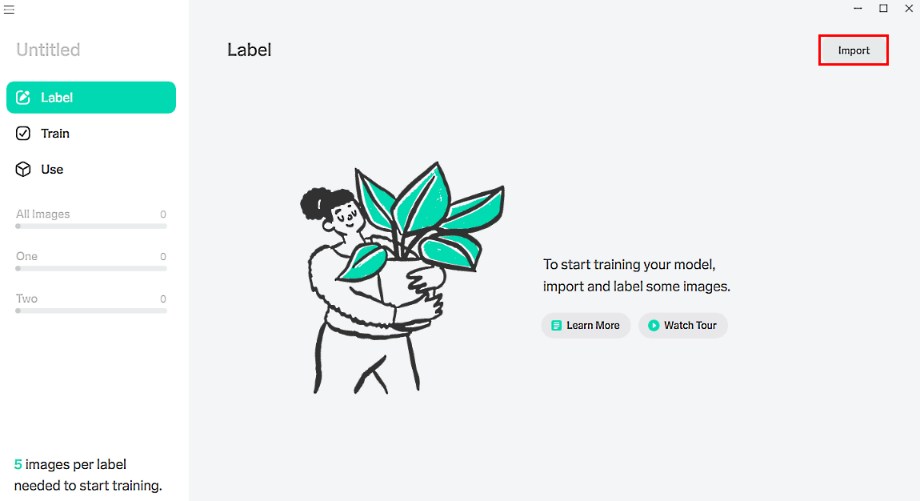

# Overview of  image classification by Lobe (preview)

[!INCLUDE[cc-beta-prerelease-disclaimer](./includes/cc-beta-prerelease-disclaimer.md)]

Lobe is a free, easy-to-use Microsoft desktop application that allows you to build, manage, and use custom machine learning models. With Lobe, you can create an image classification model to categorize images into *labels* that represent their content. You can directly upload Lobe models to AI Builder for use with Microsoft Power Apps and Microsoft Power Automate.

> [!IMPORTANT]
> - This is a preview feature.
> - [!INCLUDE[cc_preview_features_definition](includes/cc-preview-features-definition.md)]
> - This feature is being gradually rolled out across regions and might not be available yet in your region.

Here's a summary of preparing a model in Lobe:

- Import and label images.

- Train your model.

- Evaluate training results.

- Play with your model to experiment with different scenarios.

- Export and use your model in an app.

If you're familiar with the AI Builder [object detection](object-detection-overview.md) custom object detection model, you're already familiar with Lobe.

## Business scenarios

Here are some examples of how Lobe can take your machine learning ideas to production with Power Apps and Power Automate:

- Identify defects in a manufacturing line.

- Alert you when a shelf is empty.

- Identify signs in your environment.

- Filter or verify user-submitted images based on content.

- Notify you when a shipment arrives.

- Work with online retail images.

- Provide information about images in the field.

## What is image classification?

Image classification is categorizing an image into a label to represent its content overall. Image classification models learn to find patterns such as textures, colors, and shapes from your images. These patterns can then be used to identify your labels.

For example, a project named *Contoso Insurance Claims* might have labels named *Dent*, *Scratch* and *Broken Glass* to indicate types of damage to vehicles. A claims adjuster might use these images determine the insurance company's liability.

> [!div class="mx-imgBorder"]
> 

With image classification by Lobe, you train all your models on your computer. When you train this way, you don't use AI Builder credits. Lobe is integrated with Microsoft Power Platform, which adds the ability to export your model to AI Builder for use in Power Apps and Power Automate.

## Download Lobe

There are two ways to download Lobe to your desktop. If you have access to the [new AI Builder home page experience](model-types.md#new-home-page-for-ai-builder):

1. Sign in to [Power Apps](https://make.powerapps.com) or [Power Automate](https://flow.microsoft.com/).

1. Select **AI Builder** > **Build** > **Image Classification (preview)**.

> [!div class="mx-imgBorder"]
> ")

If your region doesn't have access yet to the new AI Builder home page experience, go to the [Lobe home page](https://www.lobe.ai/) to download Lobe.

## Use image classification by Lobe

1. Create a new project by selecting **New Project** > **Import**.

    > [!div class="mx-imgBorder"]
    > 

1. Import and label your images, and train the classification model. To learn how to do this, go to the [Lobe Help site](https://www.lobe.ai/docs/welcome/welcome).

1. (Optional) Watch a video of image classification by Lobe on the [Lobe home page](https://www.lobe.ai/).

### Consider image quantity and object balance

You'll want to upload enough images to train your model accurately. You'll also want to make sure there are enough images to represent each object.
This will increase consistency when training your model.

For tips on choosing enough images, go to [Data quantity and data balance](collect-images.md#data-quantity-and-data-balance).

### Adjust your model architecture

Lobe determines the best model architecture for your project, but you have the option to change it. Changing your project will reset any training completed and automatically train a new model.

Following are recommendations for Power Platform users:

- **Speed:** Use this setting as default for apps or flows that require quick response times.

- **Accuracy:** Use this setting for apps or flows that batch jobs or slower processing requirements.

## Next step

[Export your image classification model from Lobe to AI Builder (preview)](lobe-export.md)