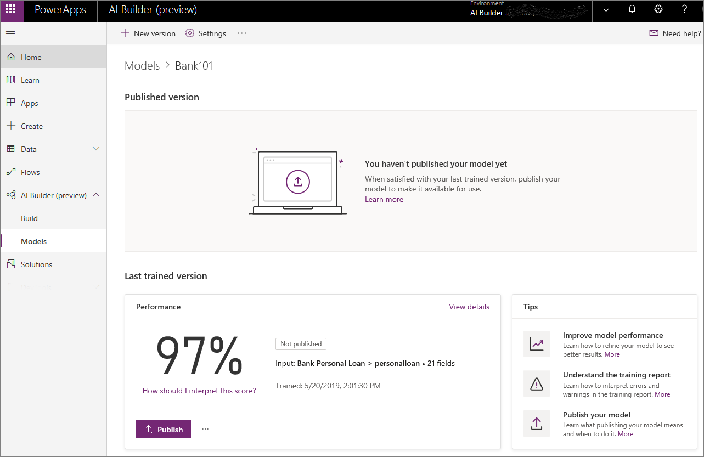
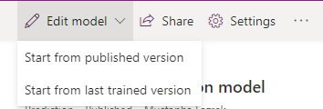

# Manage a model in AI Builder

[!INCLUDE[cc-beta-prerelease-disclaimer](./includes/cc-beta-prerelease-disclaimer.md)]

Creating the optimal model for your business can be a rather iterative process. Results may vary depending on the configurations you set and the training data you provide. Thus, updating either or both of those factors could improve your model performance. In some cases, however, there is a chance the performance may degrade. Each AI model type has a set of guidelines to help walk you through the process of creating the best model, tailored to your needs.

## Evaluate your model

After you train your model for the first time, you can evaluate its performance and quality on it's details page.

Depending on your AI model type, a performance score may appear for each version you have trained. You can use this score to quickly compare two versions of the same model. However, the score is based on the configuration for that training. It is important to take into consideration any changes made between versions when comparing scores.

Each AI model type has a different explanation for how the score is calculated, and how the score should be interpreted. Select **How should I interpret this score** to learn more.

Some AI model types have the option to quickly test the results of your model version with real data of your choosing. Select **Quick test** to see your model in action.

After you finish evaluating your newly trained model, you have two options:

- **Publish your model**: For more information about when to publish a model, see [When should I publish my model](publish-model.md#when-should-i-publish-my-model).
- **Create a new version**: For more information about when to create a new version, see [When should I create a new version](#when-should-i-create-a-new-version).

## Edit model name

1. At the top of the page, select **Settings**.
2. In the Model settings pane on the right, under **Model name**, enter a different name.
3. Select **Save** to finalize the change.

## Create a new version

To create a new version, select **New version** at the top of the page.

You can have up to two trained versions available at a time - one **Published version**, and one that is not published, **Last trained version**. If you train a new version when a last trained version already exists, the existing last trained version is overwritten.

When you create a new version, your model is based on the configuration from an existing version – your published version, or  your last trained version. If you have both, you have to choose which one you want to create the new version from. 

 
A new version is created only after you have successfully trained it. If you leave without finishing your changes and training your model, your progress is saved as a draft. Certain actions, such as creating a new version or retraining, may be disabled until you train or discard your draft. You can only have one draft available at a time, so you have to select **Resume draft** to pick up where you left off, or **Discard draft** to get rid of the changes before you can continue.

After training, your training results appear under **Last trained version** section of the **Details** page.

If you are satisfied with your last trained version, you can [publish your model](publish-model.md) to make it available. Otherwise, you can always create a new version. For more information about publishing your model, see [When should I publish my model?](publish-model.md)

## When should I create a new version?

You can create a new version of your model to help improve the model performance or quality. This depends on the AI model type, where some models can be improved by updating the configuration and some models can be improved by updating the training data.

Due to the experimental nature of machine learning, not all new versions you create will have an increase in model performance. If you are not satisfied with your model, you can create a new version to try to yield better results.

If you are satisfied with your model, you can [publish your model](publish-model.md) to make it available. Similarly, as you can only have  two trained versions available at a time, you can publish a version if you do not want it to be overwritten by a new version.

For more information about the nuances of improving your model performance, under the **Last trained version** and in the **Tips section**, select **Improve model performance**. This tip only appears for the AI model types where it is applicable.

### Next steps

[Publish your model](publish-model.md)
