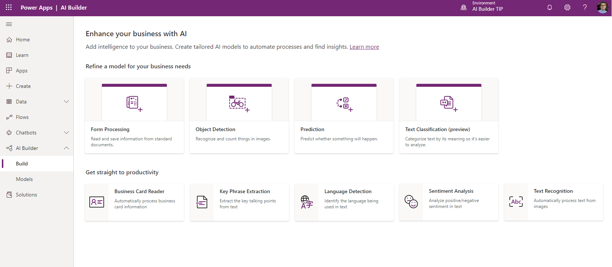

# AI model types

In AI Builder, AI is based on model types that you choose from, based your business needs. For example, build an object detection model that recognizes your products in an image, or a prediction model that predicts business outcomes based on patterns the AI learns from your historical data.  Train and publish the model, and it's ready for use in your business.

To build a model using AI Builder, sign in to [Power Apps](https://make.powerapps.com) and, in the the left navigation pane, select **AI Builder > Build**. Select the model type that matches what you want to do, and you are ready to get started.

> [!div class="mx-imgBorder"]
> 

## List of AI model types

AI model types give you the ability to tailor a scenario to the needs of your business. With AI Builder, you can build and train your own AI model suited to your needs, or you choose from several prebuilt models that you use in Power Apps and Power Automate without having to build and train the model. 

### Custom AI models

Custom AI models are models that you build choosing a model type in AI Builder, and that you train to perform a specific AI task using your data. You select the model type, provide the data, build and train your own unique AI model, and then use or share the model. Build your own custom AI model using these AI model types:

| AI model type  | Category  | Start here
|---|---|---|
| Prediction   | Prediction  | [Overview of prediction model](prediction-overview.md)
| Form processing  | Vision   | [Overview of form classification model](form-processing-model-overview.md)
| Object detection  | Vision   | [Overview of object detection model](object-detection-overview.md)
| Text classification  |Language   | [Overview of text classification model](text-classification-overview.md)

### Prebuilt AI models

AI Builder features prebuilt AI models that you can use in Power Apps and Power Automate. With a prebuilt model, you get an AI model that Microsoft has built and trained to perform a specific task. You don't need to build or train the model yourself to use it. The following prebuilt AI models are available:

| AI model type | Category |Start here |
|--------|--------|--------|
|Business card reader |Vision | [Overview of business card reader](prebuilt-business-card.md)
|Key phrase extraction |Language | [Overview of key phrase extraction](prebuilt-key-phrase.md)
|Language detection |Language | [Overview of language detection](prebuilt-language-detection.md)
|Text recognition |Vision | [Overview of text recognition](prebuilt-text-recognition.md)
|Sentiment analysis |Language | [Overview of sentiment analysis](prebuilt-sentiment-analysis.md)

### Related topic

[Build a model](build-model.md)
