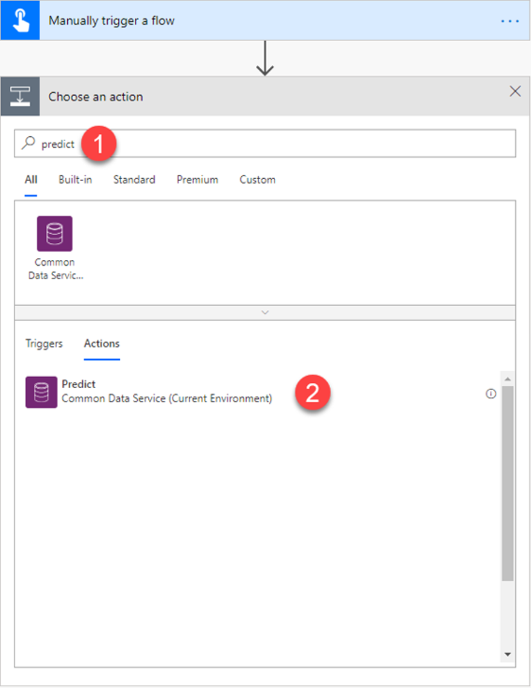

# Use object detection model in Microsoft Flow

[!INCLUDE[cc-beta-prerelease-disclaimer](./includes/cc-beta-prerelease-disclaimer.md)]

1. Sign in to [Microsoft Flow](https://flow.microsoft.com/), select the **My flows** tab, and then select **Create from blank**.
1. Search for *manually*, select **Manually trigger a flow** in the list of triggers, and then select **+ Add an input**.
5. Select **File**, and set **My Image** as input title.
4. Select **+ New step**, search for *Predict*, and then select **Predict Common Data Service** in the list of actions.

    

8. Select the object detection model you want to use, and specify the following as **Request Payload**: 

    ```
    {
    "base64Encoded": "EXPRESSION",
    "mimeType": "image/jpeg"
    }
    ```

    Replace **EXPRESSION** with the following expression string:

    ```
    triggerBody()?['file']?['contentBytes']) on the formula bar on the right as shown on the illustration.
    ```

5. Select **+ New step**, search for *Parse JSON*, and then select **Parse JSON – Data Operations** from the lists of actions.

    
11.	In the **Parse JSON** screen, next to **Content**, select **Response Payload**.

    
 
12. Copy and paste the following JSON code into the **Schema** box: 
```JSON
{
    "type": "object",
    "properties": {
        "predictionOutput": {
            "type": "object",
            "properties": {
                "results": {
                    "type": "array",
                    "items": {
                        "type": "object",
                        "properties": {
                            "tagId": {
                                "type": "string"
                            },
                            "boundingBox": {
                                "type": "object",
                                "properties": {
                                    "left": {
                                        "type": "number"
                                    },
                                    "top": {
                                        "type": "number"
                                    },
                                    "width": {
                                        "type": "number"
                                    },
                                    "height": {
                                        "type": "number"
                                    }
                                }
                            },
                            "confidence": {
                                "type": "number"
                            }
                        },
                        "required": [
                            "tagId",
                            "boundingBox",
                            "confidence"
                        ]
                    }
                }
            }
        },
        "operationStatus": {
            "type": "string"
        },
        "error": {}
    }
}
```
 


13. To retreive the name of the detected object or objects on the image, add the **Get a record** action from Common Data Service. 
14. On the **Get a record** screen, select **AI Object Detection Labels** in the **Entity Name** box, and in **Item identifier** enter **tagId**. 

    When you add **tagId** as Item identifier an *apply to each* loop is automatically added. This loops all the object tags that are detected on the image that is provided by the flow trigger. 

    You can continue to build your flow to meet your business needs. 
Congratulations! You have created a flow that leverages an objectdDetection AI Builder model. Click **Save** on the top right, and then click **Test** to try out your Flow. 

## Example object detection flow

The following example shows the creation of a flow that counts the number of green tea bottles in a image that is triggering the flow. If the number of green tea bottle is below 2, an email is sent to a stock fulfillment manager.


To learn more about all the rich offer of triggers and actions that you can use, go to the [Microsoft Flow documentation](/flow/getting-started)
 


### Related topics
[Object detection overview](object-detection-overview.md)
