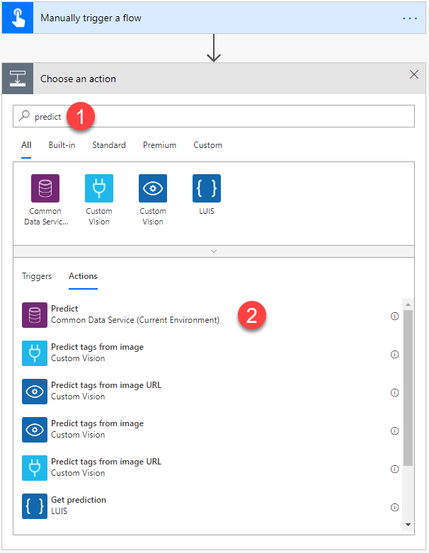
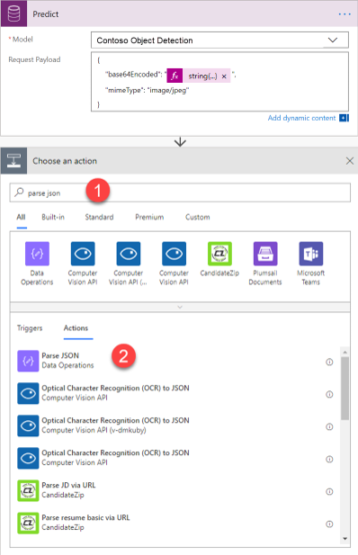
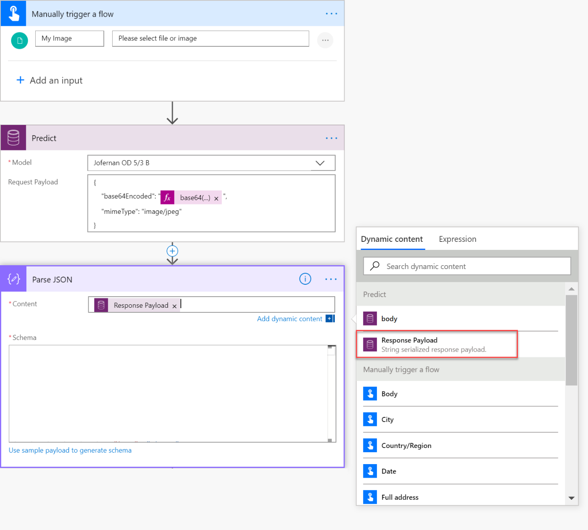
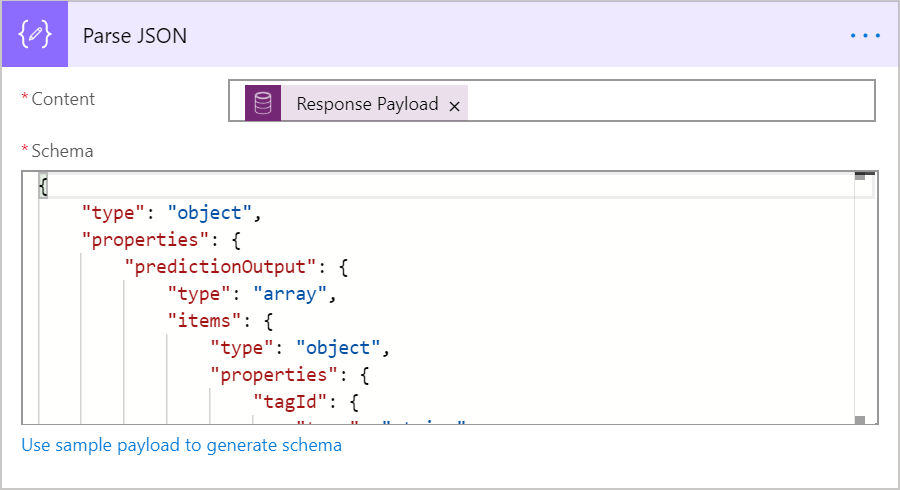
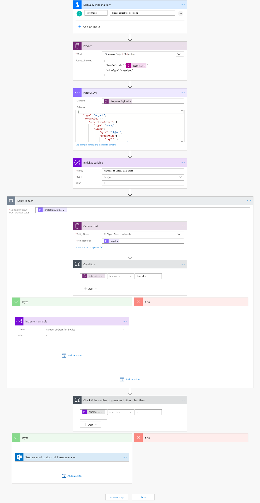

# Use object detection model in Power Automate

[!INCLUDE[cc-beta-prerelease-disclaimer](./includes/cc-beta-prerelease-disclaimer.md)]

1. Sign in to [Power Automate](https://flow.microsoft.com/), select the **My flows** tab, and then select **Create from blank**.
2. Search for *manually*, select **Manually trigger a flow** in the list of triggers, and then select **+ Add an input**.
3. Select **File**, and set **My Image** as input title.
4. Select **+ New step**, search for *Predict*, and then select **Predict - Common Data Service (Current Environment)** in the list of actions.

    > [!div class="mx-imgBorder"]
    > 

5. Select the object detection model you want to use, and specify the following as **Request Payload**:

    ```json
    {
        "base64Encoded": "EXPRESSION",
        "mimeType": "image/jpeg"
    }
    ```

    Replace **EXPRESSION** with the following expression string on the formula bar on the right as shown in the illustration:

    `string(triggerBody()?['file']?['contentBytes']))`
    
     > [!NOTE] 
     > Depending on which connector the file comes from, the expression will need to be enclosed by base64() instead of string().

6. Select **+ New step**, search for *Parse JSON*, and then select **Parse JSON – Data Operations** from the lists of actions.

    > [!div class="mx-imgBorder"]
    > 
7.	In the **Parse JSON** screen, next to **Content**, select **Response Payload**.

    > [!div class="mx-imgBorder"]
    > 
 
8. Copy and paste the following JSON code into the **Schema** box: 

    ```JSON
    {
        "type": "object",
        "properties": {
            "predictionOutput": {
                "type": "object",
                "properties": {
                    "results": {
                        "type": "array",
                        "items": {
                            "type": "object",
                            "properties": {
                                "tagId": {
                                    "type": "string"
                                },
                                "boundingBox": {
                                    "type": "object",
                                    "properties": {
                                        "left": {
                                            "type": "number"
                                        },
                                        "top": {
                                            "type": "number"
                                        },
                                        "width": {
                                            "type": "number"
                                        },
                                        "height": {
                                            "type": "number"
                                        }
                                    }
                                },
                                "confidence": {
                                    "type": "number"
                                }
                            },
                            "required": [
                                "tagId",
                                "boundingBox",
                                "confidence"
                            ]
                        }
                    }
                }
            },
            "operationStatus": {
                "type": "string"
            },
            "error": {}
        }
    }
    ```

    > [!div class="mx-imgBorder"]
    > 

9. To retrieve the name of the detected object or objects on the image, add the **Get a record** action from Common Data Service (current Environment).

10. On the **Get a record** screen, select **AI Object Detection Labels** in the **Entity Name** box, and in **Item identifier** enter **tagId**.

    When you add **tagId** as Item identifier an *apply to each* loop is automatically added. This loops all the object tags that are detected on the image that is provided by the flow trigger.

    You can continue to build your flow to meet your business needs.

Congratulations! You have created a flow that leverages an objectdDetection AI Builder model. Select **Save** on the top right, and then select **Test** to try out your flow.

## Example object detection flow

The following example shows the creation of a flow that counts the number of green tea bottles in a image that is triggering the flow. If the number of green tea bottles is below 2, an email is sent to a stock fulfillment manager.

> [!div class="mx-imgBorder"]
> 

To learn more about all the triggers and actions you can use, go to the [Power Automate documentation](/flow/getting-started).

### Related topic

[Object detection overview](object-detection-overview.md)
